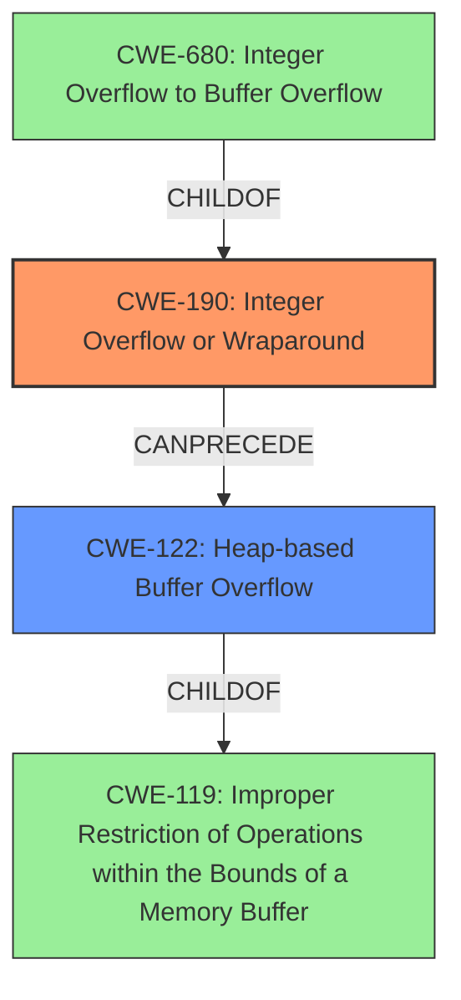

# Enhanced Analysis for CVE-2025-23016

# Summary
| CWE ID | CWE Name | Confidence | CWE Abstraction Level | CWE Vulnerability Mapping Label | CWE-Vulnerability Mapping Notes |
|---|---|---|---|---|---|
| CWE-190 | Integer Overflow or Wraparound | 1.0 | Base | Allowed | Primary CWE. Root cause of the vulnerability. |
| CWE-122 | Heap-based Buffer Overflow | 1.0 | Variant | Allowed | Secondary CWE. Resulting impact of the integer overflow. |

## Evidence and Confidence

*   **Confidence Score:** 1.0
*   **Evidence Strength:** HIGH

## Relationship Analysis
The primary weakness is CWE-190 Integer Overflow or Wraparound, which can directly lead to CWE-122 Heap-based Buffer Overflow. CWE-190 is a parent of CWE-680: Integer Overflow to Buffer Overflow, but the description explicitly mentions a heap-based buffer overflow, making CWE-122 a better fit. CWE-119 is a high-level class, and less specific than CWE-122.



## Vulnerability Chain
The vulnerability chain starts with CWE-190, an **integer overflow** due to crafted nameLen or valueLen values, which leads to CWE-122, a heap-based buffer overflow.

## Summary of Analysis
The vulnerability description clearly states that an **integer overflow** leads to a heap-based buffer overflow. The "CVE Reference Links Content Summary" confirms this.

*   "Root cause of vulnerability: An integer overflow in the ReadParams function due to improper handling of nameLen and valueLen values, which are read from the input data."
*   "This leads to a heap-based buffer overflow."

CWE-190 (Integer Overflow or Wraparound) is the most accurate root cause, and CWE-122 (Heap-based Buffer Overflow) represents the direct consequence.

Other CWEs were considered:

*   CWE-119 (Improper Restriction of Operations within the Bounds of a Memory Buffer): This is a broader category and less specific than CWE-122.
*   CWE-131 (Incorrect Calculation of Buffer Size): While related, the root cause is the integer overflow, not necessarily an incorrect calculation of the buffer size directly.
*   CWE-120 (Buffer Copy without Checking Size of Input ('Classic Buffer Overflow')): This is more specific to buffer copy operations, while the overflow in this case is a result of the integer overflow when allocating the buffer.

The selected CWEs are at the optimal level of specificity because they accurately represent the root cause (integer overflow) and the direct consequence (heap-based buffer overflow) as described in the vulnerability details.


## CWE Relationship Analysis

Current CWEs represent these abstraction levels: .


### Vulnerability Chain Analysis

**Chain starting from CWE-131:**
- 131 (Incorrect Calculation of Buffer Size) - ROOT


**Chain starting from CWE-190:**
- 190 (Integer Overflow or Wraparound) - ROOT


### CWE Relationship Diagram

```mermaid
graph TD
    classDef primary fill:#f96,stroke:#333,stroke-width:2px
    classDef secondary fill:#69f,stroke:#333
    classDef tertiary fill:#9e9,stroke:#333
```