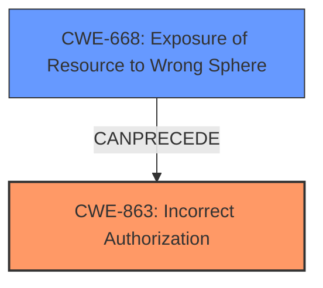

# Analysis Report for CVE-2025-23083

# Vulnerability Analysis Report: CVE-2025-23083

## Description

With the aid of the diagnostics_channel utility, an event can be hooked into whenever a worker thread is created. This is not limited only to workers but also exposes internal workers, where an instance of them can be fetched, and its constructor can be grabbed and reinstated for malicious usage. This vulnerability affects Permission Model users (--permission) on Node.js v20, v22, and v23.

## Vulnerability Description Key Phrases

- **Weakness:** expose internal workers
- **Impact:** grab constructor and reinstate for malicious usage
- **Product:** Node.js
- **Version:** ['v20', 'v22', 'and v23']

## Analysis (with Relationship Data)

# Summary
| CWE ID  | CWE Name                                                                | Confidence | CWE Abstraction Level | CWE Vulnerability Mapping Label | CWE-Vulnerability Mapping Notes |
| :------- | :---------------------------------------------------------------------- | :--------- | :-------------------- | :------------------------------ | :------------------------------ |
| CWE-863  | Incorrect Authorization                                                 | 0.9        | Class                 | Allowed-with-Review             | Primary CWE                     |
| CWE-668 | Exposure of Resource to Wrong Sphere                                                 | 0.7        | Class                 | Discouraged             | Secondary Candidate                     |

## Evidence and Confidence

*   **Confidence Score:** 0.8
*   **Evidence Strength:** MEDIUM

## Relationship Analysis

The primary relationship considered was the parent-child relationship between CWE-863 (Incorrect Authorization) and its potential children which are more specific. However, based on the provided information, there isn't enough evidence to pinpoint a more specific child of CWE-863. The other relevant relationship is between CWE-668 (Exposure of Resource to Wrong Sphere), which could be a consequence of the **incorrect authorization**, but it is a Class level of abstraction.



## Vulnerability Chain

The vulnerability chain starts with an **InternalWorker leak** due to **improper access control** in the diagnostics channel. This leads to a worker permission bypass, as internal workers can be accessed and their constructors reinstated for malicious purposes. The **root cause** is the **incorrect authorization** that allows access to internal workers.

## Summary of Analysis

The primary assessment is based on the evidence that the vulnerability allows access to internal workers, bypassing intended permission restrictions. This aligns with **CWE-863 (Incorrect Authorization)**, as the system **fails to correctly perform authorization checks** when an actor (through diagnostics channel) attempts to access a restricted resource (internal workers). The evidence for this is "worker permission bypass via an InternalWorker leak in diagnostics" and "expose internal workers".

CWE-668 (Exposure of Resource to Wrong Sphere) was considered as a secondary candidate, because the **exposure of internal workers** to the diagnostics channel could be viewed as exposing a resource to the wrong control sphere. However, since the underlying issue is the authorization failure that enables this exposure, CWE-863 is the more direct and appropriate classification.

The selected CWEs are at the Class level due to the lack of more granular information. If there were details about the specific authorization mechanism that failed, a more specific Base or Variant CWE could have been selected.

Relevant CWE Information:

# Enhanced Context (25 CWEs)
The following CWEs were identified as potentially relevant to this vulnerability:

## CWE-863: Incorrect Authorization
**Abstraction Level**: Class
**Similarity Score**: 1762.01
**Source**: sparse

**Description**:
The product performs an authorization check when an actor attempts to access a resource or perform an action, but it does not correctly perform the check.

**Mapping Guidance**:
- Usage: Allowed-with-Review
- Rationale: This CWE entry is a Class and might have Base-level children that would be more appropriate


## CWE Relationship Analysis

Current CWEs represent these abstraction levels: .


### Vulnerability Chain Analysis

**Chain starting from CWE-863:**
- 863 (Incorrect Authorization) - ROOT


**Chain starting from CWE-668:**
- 668 (Exposure of Resource to Wrong Sphere) - ROOT


### CWE Relationship Diagram

```mermaid
graph TD
    classDef primary fill:#f96,stroke:#333,stroke-width:2px
    classDef secondary fill:#69f,stroke:#333
    classDef tertiary fill:#9e9,stroke:#333
```


*Report generated on 2025-07-14 10:55:18*
