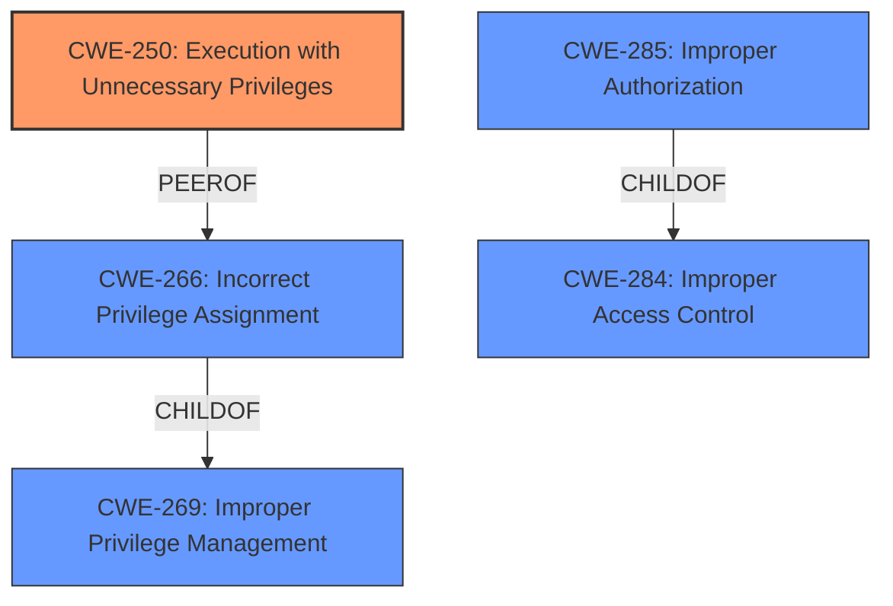

# Analysis for CVE-2025-23093

# Summary
| CWE ID | CWE Name | Confidence | CWE Abstraction Level | CWE Vulnerability Mapping Label | CWE-Vulnerability Mapping Notes |
|---|---|---|---|---|---|
| CWE-250 | Execution with Unnecessary Privileges | 1.0 | Base | Primary CWE | Allowed |
| CWE-266 | Incorrect Privilege Assignment | 0.7 | Base | Secondary Candidate | Allowed |

## Evidence and Confidence

*   **Confidence Score:** 0.9
*   **Evidence Strength:** HIGH

## Relationship Analysis
The primary CWE selected is CWE-250, which is at the Base level of abstraction. While other CWEs like CWE-266, CWE-269, CWE-284, and CWE-285 were considered, they were either too abstract or didn't precisely capture the root cause. CWE-250 focuses on the execution of a resource with unnecessary privileges, which directly aligns with the vulnerability description.

## Vulnerability Chain
The vulnerability chain starts with the **execution of a resource with unnecessary privileges** (CWE-250). This leads to the impact of privilege escalation, allowing an authenticated attacker to execute arbitrary commands with elevated privileges. The chain is relatively short and direct in this case.

## Summary of Analysis
The initial assessment, supported by the "CVE Reference Links Content Summary", identified the root cause as the **execution of a resource with unnecessary privileges**. The retriever results also highlighted CWE-250 as the top candidate. The "Vulnerability Description Key Phrases" further emphasize the "execution of a resource with unnecessary privileges" as the core issue.

The graph relationships confirm that CWE-250 is a more specific and appropriate choice compared to the higher-level classes like CWE-269 and CWE-284, or other peer CWEs like CWE-266. While CWE-266 (Incorrect Privilege Assignment) might seem relevant, the key issue isn't the assignment of privileges but rather the execution of a resource with privileges it doesn't need.

The selection of CWE-250 is at the optimal level of specificity because it directly captures the root cause of the vulnerability. Other CWEs were considered but deemed less suitable due to their higher abstraction levels or a mismatch with the specific technical details of the vulnerability.

Relevant CWE Information:

# Enhanced Context (25 CWEs)
The following CWEs were identified as potentially relevant to this vulnerability:

## CWE-250: Execution with Unnecessary Privileges
**Abstraction Level**: Base
**Similarity Score**: 0.110
**Source**: sparse

**Description**:
Code is executed with privileges that are higher than absolutely necessary, which might allow unintended operations or access to sensitive information.

**Mapping Guidance**:
- Usage: Allowed
- Rationale: This CWE entry is at the Base level of abstraction, which is a preferred level of abstraction for mapping to the root causes of vulnerabilities.

**Justification:**
The vulnerability description explicitly states that the vulnerability is due to "execution of a resource with unnecessary privileges." CWE-250 perfectly matches this description. The vulnerability allows an authenticated attacker to execute arbitrary commands with elevated privileges, which is a direct consequence of executing a resource with more privileges than required.