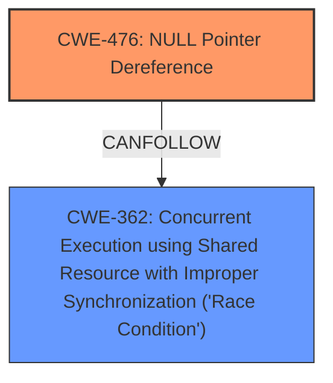

# Enhanced Analysis for CVE-2025-23145

# Summary
| CWE ID | CWE Name | Confidence | CWE Abstraction Level | CWE Vulnerability Mapping Label | CWE-Vulnerability Mapping Notes |
|---|---|---|---|---|---|
| CWE-476 | NULL Pointer Dereference | 1.0 | Base | Allowed | Primary CWE |
| CWE-362 | Concurrent Execution using Shared Resource with Improper Synchronization ('Race Condition') | 0.7 | Class | Allowed-with-Review | Secondary Candidate |

## Evidence and Confidence

*   **Confidence Score:** 0.9
*   **Evidence Strength:** HIGH

## Relationship Analysis
The primary relationship is that **CWE-476** [NULL Pointer Dereference] can be caused by a race condition, which is represented by **CWE-362** [Concurrent Execution using Shared Resource with Improper Synchronization ('Race Condition')]. **CWE-476** [NULL Pointer Dereference] is a base CWE, while **CWE-362** [Concurrent Execution using Shared Resource with Improper Synchronization ('Race Condition')] is a class CWE, meaning **CWE-476** [NULL Pointer Dereference] is more specific.



## Vulnerability Chain
The vulnerability chain starts with a race condition (**CWE-362** [Concurrent Execution using Shared Resource with Improper Synchronization ('Race Condition')]) where the same request is processed concurrently on different CPUs. This leads to the `subflow_req->msk` ownership being transferred to a subflow, and subsequently a **null pointer dereference** (**CWE-476** [NULL Pointer Dereference]) when the other CPU tries to access the same `subflow_req->msk` that is now NULL, leading to a kernel panic.

## Summary of Analysis
The primary weakness is a **null pointer dereference** (**CWE-476** [NULL Pointer Dereference]) in `mptcp_can_accept_new_subflow`. The root cause is a race condition (**CWE-362** [Concurrent Execution using Shared Resource with Improper Synchronization ('Race Condition')]) where the ownership of `subflow_req->msk` is not properly synchronized between multiple CPUs, leading to the **null pointer dereference**.

The vulnerability description clearly states: "the kernel panics in mptcp_can_accept_new_subflow because subflow_req->msk is NULL" and "the subflow_req->msk ownership is transferred to the subflow the first, and there will be a risk of a **null pointer dereference** here." This is direct evidence for **CWE-476** [NULL Pointer Dereference]. The description also mentions "the same req received two SYN-ACK in a very short time...they can be processed by the server on different CPUs concurrently)," which indicates a race condition and supports **CWE-362** [Concurrent Execution using Shared Resource with Improper Synchronization ('Race Condition')].

**CWE-476** [NULL Pointer Dereference] is a base CWE and directly describes the error. **CWE-362** [Concurrent Execution using Shared Resource with Improper Synchronization ('Race Condition')] is a class CWE, so it is a higher level of abstraction, but it does describe the cause of the dereference.

Other CWEs considered but not used:

*   CWE-617 (Reachable Assertion): The description does not indicate that the vulnerability involves an assertion, so it is not appropriate.
*   CWE-909 (Missing Initialization of Resource): While it could be argued that the resource is not properly initialized in the context of concurrent access, the core issue is that it becomes null due to a race condition, making CWE-476 a more direct fit.
*   CWE-667 (Improper Locking): The description doesn't explicitly mention locking mechanisms, so this is less relevant than the race condition itself.
*   CWE-367 (Time-of-check Time-of-use (TOCTOU) Race Condition): TOCTOU is a specific type of race condition where the state of a resource changes between the check and the use. While this could be considered, CWE-362 is a broader category that fits the description better, as the issue isn't specifically about a check-then-use scenario but rather unsynchronized access.
*   CWE-824 (Access of Uninitialized Pointer): This is similar to CWE-476, but CWE-476 is more accurate, because the pointer is set, and then becomes NULL, so it is not uninitialized.


## CWE Relationship Analysis

Current CWEs represent these abstraction levels: .


### Vulnerability Chain Analysis

**Chain starting from CWE-476:**
- 476 (NULL Pointer Dereference) - ROOT


**Chain starting from CWE-667:**
- 667 (Improper Locking) - ROOT


### CWE Relationship Diagram

```mermaid
graph TD
    classDef primary fill:#f96,stroke:#333,stroke-width:2px
    classDef secondary fill:#69f,stroke:#333
    classDef tertiary fill:#9e9,stroke:#333
```