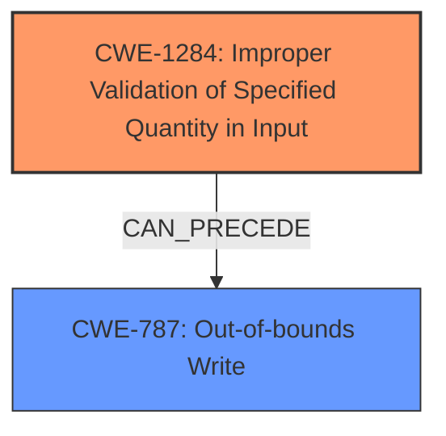

# Analysis Report for CVE-2025-23158

# Vulnerability Analysis Report: CVE-2025-23158

## Description

In the Linux kernel, the following vulnerability has been resolved media venus hfi add check to handle **incorrect queue size** qsize represents size of shared queued between driver and video firmware. Firmware can modify this value to an invalid large value. In such situation, empty_space will be bigger than the space actually available. Since new_wr_idx is not checked, so the following code will result in an **OOB write**. ... qsize = qhdr->q_size if (wr_idx >= rd_idx) empty_space = qsize - (wr_idx - rd_idx) .... if (new_wr_idx **OOB write** Add check to ensure qsize is within the allocated size while reading and writing packets into the queue.

## Vulnerability Description Key Phrases

- **Rootcause:** incorrect queue size
- **Weakness:** OOB write
- **Product:** Linux kernel
- **Component:** media venus hfi

## Analysis (with Relationship Data)

# Summary
| CWE ID | CWE Name | Confidence | CWE Abstraction Level | CWE Vulnerability Mapping Label | CWE-Vulnerability Mapping Notes |
|---|---|---|---|---|---|
| CWE-1284 | Improper Validation of Specified Quantity in Input | 0.8 | Base | Allowed | Primary CWE. The **incorrect queue size** is not validated, leading to an **OOB write**. |
| CWE-787 | Out-of-bounds Write | 0.7 | Base | Allowed | Secondary CWE. The direct result of the **incorrect queue size** is an **OOB Write**. |

## Evidence and Confidence

*   **Confidence Score:** 0.75
*   **Evidence Strength:** MEDIUM

## Relationship Analysis
The primary relationship is that **Improper Validation of Specified Quantity in Input (CWE-1284)** can lead to an **Out-of-bounds Write (CWE-787)**.
CWE-1284 is a cause, and CWE-787 is the effect.
CWE-1284 is a Base level CWE and CWE-787 is also a Base level CWE.



## Vulnerability Chain
1.  The vulnerability starts with an **incorrect queue size**.
2.  The **incorrect queue size** is not validated (**Improper Validation of Specified Quantity in Input (CWE-1284)**).
3.  This leads to an **OOB Write (CWE-787)**.

## Summary of Analysis
The vulnerability description clearly states that the root cause is an **incorrect queue size** that leads to an **OOB write**.
The **incorrect queue size** is not validated, so **CWE-1284 (Improper Validation of Specified Quantity in Input)** is the primary CWE.
The **OOB write** is a direct result of the **incorrect queue size**, so **CWE-787 (Out-of-bounds Write)** is a secondary CWE.
The retriever results also suggest **CWE-1284 (Improper Validation of Specified Quantity in Input)** and **CWE-787 (Out-of-bounds Write)** as potential CWEs.

The evidence that influenced the selection of CWE-1284 is:
"media venus hfi add check to handle **incorrect queue size** qsize represents size of shared queued between driver and video firmware. Firmware can modify this value to an invalid large value."

The evidence that influenced the selection of CWE-787 is:
"Since new_wr_idx is not checked, so the following code will result in an **OOB write**."

Other CWEs Considered:
*   CWE-190 (Integer Overflow or Wraparound): While an integer overflow *could* be involved in calculating the queue size, the primary issue is the lack of validation of the queue size itself.
*   CWE-789 (Memory Allocation with Excessive Size Value): This is similar to CWE-1284, but CWE-1284 is more specific to the quantity being provided as input.
*   CWE-1285 (Improper Validation of Specified Index, Position, or Offset in Input): The issue isn't that the *index* is invalid, but rather the *size* of the queue is invalid.

The selected CWEs are at the optimal level of specificity because they directly address the root cause (**incorrect queue size** not validated) and the resulting vulnerability (**OOB write**).


## CWE Relationship Analysis

Current CWEs represent these abstraction levels: .


### Vulnerability Chain Analysis

**Chain starting from CWE-1284:**
- 1284 (Improper Validation of Specified Quantity in Input) - ROOT


**Chain starting from CWE-787:**
- 787 (Out-of-bounds Write) - ROOT


### CWE Relationship Diagram

```mermaid
graph TD
    classDef primary fill:#f96,stroke:#333,stroke-width:2px
    classDef secondary fill:#69f,stroke:#333
    classDef tertiary fill:#9e9,stroke:#333
```


*Report generated on 2025-07-14 11:02:43*
