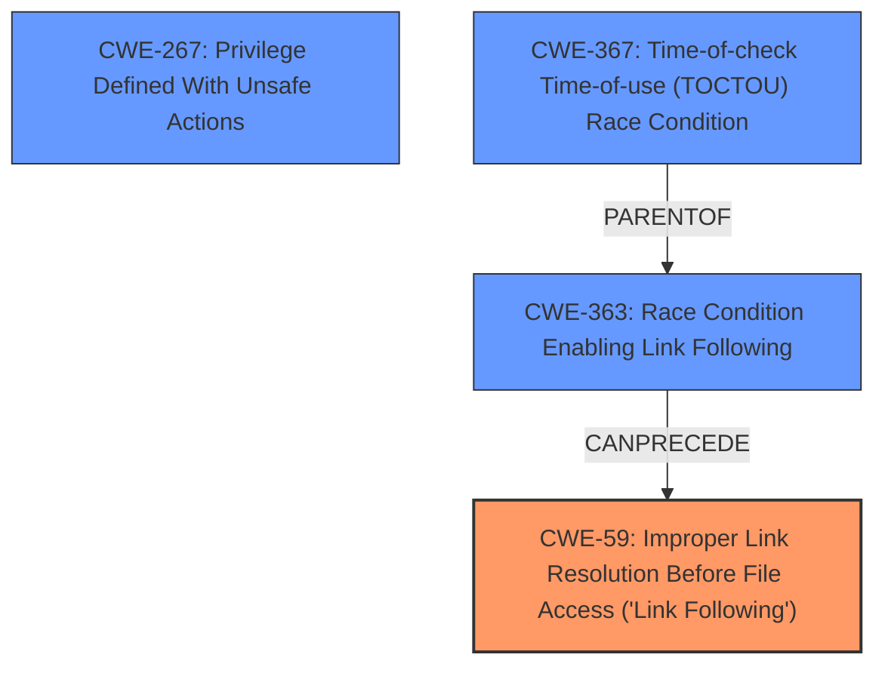

# Enhanced Analysis for CVE-2025-23394

# Summary
| CWE ID | CWE Name | Confidence | CWE Abstraction Level | CWE Vulnerability Mapping Label | CWE-Vulnerability Mapping Notes |
|---|---|---|---|---|---|
| CWE-59 | Improper Link Resolution Before File Access ('Link Following') | 0.9 | Base | Primary | Allowed |
| CWE-267 | Privilege Defined With Unsafe Actions | 0.7 | Base | Secondary | Allowed |
| CWE-367 | Time-of-check Time-of-use (TOCTOU) Race Condition | 0.6 | Base | Secondary | Allowed |

## Evidence and Confidence

*   **Confidence Score:** 0.8
*   **Evidence Strength:** HIGH

## Relationship Analysis
The primary CWE is CWE-59, which focuses on the improper handling of links. The vulnerability also involves a privilege escalation, suggesting CWE-267 (Privilege Defined With Unsafe Actions). A TOCTOU Race Condition (CWE-367) may occur if the link's target is checked before use, but changes before the actual operation.
The relationship to CWE-363 (Race Condition Enabling Link Following) is also relevant, as a race condition could enable the link following.



## Vulnerability Chain
1.  The `daily-backup.sh` script runs with root privileges.
2.  The script operates in directories controlled by the unprivileged "cyrus" user.
3.  The "cyrus" user can create symlinks within `/var/lib/imap`. (**CWE-59: Improper Link Resolution Before File Access ('Link Following')**)
4.  The backup script follows these symlinks, potentially leading to unintended file operations.
5.  The attacker escalates privileges from "cyrus" to root. (**CWE-267: Privilege Defined With Unsafe Actions**)
6.  A **Time-of-check Time-of-use (TOCTOU) Race Condition** may occur if the link's target is checked before use, but changes before the actual operation. (**CWE-367**)

## Summary of Analysis
The vulnerability involves a **UNIX Symbolic Link (Symlink) Following** issue where the "cyrus" user can manipulate symlinks that are then followed by a root-privileged script. The primary weakness is **CWE-59: Improper Link Resolution Before File Access ('Link Following')**, as the script **does not properly prevent that filename from identifying a link or shortcut that resolves to an unintended resource**. This leads to a privilege escalation, represented by **CWE-267: Privilege Defined With Unsafe Actions**, because a particular privilege, role, capability, or right can be used to perform unsafe actions that were not intended, even when it is assigned to the correct entity. Additionally, there's a potential for **CWE-367: Time-of-check Time-of-use (TOCTOU) Race Condition** if the link's target is checked before use, but changes before the actual operation.

The evidence supports the primary CWE because the CVE description clearly states a **UNIX Symbolic Link (Symlink) Following** vulnerability. The CVE Reference Links Content Summary confirms that the script operates in directories controlled by the unprivileged "cyrus" user, who can create symlinks, and the backup script follows them. The suggested fix also indicates that the service should run with "cyrus" privileges from the beginning.

Other CWEs considered but not used:

*   CWE-61: UNIX Symbolic Link (Symlink) Following - This is a compound CWE, and CWE-59 is more specific.
*   CWE-64: Windows Shortcut Following (.LNK) - This is specific to Windows shortcuts, not UNIX symlinks.
*   CWE-22: Improper Limitation of a Pathname to a Restricted Directory ('Path Traversal') - While path traversal could be a consequence, the root cause is the improper handling of links.


## CWE Relationship Analysis

Current CWEs represent these abstraction levels: .


### Vulnerability Chain Analysis

**Chain starting from CWE-22:**
- 22 (Improper Limitation of a Pathname to a Restricted Directory ('Path Traversal')) - ROOT


**Chain starting from CWE-59:**
- 59 (Improper Link Resolution Before File Access ('Link Following')) - ROOT


### CWE Relationship Diagram

```mermaid
graph TD
    classDef primary fill:#f96,stroke:#333,stroke-width:2px
    classDef secondary fill:#69f,stroke:#333
    classDef tertiary fill:#9e9,stroke:#333
```