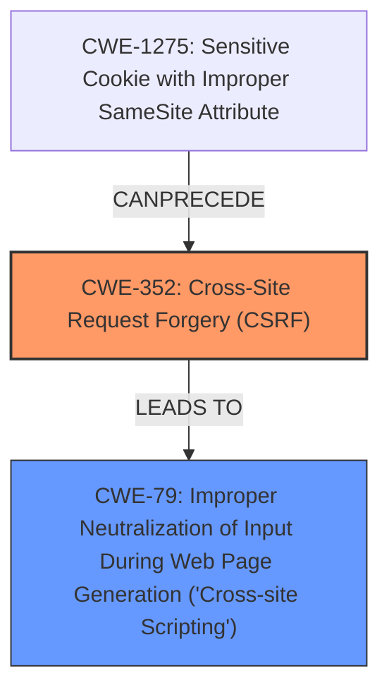

# Enhanced Analysis for CVE-2025-23659

# Summary
| CWE ID | CWE Name | Confidence | CWE Abstraction Level | CWE Vulnerability Mapping Label | CWE-Vulnerability Mapping Notes |
|---|---|---|---|---|---|
| CWE-352 | Cross-Site Request Forgery (CSRF) | 0.9 | Compound | Primary | Allowed |
| CWE-79 | Improper Neutralization of Input During Web Page Generation ('Cross-site Scripting') | 0.7 | Base | Secondary | Allowed |

## Evidence and Confidence

*   **Confidence Score:** 0.8
*   **Evidence Strength:** MEDIUM

## Relationship Analysis
The primary weakness is **CWE-352 [Cross-Site Request Forgery (CSRF)]**, which allows an attacker to force a user to perform actions against their will. The description also identifies the presence of **Stored XSS**, which is best represented by **CWE-79 [Improper Neutralization of Input During Web Page Generation ('Cross-site Scripting')]**. **CWE-352** can **CANFOLLOW** **CWE-1275 [Sensitive Cookie with Improper SameSite Attribute]**. There are no direct relationships between **CWE-352** and **CWE-79** but the **CSRF** leads to stored **XSS** which is the result of **improper neutralization of input**.



## Vulnerability Chain
The vulnerability chain starts with **CWE-352 [Cross-Site Request Forgery (CSRF)]**, which allows an attacker to force a user to perform actions against their will. One such action is to inject malicious input that is not properly neutralized leading to **CWE-79 [Improper Neutralization of Input During Web Page Generation ('Cross-site Scripting')]** i.e. **Stored XSS**.
  - **CWE-352**: Root cause, the attacker leverages CSRF to inject malicious code.
  - **CWE-79**: Impact, the injected code is not neutralized, leading to XSS.

## Summary of Analysis
Based on the information provided, the primary vulnerability is **CWE-352 [Cross-Site Request Forgery (CSRF)]**. The vulnerability description indicates a **cross-site request forgery** vulnerability. The *CVE Reference Links Content Summary* confirms that the WordPress MercadoLibre Integration Plugin is vulnerable to **Cross-Site Request Forgery (CSRF)** which allows a malicious actor to force higher privileged users to execute unwanted actions under their current authentication. The description mentions the presence of **Stored XSS**, so a secondary CWE is **CWE-79 [Improper Neutralization of Input During Web Page Generation ('Cross-site Scripting')]**.

The retriever results also suggest **CWE-79 [Improper Neutralization of Input During Web Page Generation ('Cross-site Scripting')]** and **CWE-352 [Cross-Site Request Forgery (CSRF)]** as potential CWEs with high scores.

Other CWEs considered but not used:
*   **CWE-918 [Server-Side Request Forgery (SSRF)]**: Not applicable, as there is no indication of the server making requests to unintended destinations.
*   **CWE-89 [Improper Neutralization of Special Elements used in an SQL Command ('SQL Injection')]**: Not applicable, as there is no indication of SQL injection.
*   **CWE-601 [URL Redirection to Untrusted Site ('Open Redirect')]**: Not applicable, as there is no indication of URL redirection.
*   **CWE-1004 [Sensitive Cookie Without 'HttpOnly' Flag]**: While cookies might be involved in CSRF, this is not the root cause.
*   **CWE-116 [Improper Encoding or Escaping of Output]**: **CWE-79** is more specific.
*   **CWE-1275 [Sensitive Cookie with Improper SameSite Attribute]**: While the SameSite attribute could mitigate CSRF, its absence is not the root cause.
*   **CWE-80 [Improper Neutralization of Script-Related HTML Tags in a Web Page (Basic XSS)]**: **CWE-79** is more general and applies to the description.
*   **CWE-184 [Incomplete List of Disallowed Inputs]**: Not directly applicable, as the main issue is CSRF leading to XSS, not an incomplete list of inputs.


## CWE Relationship Analysis

Current CWEs represent these abstraction levels: .


### Vulnerability Chain Analysis

**Chain starting from CWE-89:**
- 89 (Improper Neutralization of Special Elements used in an SQL Command ('SQL Injection')) - ROOT


**Chain starting from CWE-116:**
- 116 (Improper Encoding or Escaping of Output) - ROOT


### CWE Relationship Diagram

```mermaid
graph TD
    classDef primary fill:#f96,stroke:#333,stroke-width:2px
    classDef secondary fill:#69f,stroke:#333
    classDef tertiary fill:#9e9,stroke:#333
```