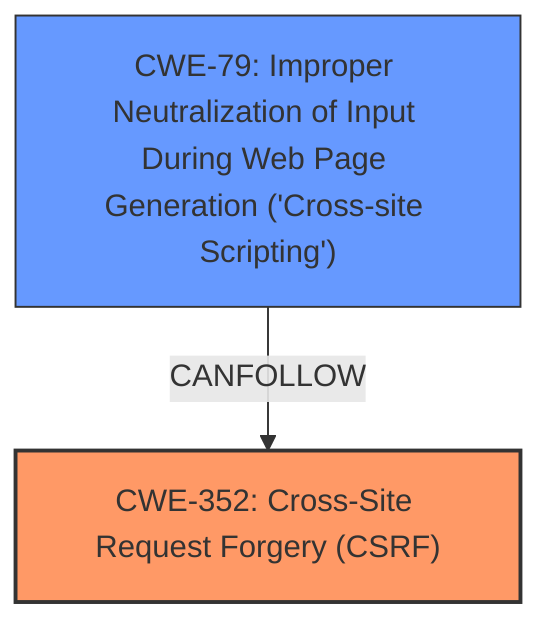

# Analysis for CVE-2025-23708

# Summary
| CWE ID | CWE Name | Confidence | CWE Abstraction Level | CWE Vulnerability Mapping Label | CWE-Vulnerability Mapping Notes |
|---|---|---|---|---|---|
| CWE-352 | Cross-Site Request Forgery (CSRF) | 1.0 | Compound | Allowed | Primary CWE |
| CWE-79 | Improper Neutralization of Input During Web Page Generation ('Cross-site Scripting') | 1.0 | Base | Allowed | Secondary Candidate |

## Evidence and Confidence

*   **Confidence Score:** 1.0
*   **Evidence Strength:** HIGH

## Relationship Analysis
The primary relationship is that CWE-352 [Cross-Site Request Forgery (CSRF)] can lead to other vulnerabilities such as CWE-79 [Improper Neutralization of Input During Web Page Generation ('Cross-site Scripting')] because a successful CSRF attack can allow an attacker to inject malicious scripts. CWE-352 is a compound weakness, while CWE-79 is a base weakness, which aligns with the identified root cause and potential impact.

## Vulnerability Chain
The vulnerability chain starts with the **Cross-Site Request Forgery (CSRF)** (**rootcause**), which allows an attacker to force a privileged user to perform unwanted actions. This can then be exploited to inject a **Stored XSS** (**weakness**), represented by CWE-79 [Improper Neutralization of Input During Web Page Generation ('Cross-site Scripting')]. The initial flaw is the lack of CSRF protection, leading to the XSS vulnerability due to improper neutralization of input.

## Summary of Analysis
The primary CWE is CWE-352 [Cross-Site Request Forgery (CSRF)] because the vulnerability description and the CVE Reference Links Content Summary clearly state that the **rootcause** of the vulnerability is **Cross-Site Request Forgery (CSRF)**. The **Cross-Site Request Forgery (CSRF)** allows a malicious actor to force higher privileged users to execute unwanted actions which results in **Stored XSS, cross-site scripting**. The retriever results also listed CWE-352 [Cross-Site Request Forgery (CSRF)] as a candidate. The vulnerability is described as a **Cross-Site Request Forgery (CSRF)** vulnerability that allows **Stored XSS**. This aligns with the description of CWE-352 [Cross-Site Request Forgery (CSRF)], which involves forcing users to perform actions they did not intend to perform. The description also mentions that a malicious actor can force higher privileged users to execute unwanted actions under their current authentication. CWE-79 [Improper Neutralization of Input During Web Page Generation ('Cross-site Scripting')] is also relevant because the **Cross-Site Request Forgery (CSRF)** can be exploited to inject a stored XSS due to improper neutralization of input.

CWE-89 [Improper Neutralization of Special Elements used in an SQL Command ('SQL Injection')], CWE-918 [Server-Side Request Forgery (SSRF)], CWE-601 [URL Redirection to Untrusted Site ('Open Redirect')], CWE-1004 [Sensitive Cookie Without 'HttpOnly' Flag], CWE-116 [Improper Encoding or Escaping of Output], CWE-1275 [Sensitive Cookie with Improper SameSite Attribute], CWE-80 [Improper Neutralization of Script-Related HTML Tags in a Web Page (Basic XSS)], and CWE-494 [Download of Code Without Integrity Check] were considered but ultimately not chosen as primary CWEs because the vulnerability description and CVE Reference Links Content Summary focused on **Cross-Site Request Forgery (CSRF)** as the **rootcause**.