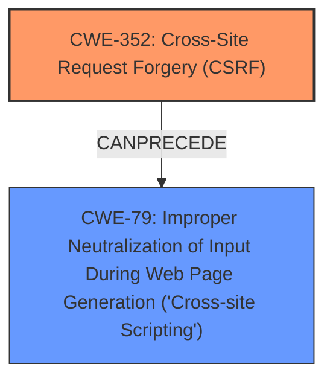

# Analysis for CVE-2025-23712

# Summary
| CWE ID | CWE Name | Confidence | CWE Abstraction Level | CWE Vulnerability Mapping Label | CWE-Vulnerability Mapping Notes |
|---|---|---|---|---|---|
| CWE-352 | Cross-Site Request Forgery (CSRF) | 1.0 | Compound | Primary | Allowed |
| CWE-79 | Improper Neutralization of Input During Web Page Generation ('Cross-site Scripting') | 0.75 | Base | Secondary | Allowed |

## Evidence and Confidence

*   **Confidence Score:** 0.85
*   **Evidence Strength:** HIGH

## Relationship Analysis
The primary relationship is that CWE-352 [Cross-Site Request Forgery (CSRF)] can lead to other vulnerabilities like Cross-Site Scripting (XSS). Although XSS is mentioned as an impact, the root cause is the **CSRF** vulnerability itself.

## Vulnerability Chain
The vulnerability chain starts with a **weakness in Kapost** concerning **Cross-Site Request Forgery (CSRF)**, which allows a malicious actor to force higher privileged users to execute unwanted actions. This leads to Stored XSS. Therefore:
1.  The Root Cause: **CWE-352** [Cross-Site Request Forgery (CSRF)]
2.  Impact: **CWE-79** [Improper Neutralization of Input During Web Page Generation ('Cross-site Scripting')]

## Summary of Analysis
Initially, the description indicated a **weakness in Kapost** regarding **Cross-Site Request Forgery (CSRF)**, resulting in Stored XSS. The primary focus was to identify the root cause, which is the **CSRF** vulnerability.

The evidence provided explicitly states, "The Kapost WordPress plugin versions less than or equal to 2.2.9 are vulnerable to Cross Site Request Forgery (CSRF)."

**CWE-352** [Cross-Site Request Forgery (CSRF)] is selected as the primary CWE because the description explicitly mentions it and the reference links confirm it as the root cause. The **CSRF** allows "a malicious actor to force higher privileged users to execute unwanted actions," which is a direct characteristic of the **CWE-352** [Cross-Site Request Forgery (CSRF)] weakness.

**CWE-79** [Improper Neutralization of Input During Web Page Generation ('Cross-site Scripting')] is selected as a secondary CWE because the **CSRF** leads to Stored XSS.

The selection of **CWE-352** [Cross-Site Request Forgery (CSRF)] is at the Compound level because it is a composite of multiple weaknesses that must all occur simultaneously. The selection of **CWE-79** [Improper Neutralization of Input During Web Page Generation ('Cross-site Scripting')] is at the Base level because it is a general type of Cross-Site Scripting.

**CWEs Considered But Not Used:**

*   CWE-89 [Improper Neutralization of Special Elements used in an SQL Command ('SQL Injection')], CWE-601 [URL Redirection to Untrusted Site ('Open Redirect')], CWE-918 [Server-Side Request Forgery (SSRF)], and CWE-434 [Unrestricted Upload of File with Dangerous Type] were considered but not used because they are not directly supported by the vulnerability description.