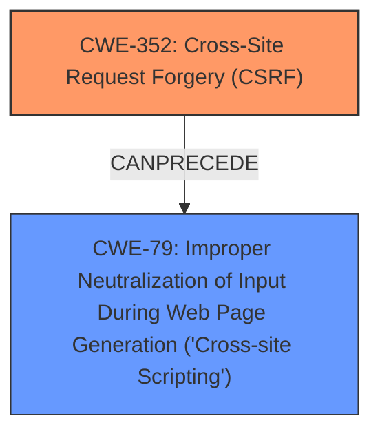

# Enhanced Analysis for CVE-2025-23875

# Summary
| CWE ID | CWE Name | Confidence | CWE Abstraction Level | CWE Vulnerability Mapping Label | CWE-Vulnerability Mapping Notes |
|---|---|---|---|---|---|
| CWE-352 | Cross-Site Request Forgery (CSRF) | 0.9 | Compound | Primary | Allowed |
| CWE-79 | Improper Neutralization of Input During Web Page Generation ('Cross-site Scripting') | 0.8 | Base | Secondary | Allowed |

## Evidence and Confidence

*   **Confidence Score:** 0.85
*   **Evidence Strength:** MEDIUM

## Relationship Analysis
The primary weakness is identified as CWE-352 [Cross-Site Request Forgery (CSRF)], which can **precede** CWE-79 [Improper Neutralization of Input During Web Page Generation ('Cross-site Scripting')] in a vulnerability chain, as a successful CSRF attack can lead to stored XSS.



## Vulnerability Chain
The vulnerability chain begins with the **rootcause** of CWE-352 [Cross-Site Request Forgery (CSRF)]. An attacker leverages this vulnerability to force a higher-privileged user to perform unwanted actions. If the application **fails to neutralize input properly**, this can lead to the injection of malicious scripts, resulting in CWE-79 [Improper Neutralization of Input During Web Page Generation ('Cross-site Scripting')] (Stored XSS). Thus, CSRF is the **rootcause**, and XSS is the exploitable weakness.

## Summary of Analysis
The analysis is based on the vulnerability description and CVE reference. The description explicitly mentions **Cross-Site Request Forgery** as the **rootcause** and **Stored XSS** as the resulting weakness. The CVE reference confirms that the WordPress Better Protected Pages Plugin is vulnerable to CSRF, allowing a malicious actor to force higher privileged users to execute unwanted actions. Because the actions are unwanted due to the CSRF vulnerability, this can allow an attacker to introduce Cross-Site Scripting.

The graph relationships show that CWE-352 [Cross-Site Request Forgery (CSRF)] can **precede** CWE-79 [Improper Neutralization of Input During Web Page Generation ('Cross-site Scripting')]. This aligns with the vulnerability description, where the CSRF vulnerability is exploited to achieve Stored XSS.

The selected CWEs are at the optimal level of specificity because CWE-352 [Cross-Site Request Forgery (CSRF)] directly addresses the **rootcause**, and CWE-79 [Improper Neutralization of Input During Web Page Generation ('Cross-site Scripting')] accurately represents the Stored XSS weakness.

Relevant CWE Information:

# Enhanced Context (25 CWEs)
The following CWEs were identified as potentially relevant to this vulnerability:

## CWE-352: Cross-Site Request Forgery (CSRF)
**Abstraction Level**: Compound
**Similarity Score**: 0.78
**Source**: dense

**Description**:
The web application does not, or can not, sufficiently verify whether a well-formed, valid, consistent request was intentionally provided by the user who submitted the request.

**Mapping Guidance**:
- Usage: Allowed
- Rationale: This is a well-known Composite of multiple weaknesses that must all occur simultaneously, although it is attack-oriented in nature.

*Technical Explanation:*
CWE-352 [Cross-Site Request Forgery (CSRF)] occurs when a web application does not adequately verify that a request was intentionally initiated by the user. This allows an attacker to craft malicious requests that a legitimate user unknowingly executes, leading to unintended actions on the user's behalf.
*Security Implications:*
Successful exploitation of CWE-352 [Cross-Site Request Forgery (CSRF)] can lead to unauthorized modifications, data theft, or complete account compromise.
*Relationship Analysis:*
CWE-352 [Cross-Site Request Forgery (CSRF)] is a compound weakness, indicating that it involves multiple contributing factors. It can also **precede** other vulnerabilities like CWE-79 [Improper Neutralization of Input During Web Page Generation ('Cross-site Scripting')] if the forged request results in the injection of malicious code.
*Mapping Guidance Analysis:*
The MITRE mapping guidance allows the use of CWE-352 [Cross-Site Request Forgery (CSRF)], despite its compound nature, due to its widespread recognition and the simultaneous occurrence of its constituent weaknesses.
*Mitigation Analysis:*
Mitigation for CWE-352 [Cross-Site Request Forgery (CSRF)] involves implementing anti-CSRF tokens, proper request verification, and ensuring that sensitive actions require user confirmation.
*Evidence:*
"**Cross-Site Request Forgery** (CSRF) vulnerability in Tim Ridgway Better Protected Pages allows Stored XSS." and "The WordPress Better Protected Pages Plugin <= 1.0 is vulnerable to Cross Site Request Forgery (CSRF)." The CVE Reference Links Content Summary states "Cross Site Request Forgery (CSRF) - allows a malicious actor to force higher privileged users to execute unwanted actions under their current authentication."
*Justification:*
CWE-352 [Cross-Site Request Forgery (CSRF)] is the primary CWE because the vulnerability description explicitly identifies it as the **rootcause**. Confidence is high (0.9) due to the direct mention and supporting evidence.

## CWE-79: Improper Neutralization of Input During Web Page Generation ('Cross-site Scripting')
**Abstraction Level**: Base
**Similarity Score**: 0.71
**Source**: dense

**Description**:
The product does not neutralize or incorrectly neutralizes user-controllable input before it is placed in output that is used as a web page that is served to other users.

*Technical Explanation:*
CWE-79 [Improper Neutralization of Input During Web Page Generation ('Cross-site Scripting')] occurs when user-supplied input is not properly sanitized or encoded before being included in a web page. This allows an attacker to inject malicious scripts that are then executed by other users' browsers.
*Security Implications:*
Exploitation of CWE-79 [Improper Neutralization of Input During Web Page Generation ('Cross-site Scripting')] can lead to data theft, session hijacking, or defacement of the web page.
*Relationship Analysis:*
CWE-79 [Improper Neutralization of Input During Web Page Generation ('Cross-site Scripting')] is a base weakness that can be a consequence of other vulnerabilities or a standalone issue. It is often **preceded** by vulnerabilities that allow an attacker to inject data into the application, such as CWE-352 [Cross-Site Request Forgery (CSRF)].
*Mapping Guidance Analysis:*
The MITRE mapping guidance allows the use of CWE-79 [Improper Neutralization of Input During Web Page Generation ('Cross-site Scripting')] as a base weakness.
*Mitigation Analysis:*
Mitigation for CWE-79 [Improper Neutralization of Input During Web Page Generation ('Cross-site Scripting')] involves properly encoding output, sanitizing input, and using context-aware escaping techniques.
*Evidence:*
"**Cross-Site Request Forgery** (CSRF) vulnerability in Tim Ridgway Better Protected Pages allows Stored XSS." The vulnerability description explicitly states that the CSRF vulnerability leads to "Stored XSS", which is a variant of XSS.
*Justification:*
CWE-79 [Improper Neutralization of Input During Web Page Generation ('Cross-site Scripting')] is a secondary CWE because the vulnerability description explicitly mentions that the CSRF leads to "Stored XSS". The **weakness** is **Stored XSS**. Confidence is high (0.8) because the vulnerability states it leads to Stored XSS.

## Other CWEs Considered and Rejected:

*   CWE-89 [Improper Neutralization of Special Elements used in an SQL Command ('SQL Injection')]: While SQL Injection is a common web vulnerability, there's no evidence in the description to suggest its presence.
*   CWE-601 [URL Redirection to Untrusted Site ('Open Redirect')]: There is no mention of URL redirection in the vulnerability description.
*   CWE-425 [Direct Request ('Forced Browsing')]: While related to authorization, it doesn't capture the CSRF aspect of the vulnerability.
*   CWE-918 [Server-Side Request Forgery (SSRF)]: There is no mention of server-side requests in the vulnerability description.
*   CWE-80 [Improper Neutralization of Script-Related HTML Tags in a Web Page (Basic XSS)]: CWE-79 [Improper Neutralization of Input During Web Page Generation ('Cross-site Scripting')] is a better fit because it is at the base level of abstraction and XSS is a common result of a CSRF attack.


## CWE Relationship Analysis

Current CWEs represent these abstraction levels: .


### Vulnerability Chain Analysis

**Chain starting from CWE-89:**
- 89 (Improper Neutralization of Special Elements used in an SQL Command ('SQL Injection')) - ROOT


**Chain starting from CWE-80:**
- 80 (Improper Neutralization of Script-Related HTML Tags in a Web Page (Basic XSS)) - ROOT


### CWE Relationship Diagram

```mermaid
graph TD
    classDef primary fill:#f96,stroke:#333,stroke-width:2px
    classDef secondary fill:#69f,stroke:#333
    classDef tertiary fill:#9e9,stroke:#333
```