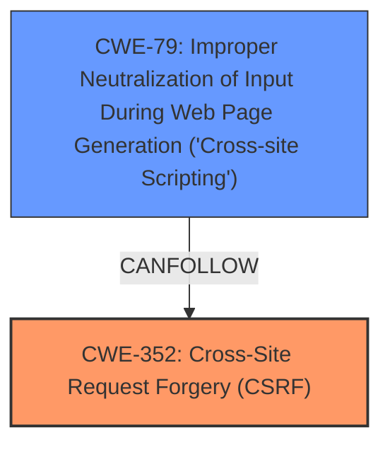

# Enhanced Analysis for CVE-2025-23976

# Summary
| CWE ID | CWE Name | Confidence | CWE Abstraction Level | CWE Vulnerability Mapping Label | CWE-Vulnerability Mapping Notes |
|---|---|---|---|---|---|
| CWE-352 | Cross-Site Request Forgery (CSRF) | 0.9 | Compound | Primary CWE | Allowed |
| CWE-79 | Improper Neutralization of Input During Web Page Generation ('Cross-site Scripting') | 0.8 | Base | Secondary Candidate | Allowed |

## Evidence and Confidence

*   **Confidence Score:** 0.85
*   **Evidence Strength:** MEDIUM

## Relationship Analysis
The primary relationship that influenced the decision was the direct identification of **Cross-Site Request Forgery (CSRF)** as the root cause in both the vulnerability description and the CVE Reference Links Content Summary. The **Cross-site Scripting (XSS)** vulnerability is a secondary effect of the **CSRF**, which could be exploited to achieve the **XSS**. **Cross-Site Request Forgery (CSRF)** can lead to other vulnerabilities; however, the **Improper Neutralization of Input During Web Page Generation ('Cross-site Scripting')** is the most relevant.



## Vulnerability Chain
The vulnerability chain starts with **Cross-Site Request Forgery (CSRF)**. A successful **CSRF** attack allows an attacker to force a user to perform actions they did not intend to. In this case, the vulnerability allows for Stored **XSS**, meaning the attacker can inject malicious scripts that are then stored on the server and executed by other users. Thus the chain of weaknesses is:
1.  **CWE-352** **Cross-Site Request Forgery (CSRF)**
2.  **CWE-79** Improper Neutralization of Input During Web Page Generation ('Cross-site Scripting')

## Summary of Analysis
The initial analysis identified **CWE-352** **Cross-Site Request Forgery (CSRF)** as the primary **rootcause** due to its explicit mention in the vulnerability description and CVE reference summary. The description states "Cross-Site Request Forgery (CSRF) vulnerability in Pedro Marcelo Issuu Panel allows Stored XSS." This clearly indicates that the **CSRF** is the underlying issue that enables the **XSS**.

The **CSRF** vulnerability allows an attacker to force a higher-privileged user to perform unwanted actions. This can lead to the injection of malicious scripts, resulting in **Cross-site Scripting (XSS)**. The evidence from the CVE Reference Links Content Summary further supports this: "The Issuu Panel plugin is vulnerable to Cross Site Request Forgery (CSRF)...allows a malicious actor to force higher privileged users to execute unwanted actions under their current authentication."

The Retriever Results also list **CWE-79** Improper Neutralization of Input During Web Page Generation ('Cross-site Scripting') as a potential match. Since the vulnerability allows for stored **XSS**, **CWE-79** is included as a secondary candidate.

The selected CWEs are at the optimal level of specificity. **CWE-352** is a Compound weakness that accurately represents the nature of a **CSRF** vulnerability. **CWE-79** is a Base level weakness that precisely captures the **XSS** aspect of the vulnerability.

Relevant CWE Information:

# Enhanced Context (25 CWEs)
The following CWEs were identified as potentially relevant to this vulnerability:

## CWE-352: Cross-Site Request Forgery (CSRF)
**Abstraction Level**: Compound
**Similarity Score**: 0.73
**Source**: dense

**Description**:
The web application does not, or can not, sufficiently verify whether a well-formed, valid, consistent request was intentionally provided by the user who submitted the request.

**Mapping Guidance**:
- Usage: Allowed
- Rationale: This is a well-known Composite of multiple weaknesses that must all occur simultaneously, although it is attack-oriented in nature.

## CWE-79: Improper Neutralization of Input During Web Page Generation ('Cross-site Scripting')
**Abstraction Level**: Base
**Similarity Score**: 0.72
**Source**: dense

**Description**:
The product does not neutralize or incorrectly neutralizes user-controllable input before it is placed in output that is used as a web page that is served to other users.

**Mapping Guidance**:
- Usage: Allowed
- Rationale: This CWE entry is at the Base level of abstraction, which is a preferred level of abstraction for mapping to the root causes of vulnerabilities.


## CWE Relationship Analysis

Current CWEs represent these abstraction levels: .


### Vulnerability Chain Analysis

**Chain starting from CWE-352:**
- 352 (Cross-Site Request Forgery (CSRF)) - ROOT


**Chain starting from CWE-79:**
- 79 (Improper Neutralization of Input During Web Page Generation ('Cross-site Scripting')) - ROOT


### CWE Relationship Diagram

```mermaid
graph TD
    classDef primary fill:#f96,stroke:#333,stroke-width:2px
    classDef secondary fill:#69f,stroke:#333
    classDef tertiary fill:#9e9,stroke:#333
```