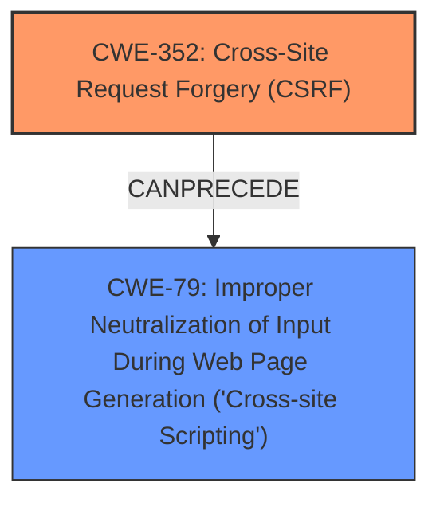

# Raw Analyzer Response for CVE-2025-23977

# Summary
| CWE ID | CWE Name | Confidence | CWE Abstraction Level | CWE Vulnerability Mapping Label | CWE-Vulnerability Mapping Notes |
|---|---|---|---|---|---|
| CWE-352 | Cross-Site Request Forgery (CSRF) | 0.9 | Compound | Primary | Allowed |
| CWE-79 | Improper Neutralization of Input During Web Page Generation ('Cross-site Scripting') | 0.9 | Base | Secondary | Allowed |

## Evidence and Confidence

*   **Confidence Score:** 0.9
*   **Evidence Strength:** HIGH

## Relationship Analysis
The primary weakness is **CWE-352: Cross-Site Request Forgery (CSRF)**, which allows an attacker to induce a user to perform actions they did not intend. In this case, the CSRF vulnerability allows for Stored **XSS (CWE-79: Improper Neutralization of Input During Web Page Generation ('Cross-site Scripting'))**. This is a compound weakness, where the CSRF vulnerability is the root cause, and the XSS is the exploitable impact.

## Vulnerability Chain
The vulnerability chain starts with a **CWE-352: Cross-Site Request Forgery (CSRF)** vulnerability. Because of the lack of CSRF protection, an attacker can trick an authenticated user into performing actions, such as injecting malicious scripts. This leads to **CWE-79: Improper Neutralization of Input During Web Page Generation ('Cross-site Scripting')**, resulting in stored XSS.

## Summary of Analysis
The vulnerability description clearly states a "Cross-Site Request Forgery (CSRF) vulnerability in Bhaskar Dhote Post Carousel Slider allows Stored XSS." The key phrase identifies **CSRF** as the **rootcause** and **XSS** as the **weakness**. The CVE reference summary confirms the **CSRF** vulnerability and the impact of an attacker forcing higher-privileged users to execute unwanted actions.

The Retriever Results list **CWE-79** and **CWE-352** as the top candidates. **CWE-352** is selected as the primary CWE because it is the **rootcause**, enabling the **XSS** vulnerability. **CWE-79** is selected as a secondary CWE because it represents the specific type of vulnerability that is exploited due to the **CSRF**.

The confidence level is high (0.9) because the evidence directly supports the presence of both **CSRF** and **XSS**. The abstraction levels (Compound for **CWE-352** and Base for **CWE-79**) are appropriate for representing the nature of each weakness.