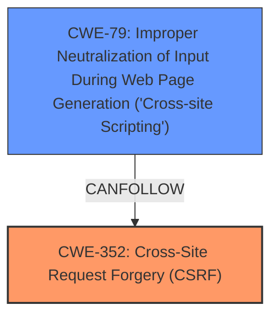

# Raw Analyzer Response for CVE-2025-23978

# Summary
| CWE ID | CWE Name | Confidence | CWE Abstraction Level | CWE Vulnerability Mapping Label | CWE-Vulnerability Mapping Notes |
|---|---|---|---|---|---|
| CWE-352 | Cross-Site Request Forgery (CSRF) | 1.0 | Compound | Allowed | Primary CWE |
| CWE-79 | Improper Neutralization of Input During Web Page Generation ('Cross-site Scripting') | 0.7 | Base | Allowed | Secondary Candidate |

## Evidence and Confidence

*   **Confidence Score:** 0.85
*   **Evidence Strength:** HIGH

## Relationship Analysis
The primary relationship influencing the decision is the direct identification of **Cross-Site Request Forgery (CSRF)** as the root cause. The secondary relationship considered is the resulting Stored XSS, which is a consequence of the CSRF vulnerability. CWE-352 is a compound weakness, representing a combination of factors leading to the vulnerability, while CWE-79 is a base weakness that represents the impact of the **improper neutralization of input**.

## Vulnerability Chain
The vulnerability chain starts with the **Cross-Site Request Forgery (CSRF) vulnerability (CWE-352)**, allowing a malicious actor to force higher-privileged users to execute unwanted actions. This leads to **Stored XSS (CWE-79)**, where the injected script is persistently stored on the server and executed when other users view the affected content.
  - **CWE-352**: Root Cause - **Cross-Site Request Forgery (CSRF)** allows unauthorized actions.
  - **CWE-79**: Impact - **Improper Neutralization of Input** leads to Stored XSS.

## Summary of Analysis
The initial analysis identified CWE-352 as the primary vulnerability based on the description explicitly stating "Cross-Site Request Forgery (CSRF) vulnerability". The secondary consideration was the resulting "Stored XSS", which is a consequence of the CSRF, leading to CWE-79. The retriever results and graph relationships supported this conclusion.

The selection of CWE-352 as the primary weakness is based on the fact that the vulnerability description specifically mentions **Cross-Site Request Forgery** as the root cause. The CVE Reference Links Content Summary also confirms this, stating that the WordPress FlashCounter Plugin is vulnerable to **Cross-Site Request Forgery (CSRF)**. This provides strong evidence for classifying the vulnerability as CWE-352.

The selection of CWE-79 is because the CSRF leads to stored XSS.

The selected CWEs are at the optimal level of specificity because CWE-352 accurately represents the **Cross-Site Request Forgery** root cause, and CWE-79 represents the resulting XSS.

Relevant CWE Information:

# Enhanced Context (25 CWEs)
The following CWEs were identified as potentially relevant to this vulnerability:

## CWE-352: Cross-Site Request Forgery (CSRF)
**Abstraction Level**: Compound
**Similarity Score**: 0.73
**Source**: dense

**Description**:
The web application does not, or can not, sufficiently verify whether a well-formed, valid, consistent request was intentionally provided by the user who submitted the request.

**Mapping Guidance**:
- Usage: Allowed
- Rationale: This is a well-known Composite of multiple weaknesses that must all occur simultaneously, although it is attack-oriented in nature.

## CWE-79: Improper Neutralization of Input During Web Page Generation ('Cross-site Scripting')
**Abstraction Level**: Base
**Similarity Score**: 0.69
**Source**: dense

**Description**:
The product does not neutralize or incorrectly neutralizes user-controllable input before it is placed in output that is used as a web page that is served to other users.

**Mapping Guidance**:
- Usage: Allowed
- Rationale: This CWE entry is at the Base level of abstraction, which is a preferred level of abstraction for mapping to the root causes of vulnerabilities.