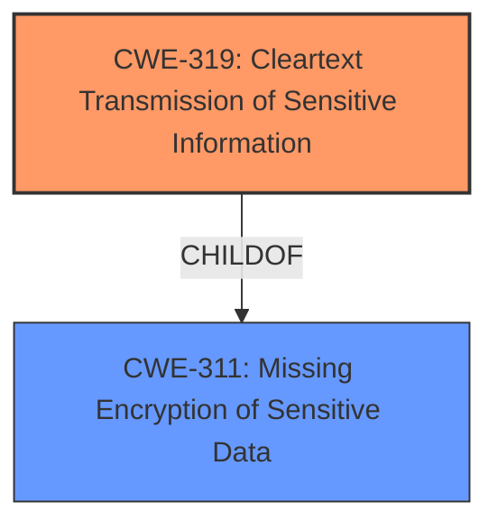

# Analysis for CVE-2025-24008

# Summary

| CWE ID  | CWE Name                                            | Confidence | CWE Abstraction Level | CWE Vulnerability Mapping Label | CWE-Vulnerability Mapping Notes |
| :-------- | :-------------------------------------------------- | :--------- | :---------------------- | :------------------------------ | :------------------------------ |
| CWE-319 | Cleartext Transmission of Sensitive Information | 1.0      | Base                    | Primary                         | Allowed                       |

## Evidence and Confidence

*   **Confidence Score:** 1.0
*   **Evidence Strength:** HIGH

## Relationship Analysis
The primary weakness is the **Cleartext Transmission of Sensitive Information (CWE-319)**. CWE-319 is a base level CWE, which is preferred. CWE-311 **(Missing Encryption of Sensitive Data)** is a parent of CWE-319 but is not the best choice since it is a class and discouraged.

## Vulnerability Chain
The chain of events is as follows:
1.  **Root Cause:** The system **does not encrypt data in transit**, leading to
2.  **Weakness:** Cleartext Transmission of Sensitive Information (CWE-319)
3.  **Impact:** An attacker can eavesdrop and retrieve sensitive information, including obfuscated safety passwords.

## Summary of Analysis
The primary issue is the lack of encryption for data transmitted by the affected devices. The **Vulnerability Description** clearly states that the devices **"do not encrypt data in transit"**. The **CVE Reference Links Content Summary** states, "The affected devices do not encrypt data in transit". This leads directly to CWE-319 **(Cleartext Transmission of Sensitive Information)**. The retriever results listed CWE-319 as the second highest, and the CWE is a base level CWE which is preferrable.

Relevant CWE Information:

# Enhanced Context (25 CWEs)
The following CWEs were identified as potentially relevant to this vulnerability:

## CWE-311: Missing Encryption of Sensitive Data
**Abstraction Level**: Class
**Similarity Score**: 0.77
**Source**: dense

**Description**:
The product does not encrypt sensitive or critical information before storage or transmission.

**Mapping Guidance**:
- Usage: Discouraged
- Rationale: CWE-311 is high-level with more precise children available. It is a level-1 Class (i.e., a child of a Pillar).

## CWE-319: Cleartext Transmission of Sensitive Information
**Abstraction Level**: Base
**Similarity Score**: 0.73
**Source**: dense

**Description**:
The product transmits sensitive or security-critical data in cleartext in a communication channel that can be sniffed by unauthorized actors.

**Mapping Guidance**:
- Usage: Allowed
- Rationale: This CWE entry is at the Base level of abstraction, which is a preferred level of abstraction for mapping to the root causes of vulnerabilities.