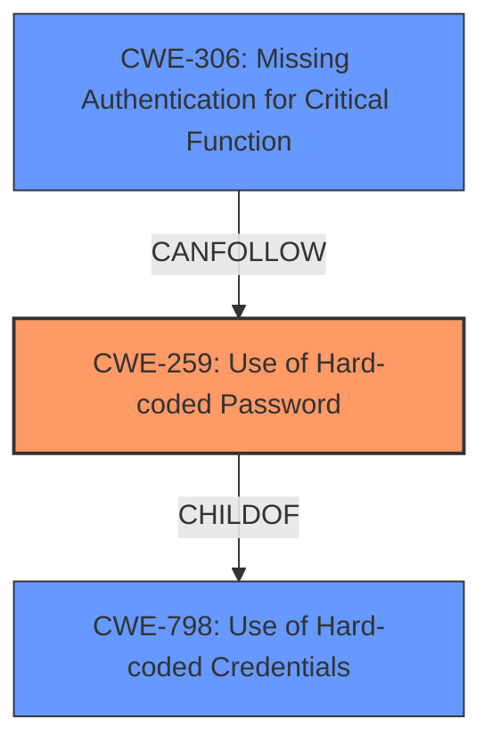

# Analysis for CVE-2025-2402

# Summary
| CWE ID | CWE Name | Confidence | CWE Abstraction Level | CWE Vulnerability Mapping Label | CWE-Vulnerability Mapping Notes |
|---|---|---|---|---|---|
| CWE-259 | Use of Hard-coded Password | 1.0 | Variant | Allowed | Primary CWE. Directly reflects the **root cause** identified in the vulnerability description and CVE details. |
| CWE-306 | Missing Authentication for Critical Function | 0.7 | Base | Allowed | Secondary CWE. While the primary issue is the hardcoded password, the impact reveals a lack of proper authentication mechanisms, making this relevant. |

## Evidence and Confidence

*   **Confidence Score:** 0.9
*   **Evidence Strength:** HIGH

## Relationship Analysis
The primary CWE is CWE-259 (Use of Hard-coded Password), which is a Variant of CWE-798 (Use of Hard-coded Credentials). CWE-798 is, in turn, a parent of both CWE-259 and CWE-321 (Use of Hard-coded Cryptographic Key). The relationship between CWE-259 and CWE-306 is more complex. CWE-306 (Missing Authentication for Critical Function) can be a consequence of using hardcoded credentials, as the system might rely solely on these credentials for authentication, neglecting proper authentication mechanisms. This creates a chain where the hardcoded password (CWE-259) leads to missing authentication (CWE-306) and subsequent unauthorized access.

## Vulnerability Chain
The vulnerability chain starts with the **hard-coded non-random password** (CWE-259). This allows an unauthenticated remote attacker to bypass authentication, effectively resulting in **Missing Authentication for Critical Function** (CWE-306). The attacker can then read and manipulate swapped jobs, read and manipulate in- and output data of active jobs, or cause a denial-of-service.

CWE-259 (Root Cause) -> CWE-306 (Missing Authentication) -> Impact (Data Manipulation, DoS)

## Summary of Analysis
The primary focus is on the **hard-coded password**, making CWE-259 the most appropriate primary CWE. The "CVE Reference Links Content Summary" explicitly identifies "A **hard-coded**, non-random password" as the **root cause of the vulnerability**. The impact described in the vulnerability description aligns with the consequences of using a **hard-coded password**, further reinforcing this choice.

CWE-306 is included as a secondary CWE because the vulnerability enables an attacker to perform actions without proper authentication. This is a direct consequence of the **hard-coded password**, where the system essentially bypasses standard authentication procedures. The relationship analysis highlights this dependency.

Other CWEs were considered but deemed less appropriate. For example, CWE-287 (Improper Authentication) is a higher-level class and doesn't capture the specific weakness of using a hardcoded password. CWE-321 (Use of Hard-coded Cryptographic Key) is similar but less accurate because the vulnerability description explicitly mentions a password.

The final selection of CWE-259 and CWE-306 offers the optimal level of specificity by addressing both the **root cause** (hardcoded password) and a significant consequence (missing authentication).