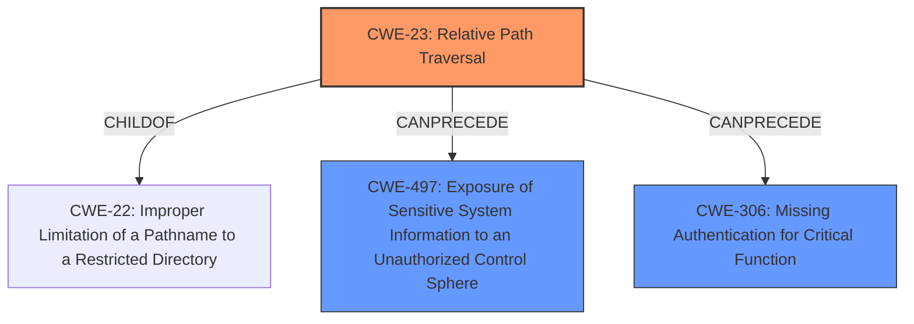

# Enhanced Analysis for CVE-2025-24030

# Summary
| CWE ID | CWE Name | Confidence | CWE Abstraction Level | CWE Vulnerability Mapping Label | CWE-Vulnerability Mapping Notes |
|---|---|---|---|---|---|
| CWE-23 | Relative Path Traversal | 1.0 | Base | Allowed | Primary CWE: The vulnerability is caused by the product's failure to properly neutralize sequences that can resolve to a location outside of the restricted directory. |
| CWE-497 | Exposure of Sensitive System Information to an Unauthorized Control Sphere | 0.7 | Base | Allowed | Secondary Candidate: The **path traversal** leads to the exposure of the Envoy configuration, which may contain sensitive data.|
| CWE-306 | Missing Authentication for Critical Function | 0.6 | Base | Allowed | Secondary Candidate: Executing Envoy Admin interface commands allows an attacker to terminate the Envoy process.|

## Evidence and Confidence

*   **Confidence Score:** 0.85
*   **Evidence Strength:** HIGH

## Relationship Analysis
The primary CWE is CWE-23, Relative Path Traversal, which is a base-level CWE. This is because the root cause of the vulnerability is the **improper neutralization** of path traversal sequences. CWE-23 is related to CWE-22, Improper Limitation of a Pathname to a Restricted Directory ('Path Traversal'), as CWE-23 is a specific type of CWE-22. CWE-497 is a Class level CWE which results from the Path Traversal Attack.



## Vulnerability Chain
The vulnerability chain starts with the **path traversal vulnerability** (CWE-23). This allows the attacker to execute Envoy Admin interface commands, leading to two potential impacts: termination of the Envoy process (CWE-306) and extraction of the Envoy configuration (CWE-497).

## Summary of Analysis
The initial assessment identified CWE-23 as the primary weakness due to the **path traversal vulnerability**. The `github.com_d9ebcbed_20250624_191239.html` content explicitly mentions a **path traversal attack** as the root cause. The vulnerability allows the execution of Envoy Admin interface commands, leading to potential impacts such as termination of the Envoy process and extraction of the Envoy configuration. The Retriever Results also listed CWE-23 and CWE-22 as high-scoring candidates.

The relationship graph shows that CWE-23 can precede CWE-497 and CWE-306. The abstraction level of CWE-23 is Base, which is the preferred level for mapping root causes.

CWE-22 was considered but not selected as the primary CWE because CWE-23, Relative Path Traversal, is a more specific type of CWE-22.

Relevant CWE Information:
# Enhanced Context (25 CWEs)
The following CWEs were identified as potentially relevant to this vulnerability:

## CWE-497: Exposure of Sensitive System Information to an Unauthorized Control Sphere
**Abstraction Level**: Base
**Similarity Score**: 0.74
**Source**: dense

**Description**:
The product does not properly prevent sensitive system-level information from being accessed by unauthorized actors who do not have the same level of access to the underlying system as the product does.

**Mapping Guidance**:
- Usage: Allowed
- Rationale: This CWE entry is at the Base level of abstraction, which is a preferred level of abstraction for mapping to the root causes of vulnerabilities.

## CWE-23: Relative Path Traversal
**Abstraction Level**: Base
**Similarity Score**: 0.73
**Source**: dense

**Description**:
The product uses external input to construct a pathname that should be within a restricted directory, but it does not properly neutralize sequences such as ".." that can resolve to a location that is outside of that directory.

**Mapping Guidance**:
- Usage: Allowed
- Rationale: This CWE entry is at the Base level of abstraction, which is a preferred level of abstraction for mapping to the root causes of vulnerabilities.

## CWE-306: Missing Authentication for Critical Function
**Abstraction Level**: base
**Similarity Score**: 2.47
**Source**: graph

**Description**:
CWE-306: Missing Authentication for Critical Function

**Mapping Guidance**:
- Usage: Allowed
- Rationale: This CWE entry is at the Base level of abstraction, which is a preferred level of abstraction for mapping to the root causes of vulnerabilities.

**Relationships**:
- PARENTOF -> CWE-322
- PARENTOF -> CWE-288
- CHILDOF -> CWE-287
- CHILDOF -> CWE-287
- CHILDOF -> CWE-306


## CWE Relationship Analysis

Current CWEs represent these abstraction levels: .


### Vulnerability Chain Analysis

**Chain starting from CWE-288:**
- 288 (Authentication Bypass Using an Alternate Path or Channel) - ROOT


**Chain starting from CWE-22:**
- 22 (Improper Limitation of a Pathname to a Restricted Directory ('Path Traversal')) - ROOT


### CWE Relationship Diagram

```mermaid
graph TD
    classDef primary fill:#f96,stroke:#333,stroke-width:2px
    classDef secondary fill:#69f,stroke:#333
    classDef tertiary fill:#9e9,stroke:#333
```