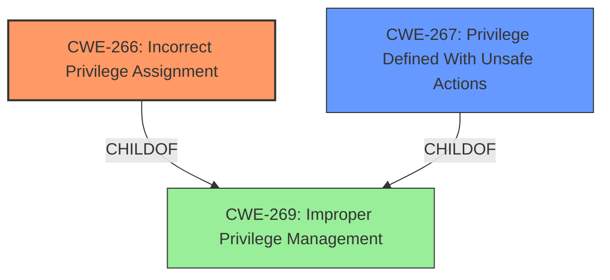

# Raw Analyzer Response for CVE-2025-24042

# Summary
| CWE ID    | CWE Name                                                                                                                                                             | Confidence | CWE Abstraction Level | CWE Vulnerability Mapping Label | CWE-Vulnerability Mapping Notes |
| :-------- | :------------------------------------------------------------------------------------------------------------------------------------------------------------------- | :--------- | :---------------------- | :------------------------------ | :----------------------------- |
| CWE-266   | Incorrect Privilege Assignment                                                                                                                                       | 0.7        | Base                    | Primary CWE                     | Allowed                        |
| CWE-267   | Privilege Defined With Unsafe Actions                                                                                                                                | 0.5        | Base                    | Secondary Candidate             | Allowed                        |

## Evidence and Confidence

*   **Confidence Score:** 0.6
*   **Evidence Strength:** LOW

## Relationship Analysis

The primary relationship considered was that of privilege assignment. Given the impact is elevation of privilege, CWE-266 fits best. We also considered CWE-267 as a secondary possibility, where a privilege may be correctly assigned, but the privilege itself allows unsafe actions.

## Vulnerability Chain

The vulnerability chain starts with an **incorrect privilege assignment** (CWE-266), leading to an **elevation of privilege** impact.

## Summary of Analysis

The primary weakness is that the JS Debug Extension in Visual Studio Code allows for **elevation of privilege**. Based on the provided guidance, we should be looking for root causes such as incorrect privilege assignment. The key phrase is **elevation of privilege** and the fact that it's a JS Debug Extension.

The retriever results included many authorization and privilege related CWEs. The top candidates from the retriever results and graph analysis included:

*   CWE-266: Incorrect Privilege Assignment
*   CWE-267: Privilege Defined With Unsafe Actions

CWE-266, Incorrect Privilege Assignment, seems like the best fit, because there's an issue in assigning privileges to the JS Debug Extension. CWE-267 is a secondary consideration, where the privilege itself allows unsafe actions.

I am overriding the retriever results which focused on input validation problems. This is because the vulnerability description indicates the *impact* is **elevation of privilege**. The provided text provides very limited information about the vulnerability itself, leading to a lower confidence score.

Relevant CWE Information:

# Enhanced Context (25 CWEs)
The following CWEs were identified as potentially relevant to this vulnerability:

## CWE-266: Incorrect Privilege Assignment
**Abstraction Level**: Base
**Similarity Score**: 0.78
**Source**: dense

**Description**:
A product incorrectly assigns a privilege to a particular actor, creating an unintended sphere of control for that actor.

**Mapping Guidance**:
- Usage: Allowed
- Rationale: This CWE entry is at the Base level of abstraction, which is a preferred level of abstraction for mapping to the root causes of vulnerabilities.

## CWE-267: Privilege Defined With Unsafe Actions
**Abstraction Level**: Base
**Similarity Score**: 0.78
**Source**: dense

**Description**:
A particular privilege, role, capability, or right can be used to perform unsafe actions that were not intended, even when it is assigned to the correct entity.

**Mapping Guidance**:
- Usage: Allowed
- Rationale: This CWE entry is at the Base level of abstraction, which is a preferred level of abstraction for mapping to the root causes of vulnerabilities.