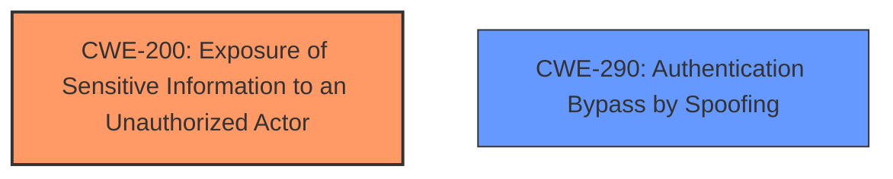

# Analysis for CVE-2025-24071

# Summary
| CWE ID | CWE Name | Confidence | CWE Abstraction Level | CWE Vulnerability Mapping Label | CWE-Vulnerability Mapping Notes |
|---|---|---|---|---|---|
| CWE-200 | Exposure of Sensitive Information to an Unauthorized Actor | 0.7 | Class |  | Discouraged |
| CWE-290 | Authentication Bypass by Spoofing | 0.6 | Base |  | Allowed |

## Evidence and Confidence

*   **Confidence Score:** 0.65
*   **Evidence Strength:** MEDIUM

## Relationship Analysis
The primary relationship considered was that CWE-200 is a class-level CWE, and while it broadly applies, it is discouraged for use when more specific CWEs exist. CWE-290, while related to the "spoofing" aspect mentioned, is about authentication bypass, which is not explicitly detailed in the provided description as the root cause, although it is a plausible impact.

## Vulnerability Chain
The vulnerability chain appears to start with an unspecified weakness in Windows File Explorer that leads to the **exposure of sensitive information**, which then allows for **spoofing**. The missing link is the specific mechanism causing the information exposure.

## Summary of Analysis
The initial assessment considered CWE-200 due to the explicit mention of "Exposure of Sensitive Information to an Unauthorized Actor." However, this is a class-level CWE and discouraged for direct mapping. The vulnerability description also mentions "spoofing," which suggests CWE-290.

The assessment relies heavily on the provided vulnerability description and the limited information in the CVE reference links content summary. The final decision to include both CWE-200 and CWE-290 reflects the dual nature of the vulnerability: information exposure as the primary issue and spoofing as a potential consequence.

The selection of CWEs is at a relatively high level of abstraction due to the limited details provided in the vulnerability description. More information about the specific **root cause** would allow for a more precise mapping.

Relevant CWE Information:

# Enhanced Context (25 CWEs)
The following CWEs were identified as potentially relevant to this vulnerability:

## CWE-497: Exposure of Sensitive System Information to an Unauthorized Control Sphere
**Abstraction Level**: Base
**Similarity Score**: 0.77
**Source**: dense

**Description**:
The product does not properly prevent sensitive system-level information from being accessed by unauthorized actors who do not have the same level of access to the underlying system as the product does.

**Mapping Guidance**:
- Usage: Allowed
- Rationale: This CWE entry is at the Base level of abstraction, which is a preferred level of abstraction for mapping to the root causes of vulnerabilities.

## CWE-200: Exposure of Sensitive Information to an Unauthorized Actor
**CWE-200**: Exposure of Sensitive Information to an Unauthorized Actor

*   **Technical Explanation:** CWE-200 describes a scenario where a product exposes sensitive information to an actor that is not authorized to have it.
*   **Match:** The vulnerability description explicitly states "Exposure of sensitive information to an unauthorized actor."
*   **Impact:** This can lead to information disclosure, potentially allowing attackers to gain unauthorized access or perform other malicious activities.
*   **Relationships:** It is a class-level CWE.
*   **Mapping Guidance:** The usage is discouraged.

## CWE-290: Authentication Bypass by Spoofing
**CWE-290**: Authentication Bypass by Spoofing

*   **Technical Explanation:** CWE-290 describes an attack-focused weakness caused by incorrectly implemented authentication schemes that are subject to spoofing attacks.
*   **Match:** The vulnerability description mentions "spoofing over a network."
*   **Impact:** Attackers can bypass authentication mechanisms and gain unauthorized access to systems or data.
*   **Relationships:** Base level of abstraction.
*   **Mapping Guidance:** Usage allowed.

## Other CWEs Considered:

*   CWE-497, CWE-668, CWE-522, CWE-285, CWE-319: These CWEs were considered but not used because the provided information did not have sufficient detail to support these more specific classifications. While they relate to information exposure and access control, the lack of detail about the specific mechanism causing the vulnerability makes them less appropriate than the more general CWE-200.
*   CWE-1386: Insecure Operation on Windows Junction / Mount Point: This CWE is too specific to the described vulnerability. There is no indication that the vulnerability is related to Windows junctions or mount points.
*   CWE-306: Missing Authentication for Critical Function, CWE-295: Improper Certificate Validation: These CWEs are too specific. The description mentions spoofing but not specifically related to missing authentication or certificate validation.