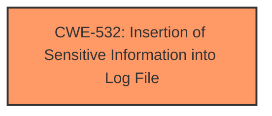

# Raw Analyzer Response for CVE-2025-24142

# Summary
| CWE ID | CWE Name | Confidence | CWE Abstraction Level | CWE Vulnerability Mapping Label | CWE-Vulnerability Mapping Notes |
|---|---|---|---|---|---|
| CWE-532 | Insertion of Sensitive Information into Log File | 0.9 | Base | Allowed | Primary CWE. The vulnerability description mentions "improved private data redaction for log entries," which directly relates to the insertion of sensitive information into log files. |

## Evidence and Confidence

*   **Confidence Score:** 0.9
*   **Evidence Strength:** HIGH

## Relationship Analysis
The primary identified CWE is CWE-532. No other relationships appeared relevant based on the provided information.

## Vulnerability Chain
The vulnerability chain begins with the **failure to properly redact sensitive information** before it is written to log files (CWE-532). The impact is that an application is able to access sensitive user data, exposing a potential privacy issue.

## Summary of Analysis
The initial analysis focused on identifying the root cause of the vulnerability. The vulnerability description specifically mentions "improved private data redaction for log entries," which strongly suggests that the original issue was the insertion of sensitive information into log files without proper redaction.

The primary assessment is based on the clear and direct evidence in the vulnerability description and the CVE reference summary:
*   **Vulnerability Description Key Phrases**: "improved private data redaction for log entries"
*   **CVE Reference Links Content Summary**: "A privacy issue was addressed with improved private data redaction for log entries."

This directly aligns with CWE-532's description: "The product places sensitive information into files or directories that are accessible to actors who are allowed to have access to the files, but not to the sensitive information."

The retriever results also support this, with CWE-532 being highly ranked.

Other CWEs considered:

*   CWE-787 (Out-of-bounds Write): While present in the retriever results, there is no evidence suggesting a memory corruption issue.
*   CWE-843 (Access of Resource Using Incompatible Type ('Type Confusion')): There is no indication of type confusion in the vulnerability description.
*   CWE-285 (Improper Authorization): The vulnerability is more related to the logging of sensitive data rather than improper authorization.
*   CWE-209 (Generation of Error Message Containing Sensitive Information): Though similar in nature, the vulnerability focuses specifically on logging, making CWE-532 a better fit.

The selected CWE, CWE-532, is at the optimal level of specificity because it directly addresses the core issue described in the vulnerability: the **insertion of sensitive information into log files** without proper redaction.