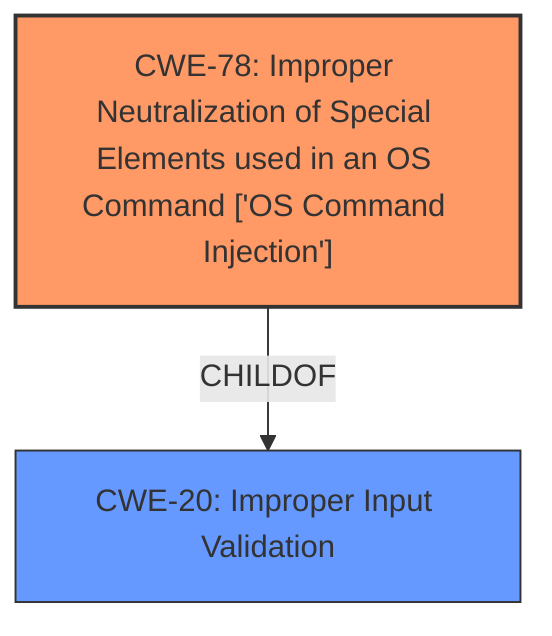

# Analysis for CVE-2025-24150

# Summary

| CWE ID | CWE Name | Confidence | CWE Abstraction Level | CWE Vulnerability Mapping Label | CWE-Vulnerability Mapping Notes |
|---|---|---|---|---|---|
| CWE-78 | Improper Neutralization of Special Elements used in an OS Command ['OS Command Injection'] | 0.8 | Base | Allowed | Primary CWE. This is the root cause of the vulnerability because copying a URL from Web Inspector may lead to command injection. |
| CWE-20 | Improper Input Validation | 0.5 | Class | Discouraged | Secondary Candidate. The root cause of command injection can be traced back to **Improper Input Validation**, as the application **fails to properly neutralize special elements**. However, this is too general. |

## Evidence and Confidence

*   **Confidence Score:** 0.8
*   **Evidence Strength:** HIGH

## Relationship Analysis

The primary CWE is CWE-78, which is a Base level weakness. It is related to CWE-20, Improper Input Validation, because command injection often stems from a failure to validate or sanitize input properly. CWE-78 is more specific than CWE-20, making it a better fit for this vulnerability.

## Vulnerability Chain

The vulnerability chain starts with the **Improper Handling of files** when copying a URL from Web Inspector which leads to the **Improper Neutralization of Special Elements**, resulting in **Command Injection**.

## Summary of Analysis

The analysis is based on the provided evidence, which indicates that copying a URL from Web Inspector may lead to command injection. The root cause is identified as **improper handling of files**, resulting in command injection. CWE-78 is selected as the primary CWE because it directly addresses the vulnerability of command injection due to **improper neutralization of special elements**.

The selection is at the optimal level of specificity because CWE-78 directly describes the root cause, whereas other CWEs are either too general (e.g., CWE-20) or address related but not central aspects of the vulnerability.

The Retriever Results listed CWE-787 (Out-of-bounds Write), CWE-843 (Access of Resource Using Incompatible Type ('Type Confusion')), and CWE-20 (Improper Input Validation) as top candidates. However, these were not selected as the primary CWE because the description points to a command injection vulnerability, which is most accurately represented by CWE-78. While **Improper Input Validation** could be a contributing factor, it is too general and doesn't capture the specific type of injection.

# Relevant CWE Information:

# Enhanced Context (25 CWEs)

## CWE-78: Improper Neutralization of Special Elements used in an OS Command ['OS Command Injection']
**Abstraction Level**: Base
**Similarity Score**: N/A

**Description**: The product constructs all or part of an OS command using externally-influenced input from an upstream component, but it does not neutralize or incorrectly neutralizes special elements that could modify the intended OS command when it is executed.

**Mapping Guidance**:
- Usage: Allowed
- Rationale: This CWE entry is at the Base level of abstraction, which is a preferred level of abstraction for mapping to the root causes of vulnerabilities.