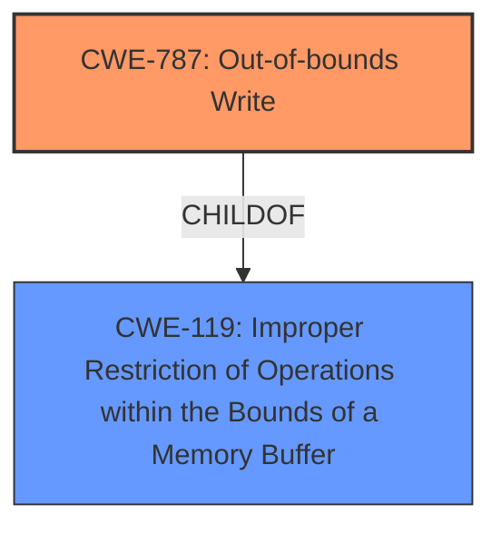

# Analysis Report for CVE-2025-24151

# Vulnerability Analysis Report: CVE-2025-24151

## Description

The issue was addressed with improved memory handling. This issue is fixed in macOS Ventura 13.7.3, macOS Sequoia 15.3, macOS Sonoma 14.7.3. An app may be able to cause unexpected system termination or corrupt kernel memory.

## Vulnerability Description Key Phrases

- **Impact:** unexpected system termination or corrupt kernel memory
- **Product:** macOS Ventura
- **Version:** 13.7.3

## Analysis (with Relationship Data)

# Summary
| CWE ID | CWE Name | Confidence | CWE Abstraction Level | CWE Vulnerability Mapping Label | CWE-Vulnerability Mapping Notes |
|---|---|---|---|---|---|
| CWE-787 | Out-of-bounds Write | 0.8 | Base | Primary | Allowed |
| CWE-119 | Improper Restriction of Operations within the Bounds of a Memory Buffer | 0.6 | Class | Secondary | Discouraged |

## Evidence and Confidence

*   **Confidence Score:** 0.7
*   **Evidence Strength:** MEDIUM

## Relationship Analysis
The primary identified weakness is CWE-787 (**Out-of-bounds Write**), which is a base-level CWE. It's related to CWE-119 (**Improper Restriction of Operations within the Bounds of a Memory Buffer**) as CWE-787 is a child of CWE-119, meaning it's a more specific type of buffer error. CWE-119 is considered as a secondary candidate because the description mentions memory corruption, which is an effect of out-of-bounds writes.



## Vulnerability Chain
The vulnerability chain starts with a **improper memory handling** that leads to **out-of-bounds write**, finally resulting in **unexpected system termination or corrupt kernel memory**.

## Summary of Analysis
The analysis indicates that the most likely root cause of the vulnerability is an out-of-bounds write (CWE-787). This is supported by the vulnerability description, which mentions "improved memory handling" as the fix, and the impact, which includes "corrupt kernel memory." The retriever results also list CWE-787 as the top candidate.

CWE-119 is considered because it is a parent of CWE-787. However, CWE-787 is more specific and accurately describes the **out-of-bounds write** condition.

The decision to select CWE-787 is based on the available evidence and the principle of selecting the most specific CWE that accurately describes the vulnerability.

Relevant CWE Information:

# Enhanced Context (25 CWEs)
The following CWEs were identified as potentially relevant to this vulnerability:

## CWE-665: Improper Initialization
**Abstraction Level**: Class
**Similarity Score**: 0.71
**Source**: dense

**Description**:
The product does not initialize or incorrectly initializes a resource, which might leave the resource in an unexpected state when it is accessed or used.

**Mapping Guidance**:
- Usage: Discouraged
- Rationale: This CWE entry is a level-1 Class (i.e., a child of a Pillar). It might have lower-level children that would be more appropriate

*Not Used:* While **improper initialization** might be a contributing factor, the provided information points more directly to memory corruption due to **out-of-bounds write**, rather than initialization issues.

## CWE-843: Access of Resource Using Incompatible Type ('Type Confusion')
**Abstraction Level**: Base
**Similarity Score**: 0.71
**Source**: dense

**Description**:
The product allocates or initializes a resource such as a pointer, object, or variable using one type, but it later accesses that resource using a type that is incompatible with the original type.

**Mapping Guidance**:
- Usage: Allowed
- Rationale: This CWE entry is at the Base level of abstraction, which is a preferred level of abstraction for mapping to the root causes of vulnerabilities.

*Not Used:* **Type confusion** could lead to memory corruption, but there is no direct evidence to support it. The vulnerability description and fix focus on **memory handling**, which is more aligned with **out-of-bounds write**.

## CWE-787: Out-of-bounds Write
**Abstraction Level**: Base
**Similarity Score**: 0.71
**Source**: dense

**Description**:
The product writes data past the end, or before the beginning, of the intended buffer.

**Mapping Guidance**:
- Usage: Allowed
- Rationale: This CWE entry is at the Base level of abstraction, which is a preferred level of abstraction for mapping to the root causes of vulnerabilities.

*Used:* This is selected as the primary CWE. The vulnerability description mentions "improved memory handling", which directly relates to preventing **out-of-bounds writes**. The impact of "corrupt kernel memory" is a common consequence of such errors.

## CWE-667: Improper Locking
**Abstraction Level**: Class
**Similarity Score**: 0.71
**Source**: dense

**Description**:
The product does not properly acquire or release a lock on a resource, leading to unexpected resource state changes and behaviors.

**Mapping Guidance**:
- Usage: Allowed-with-Review
- Rationale: This CWE entry is a Class and might have Base-level children that would be more appropriate

*Not Used:* While **improper locking** can cause memory corruption in concurrent environments, the evidence doesn't specifically point to concurrency issues. The description and fix focus on **memory handling** rather than synchronization.

## CWE-119: Improper Restriction of Operations within the Bounds of a Memory Buffer
**Abstraction Level**: Class
**Similarity Score**: 0.71
**Source**: dense

**Description**:
The product performs operations on a memory buffer, but it reads from or writes to a memory location outside the buffer's intended boundary. This may result in read or write operations on unexpected memory locations that could be linked to other variables, data structures, or internal program data.

**Mapping Guidance**:
- Usage: Discouraged
- Rationale: CWE-119 is commonly misused in low-information vulnerability reports when lower-level CWEs could be used instead, or when more details about the vulnerability are available.

*Used:* Although discouraged, this is considered as a secondary candidate as it is a parent of CWE-787.

## CWE-789: Memory Allocation with Excessive Size Value
**Abstraction Level**: Variant
**Similarity Score**: 0.70
**Source**: dense

**Description**:
The product allocates memory based on an untrusted, large size value, but it does not ensure that the size is within expected limits, allowing arbitrary amounts of memory to be allocated.

**Mapping Guidance**:
- Usage: Allowed
- Rationale: This CWE entry is at the Variant level of abstraction, which is a preferred level of abstraction for mapping to the root causes of vulnerabilities.

*Not Used:* While an **excessive size value** in memory allocation could lead to memory exhaustion, the description focuses on **memory handling** which relates to **out-of-bounds write**, and there is no evidence to suggest allocation size is the root cause.

## CWE-125: Out-of-bounds Read
**Abstraction Level**: Base
**Similarity Score**: 0.70
**Source**: dense

**Description**:
The product reads data past the end, or before the beginning, of the intended buffer.

**Mapping Guidance**:
- Usage: Allowed
- Rationale: This CWE entry is at the Base level of abstraction, which is a preferred level of abstraction for mapping to the root causes of vulnerabilities.

*Not Used:* The impact indicates memory corruption, which is more commonly associated with **out-of-bounds write** than **out-of-bounds read**. The description focuses on **memory handling**.

## CWE-131: Incorrect Calculation of Buffer Size
**Abstraction Level**: Base
**Similarity Score**: 0.69
**Source**: dense

**Description**:
The product does not correctly calculate the size to be used when allocating a buffer, which could lead to a buffer overflow.

**Mapping Guidance**:
- Usage: Allowed
- Rationale: This CWE entry is at the Base level of abstraction, which is a preferred level of abstraction for mapping to the root causes of vulnerabilities.

*Not Used:* Although an **incorrect buffer size calculation** could lead to a buffer overflow, the description focuses on **memory handling** and the impact includes memory corruption, which is more commonly associated with an **out-of-bounds write** after a bad calculation rather than the calculation itself.


## CWE Relationship Analysis

Current CWEs represent these abstraction levels: .


### Vulnerability Chain Analysis

**Chain starting from CWE-125:**
- 125 (Out-of-bounds Read) - ROOT


**Chain starting from CWE-131:**
- 131 (Incorrect Calculation of Buffer Size) - ROOT


### CWE Relationship Diagram

```mermaid
graph TD
    classDef primary fill:#f96,stroke:#333,stroke-width:2px
    classDef secondary fill:#69f,stroke:#333
    classDef tertiary fill:#9e9,stroke:#333
```


*Report generated on 2025-07-14 12:15:10*
