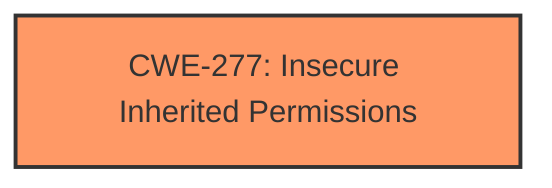

# Analysis Report for CVE-2025-24183

# Vulnerability Analysis Report: CVE-2025-24183

## Description

The issue was addressed with improved checks. This issue is fixed in macOS Ventura 13.7.3, macOS Sequoia 15.3, macOS Sonoma 14.7.3. A local user may be able to modify protected parts of the file system.

## Vulnerability Description Key Phrases

- **Impact:** modify protected parts of the file system
- **Attacker:** local user
- **Product:** macOS
- **Version:** ['macOS Ventura 13.7.3', 'macOS Sequoia 15.3', 'macOS Sonoma 14.7.3']

## Analysis (with Relationship Data)

# Summary
| CWE ID | CWE Name | Confidence | CWE Abstraction Level | CWE Vulnerability Mapping Label | CWE-Vulnerability Mapping Notes |
|---|---|---|---|---|---|
| CWE-277 | Insecure Inherited Permissions | 0.7 | Variant | Allowed | Primary CWE. The vulnerability involves a local user modifying protected parts of the filesystem, which suggests that permissions may have been **improperly inherited** or assigned, allowing unauthorized access. |

## Evidence and Confidence

*   **Confidence Score:** 0.7
*   **Evidence Strength:** MEDIUM

## Relationship Analysis
The primary focus is on the **improper configuration** of permissions, fitting within the broader category of security features. Therefore:
  - CWE-277 Insecure Inherited Permissions is the most specific and relevant choice.
  - Other candidates lack the direct connection to access control via permissions.



## Vulnerability Chain
The vulnerability chain is as follows:
  1.  **Root Cause:** **Insecure Inherited Permissions** (CWE-277) - The system incorrectly assigns or inherits permissions allowing unintended access.
  2.  **Impact:** Modification of protected parts of the file system.

## Summary of Analysis
The primary assessment is based on the evidence provided, focusing on the ability of a local user to modify protected parts of the file system and the resolution involving "improved checks".

The analysis of the description and the provided "CVE Reference Links Content Summary" indicates the vulnerability is due to **improper access control**. The vulnerability allows a local user to modify protected parts of the file system. The fix implemented involved "improved checks," further supporting the idea that the original vulnerability was related to **insufficient or incorrect permission checks**.

The Retriever Results point to several potential CWEs. Given that the vulnerability involves modifying protected parts of the file system, CWE-277 Insecure Inherited Permissions is the most appropriate.

CWE-787 Out-of-bounds Write, CWE-843 Access of Resource Using Incompatible Type ('Type Confusion'), CWE-667 Improper Locking, CWE-347 Improper Verification of Cryptographic Signature, CWE-770 Allocation of Resources Without Limits or Throttling were all considered but deemed less relevant as they describe different classes of vulnerabilities than the one described.

Relevant CWE Information:

# Enhanced Context (25 CWEs)
The following CWEs were identified as potentially relevant to this vulnerability:

## CWE-277: Insecure Inherited Permissions
**Abstraction Level**: Variant
**Similarity Score**: 0.73
**Source**: dense

**Description**:
A product defines a set of insecure permissions that are inherited by objects that are created by the program.

**Mapping Guidance**:
- Usage: Allowed
- Rationale: This CWE entry is at the Variant level of abstraction, which is a preferred level of abstraction for mapping to the root causes of vulnerabilities.


## CWE Relationship Analysis

Current CWEs represent these abstraction levels: .


### Vulnerability Chain Analysis

**Chain starting from CWE-770:**
- 770 (Allocation of Resources Without Limits or Throttling) - ROOT


**Chain starting from CWE-787:**
- 787 (Out-of-bounds Write) - ROOT


### CWE Relationship Diagram

```mermaid
graph TD
    classDef primary fill:#f96,stroke:#333,stroke-width:2px
    classDef secondary fill:#69f,stroke:#333
    classDef tertiary fill:#9e9,stroke:#333
```


*Report generated on 2025-07-14 12:17:00*
