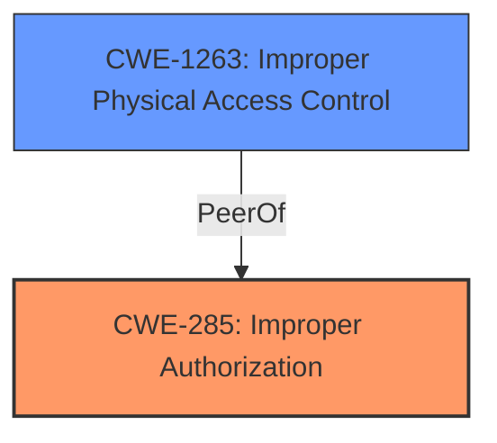

# Analysis for CVE-2025-24204

# Summary
| CWE ID | CWE Name | Confidence | CWE Abstraction Level | CWE Vulnerability Mapping Label | CWE-Vulnerability Mapping Notes |
|---|---|---|---|---|---|
| CWE-285 | Improper Authorization | 0.75 | Class | Primary CWE | Discouraged, but the most fitting based on available information. |
| CWE-1263 | Improper Physical Access Control | 0.5 | Class | Secondary Candidate | Allowed-with-Review. Considered due to the possibility of physical access implications. |

## Evidence and Confidence

*   **Confidence Score:** 0.7
*   **Evidence Strength:** MEDIUM

## Relationship Analysis
The primary relationship influencing the decision is the hierarchical relationship.

CWE-285 is a Class-level CWE, which means it's a higher-level categorization. The retriever results show that more specific CWEs could potentially apply, but the provided information lacks the detail required to confirm those more specific mappings.

## Vulnerability Chain
The vulnerability chain starts with **improper checks** (as indicated by the fix) leading to **improper authorization**, which then results in the **impact of accessing protected user data**.

## Summary of Analysis
The analysis is primarily based on the "CVE Reference Links Content Summary" and "Vulnerability Description Key Phrases". The description indicates that an app may be able to access protected user data, and the root cause is identified as the issue being addressed with improved checks.

The initial assessment focused on the **impact** and **root cause**. The core issue appears to be that the checks are **improper**, leading to the ability to bypass intended authorization mechanisms. This points towards CWE-285.

CWE-285 is a Class-level CWE. Although the guidance discourages the use of class-level CWEs, the information available doesn't allow for more specific identification.

The selection of CWE-285 is influenced by the fact that the vulnerability allows unauthorized access to protected user data, highlighting a failure in authorization. The fix, "improved checks," further supports this assessment.

Other CWEs considered but not selected:
*   CWE-787: Out-of-bounds Write - While this is a high-scoring CWE, there's no evidence to suggest memory corruption.
*   CWE-843: Access of Resource Using Incompatible Type ('Type Confusion') - There's no indication of type confusion.
*   CWE-347: Improper Verification of Cryptographic Signature - No cryptographic functions are mentioned.
*   CWE-1263: Improper Physical Access Control - This is plausible, but less directly supported by the description.
*   CWE-665: Improper Initialization - There's no indication of uninitialized variables causing the issue.

The evidence points to a problem with authorization checks, making CWE-285 the most appropriate choice given the limited information.