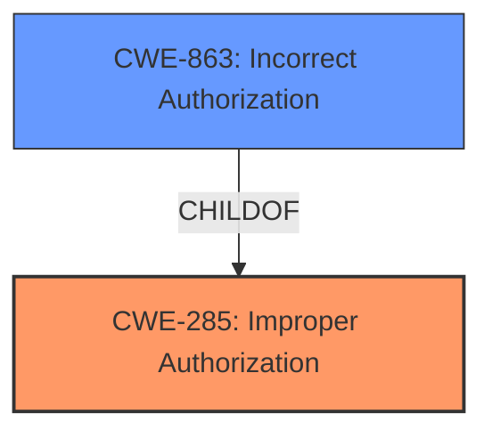

# Enhanced Analysis for CVE-2025-24215

# Summary

| CWE ID  | CWE Name                                                     | Confidence | CWE Abstraction Level | CWE Vulnerability Mapping Label | CWE-Vulnerability Mapping Notes |
| :-------- | :----------------------------------------------------------- | :--------- | :---------------------- | :------------------------------ | :------------------------------ |
| CWE-285 | Improper Authorization                                           | 0.8        | Class                   | Primary CWE                     | Discouraged                   |
| CWE-863 | Incorrect Authorization                                        | 0.6        | Class                   | Secondary Candidate             | Allowed-with-Review           |

## Evidence and Confidence

*   **Confidence Score:** 0.7
*   **Evidence Strength:** MEDIUM

## Relationship Analysis

The primary relationship influencing the decision is the hierarchical relationship between CWE-285 [CWE-285: Improper Authorization] and CWE-863 [CWE-863: Incorrect Authorization]. CWE-863 [CWE-863: Incorrect Authorization] is a more specific type of CWE-285 [CWE-285: Improper Authorization], representing a case where an authorization check is performed but is done incorrectly. Although CWE-863 [CWE-863: Incorrect Authorization] is more specific, I am using CWE-285 [CWE-285: Improper Authorization] because the vulnerability description only mentions "improved checks," and doesn't specify if the authorization checks were performed incorrectly or were missing.



## Vulnerability Chain

The chain of events is as follows:
1.  Improper or missing authorization (**CWE-285** [CWE-285: Improper Authorization]) allows a malicious app to attempt to access private information.
2.  The **impact** is that the malicious app can access private information, violating confidentiality.

## Summary of Analysis

The initial analysis focused on identifying the root cause of the vulnerability, which is the **improper authorization**. The vulnerability description mentions "improved checks," which suggests that the original checks were either missing or inadequate. The evidence from the CVE Reference Links Content Summary confirms that the vulnerability exists in CloudKit and can allow a malicious app to access private information.

The retriever results suggested several CWEs, including CWE-787 [CWE-787: Out-of-bounds Write], CWE-843 [CWE-843: Access of Resource Using Incompatible Type ('Type Confusion')], and CWE-665 [CWE-665: Improper Initialization]. However, these CWEs do not align as closely with the vulnerability description as CWE-285 [CWE-285: Improper Authorization] and CWE-863 [CWE-863: Incorrect Authorization]. The description explicitly states that the issue was addressed with "improved checks," indicating a problem with authorization.

CWE-285 [CWE-285: Improper Authorization] is a Class-level CWE, and the mapping guidance discourages its use when lower-level CWEs are available. However, in this case, the provided information is insufficient to determine whether the authorization checks were merely incorrect (CWE-863 [CWE-863: Incorrect Authorization]) or entirely missing. Therefore, CWE-285 [CWE-285: Improper Authorization] is the most appropriate choice.

The confidence level is 0.7 because, while the evidence strongly suggests an authorization issue, the specific nature of the **improper check** (missing vs. incorrect) is not explicitly stated.


## CWE Relationship Analysis

Current CWEs represent these abstraction levels: .


### Vulnerability Chain Analysis

**Chain starting from CWE-863:**
- 863 (Incorrect Authorization) - ROOT


**Chain starting from CWE-787:**
- 787 (Out-of-bounds Write) - ROOT


### CWE Relationship Diagram

```mermaid
graph TD
    classDef primary fill:#f96,stroke:#333,stroke-width:2px
    classDef secondary fill:#69f,stroke:#333
    classDef tertiary fill:#9e9,stroke:#333
```