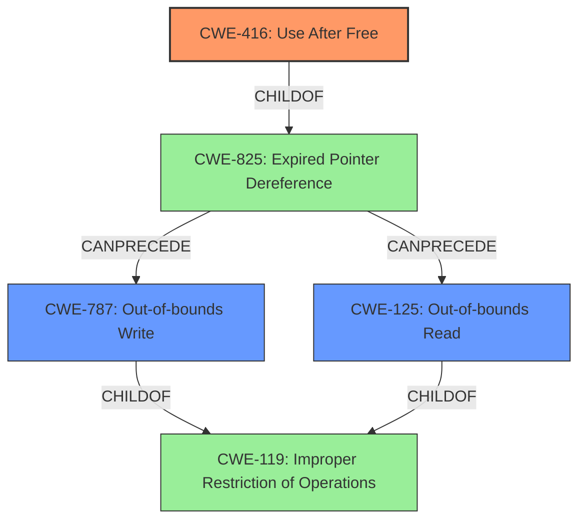

# Analysis for CVE-2025-24216

# Summary
| CWE ID | CWE Name | Confidence | CWE Abstraction Level | CWE Vulnerability Mapping Label | CWE-Vulnerability Mapping Notes |
|---|---|---|---|---|---|
| CWE-416 | Use After Free | 0.7 | Variant | Allowed | Primary CWE. The vulnerability is caused by memory handling issues. |
| CWE-787 | Out-of-bounds Write | 0.6 | Base | Allowed | Secondary CWE. Memory corruption can lead to out-of-bounds writes. |
| CWE-125 | Out-of-bounds Read | 0.5 | Base | Allowed | Secondary CWE. Memory corruption can lead to out-of-bounds reads. |

## Evidence and Confidence

*   **Confidence Score:** 0.7
*   **Evidence Strength:** MEDIUM

## Relationship Analysis
The primary weakness is CWE-416 Use After Free because the root cause of the vulnerability is related to memory handling.
CWE-787 Out-of-bounds Write and CWE-125 Out-of-bounds Read are potential consequences of memory corruption.
CWE-416 is a variant, while CWE-787 and CWE-125 are base level CWEs.

## Vulnerability Chain
The vulnerability chain starts with processing maliciously crafted web content, which leads to a **Use After Free (CWE-416)** due to improper memory handling. This can then lead to **Out-of-bounds Write (CWE-787)** or **Out-of-bounds Read (CWE-125)**, ultimately causing an unexpected Safari crash.

## Summary of Analysis
The analysis indicates that the primary root cause is a memory handling issue when processing maliciously crafted web content, leading to an unexpected Safari crash. The provided information indicates the fix involves improved memory handling.

The retriever results indicated CWE-787 Out-of-bounds Write with the highest score, but the description indicates improved memory handling which is often associated with Use After Free.

CWE-416 is a variant of CWE-825 Expired Pointer Dereference. Both CWE-787 and CWE-125 are children of CWE-119 Improper Restriction of Operations within the Bounds of a Memory Buffer.

Based on the "Root cause of vulnerability: Processing maliciously crafted web content" and "Mitigation or fix: The issue was addressed with improved memory handling" the best mapping is CWE-416 Use After Free as the Primary CWE.

Other CWEs Considered but Not Used:

*   CWE-787: Out-of-bounds Write - While possible, the root cause is more directly related to memory management.
*   CWE-843: Access of Resource Using Incompatible Type ('Type Confusion') - Not enough information to support this.
*   CWE-665: Improper Initialization - Not directly supported by the description.
*   CWE-415: Double Free - Not directly supported by the description.
*   CWE-20: Improper Input Validation - Input validation is a contributing factor, but the core issue is in memory handling.
*   CWE-401: Missing Release of Memory after Effective Lifetime - Possible, but Use After Free is more specific.
*   CWE-119: Improper Restriction of Operations within the Bounds of a Memory Buffer - This is a higher-level class, and more specific CWEs are available.
*   CWE-755: Improper Handling of Exceptional Conditions - Not directly related.
*   CWE-123: Write-what-where Condition - Possible, but not enough direct evidence.