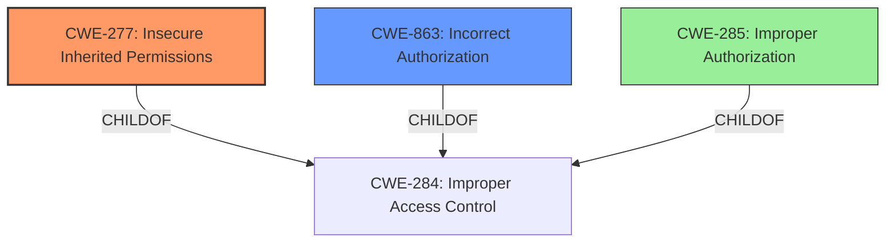

# Raw Analyzer Response for CVE-2025-24220

# Summary
| CWE ID | CWE Name | Confidence | CWE Abstraction Level | CWE Vulnerability Mapping Label | CWE-Vulnerability Mapping Notes |
|---|---|---|---|---|---|
| CWE-277 | Insecure Inherited Permissions | 0.75 | Variant | Allowed | Primary CWE |
| CWE-863 | Incorrect Authorization | 0.5 | Class | Allowed-with-Review | Secondary Candidate |

## Evidence and Confidence

*   **Confidence Score:** 0.7
*   **Evidence Strength:** MEDIUM

## Relationship Analysis
The primary CWE selected is CWE-277 (Insecure Inherited Permissions), which is a variant. While CWE-285 (Improper Authorization) and CWE-863 (Incorrect Authorization) are related to authorization issues, the vulnerability description specifically mentions a **permissions issue** suggesting a misconfiguration in how permissions are inherited or applied. CWE-277 is more specific than its parent classes. CWE-863 is considered a secondary candidate because it addresses the incorrectness of authorization, but it's a class-level CWE, and the evidence leans towards a specific permission inheritance problem.

## Vulnerability Chain
The chain begins with a **permissions issue**, specifically related to how permissions are inherited or applied (CWE-277). This leads to the impact of an app being able to read a persistent device identifier.

## Summary of Analysis
The vulnerability description indicates a **permissions issue** that allows an app to read a persistent device identifier. Given the limited information, CWE-277 (Insecure Inherited Permissions) is the most fitting primary CWE because it targets issues related to the improper inheritance of permissions, which aligns with the **root cause** of the vulnerability. The description also suggests that additional restrictions were implemented as a fix, which supports the idea of a misconfigured permission setting.

CWE-863 (Incorrect Authorization) was considered as a secondary CWE because it addresses authorization problems more broadly, but the specific mention of **"permissions issue"** in the vulnerability description steered the analysis towards CWE-277. While **Improper Authorization** (CWE-285) is listed in the guidance, **Incorrect Authorization** (CWE-863) is the more specific weakness of the two.

The decision to use CWE-277 is based on the evidence: "A **permissions issue** was addressed with additional restrictions. An app may be able to read a persistent device identifier." The **permissions issue** suggests a problem with how permissions are managed, which aligns with the definition of CWE-277.

The level of specificity is appropriate, as CWE-277 is a variant-level CWE that directly addresses the permission inheritance aspect of the vulnerability.

Relevant CWE Information:

# Enhanced Context (25 CWEs)
The following CWEs were identified as potentially relevant to this vulnerability:

## CWE-277: Insecure Inherited Permissions
**Abstraction Level**: Variant
**Similarity Score**: 0.215
**Source**: sparse

**Description**:

The product grants resources to an actor (user, process, etc.) based on the permissions granted to the actor's parent, but the product does not sufficiently restrict access to only those resources that the actor should have.
This can occur when the product does not properly handle permission inheritance, such as when a child process inherits more permissions than it should from its parent process.
This weakness can occur when the product grants access to resources based on the permissions of the parent, but does not properly restrict access to only those resources that the actor should have.

# Complete CWE Specifications

CWE-277: Insecure Inherited Permissions
The product grants resources to an actor (user, process, etc.) based on the permissions granted to the actor's parent, but the product does not sufficiently restrict access to only those resources that the actor should have. This can occur when the product does not properly handle permission inheritance, such as when a child process inherits more permissions than it should from its parent process.