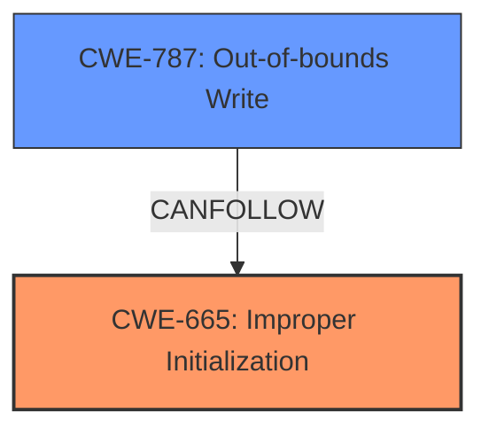

# Raw Analyzer Response for CVE-2025-24235

# Summary
| CWE ID | CWE Name | Confidence | CWE Abstraction Level | CWE Vulnerability Mapping Label | CWE-Vulnerability Mapping Notes |
|---|---|---|---|---|---|
| CWE-665 | Improper Initialization | 0.85 | Class | Primary | Allowed-with-Review |
| CWE-787 | Out-of-bounds Write | 0.65 | Base | Secondary | Allowed |

## Evidence and Confidence

*   **Confidence Score:** 0.75
*   **Evidence Strength:** MEDIUM

## Relationship Analysis
The primary relationship influencing my decision is that CWE-665 is a Class-level CWE, and several more specific Base-level children exist. However, the provided information doesn't specify the type of resource not being initialized, making it difficult to select a more specific child. CWE-787 is related as a potential consequence of the **improper initialization** leading to memory corruption.

## Vulnerability Chain
The vulnerability chain starts with **improper initialization** (CWE-665), which can lead to heap corruption. The heap corruption may manifest as an out-of-bounds write (CWE-787) when uninitialized memory is accessed, leading to unexpected app termination.

## Summary of Analysis
The initial assessment focuses on the provided evidence, especially the key phrase "**memory initialization issue**" and the impact of "heap corruption" and "unexpected app termination". The retriever results indicated CWE-665 (Improper Initialization) and CWE-787 (Out-of-bounds Write) as strong candidates.

CWE-665 is chosen as the primary CWE because the vulnerability description explicitly mentions a "**memory initialization issue**". The description says, "A **memory initialization issue** was addressed with improved memory handling." This indicates that the root cause of the vulnerability is a failure to properly initialize memory.

CWE-787 is included as a secondary CWE because the impact of the vulnerability includes "heap corruption". Out-of-bounds write is a common cause of heap corruption. The vulnerability description notes, "A remote attacker may be able to cause unexpected app termination or heap corruption."

I considered other CWEs like CWE-908 (Use of Uninitialized Resource) and CWE-824 (Access of Uninitialized Pointer), but these are more specific cases of CWE-665. The provided information does not clearly indicate the use of a pointer or the use of a resource. The level of detail of the vulnerability description makes it more suitable for the more general CWE-665, as there is no evidence to suggest more specific initialization issues.

Relevant CWE Information:

# Enhanced Context (25 CWEs)
The following CWEs were identified as potentially relevant to this vulnerability:

## CWE-665: Improper Initialization
**Abstraction Level**: Class
**Similarity Score**: 0.76
**Source**: dense

**Description**:
The product does not initialize or incorrectly initializes a resource, which might leave the resource in an unexpected state when it is accessed or used.

**Mapping Guidance**:
- Usage: Discouraged
- Rationale: This CWE entry is a level-1 Class (i.e., a child of a Pillar). It might have lower-level children that would be more appropriate

## CWE-787: Out-of-bounds Write
**Abstraction Level**: Base
**Similarity Score**: 0.72
**Source**: dense

**Description**:
The product writes data past the end, or before the beginning, of the intended buffer.

**Mapping Guidance**:
- Usage: Allowed
- Rationale: This CWE entry is at the Base level of abstraction, which is a preferred level of abstraction for mapping to the root causes of vulnerabilities.

# Analysis of Candidate CWEs:

*   **CWE-665: Improper Initialization**: This is a strong candidate because the vulnerability description explicitly mentions a "**memory initialization issue**". The description says, "A **memory initialization issue** was addressed with improved memory handling." This indicates that the root cause of the vulnerability is a failure to properly initialize memory. While the Mapping Guidance discourages its use because it's a Class-level CWE, the lack of specific details about *what* wasn't initialized makes it difficult to choose a more specific Base-level CWE.
*   **CWE-787: Out-of-bounds Write**: This is a plausible secondary CWE because the impact of the vulnerability includes "heap corruption". Out-of-bounds write is a common cause of heap corruption. The vulnerability description notes, "A remote attacker may be able to cause unexpected app termination or heap corruption."
*   **CWE-908: Use of Uninitialized Resource** and **CWE-824: Access of Uninitialized Pointer**: These are more specific cases of CWE-665. However, the provided information does not clearly indicate the use of a pointer or the use of a resource. Because the description is more general, the more general CWE-665 is more suitable.
*   **CWE-119: Improper Restriction of Operations within the Bounds of a Memory Buffer**: This is too general and doesn't pinpoint the root cause.
*   **CWE-843: Access of Resource Using Incompatible Type ('Type Confusion')**: There is no indication of type confusion in the description.
*   **CWE-415: Double Free**: There is no indication of a double free in the description.

I am overriding the general mapping guidance for CWE-665 because the evidence clearly points to an initialization issue, and the lack of further detail prevents selection of a more specific child CWE.