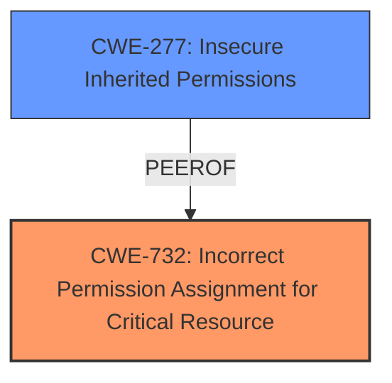

# Enhanced Analysis for CVE-2025-24261

# Summary
| CWE ID | CWE Name | Confidence | CWE Abstraction Level | CWE Vulnerability Mapping Label | CWE-Vulnerability Mapping Notes |
|---|---|---|---|---|---|
| CWE-732 | Incorrect Permission Assignment for Critical Resource | 0.7 | Class | Allowed-with-Review | Primary CWE. While the name itself indicates an assignment of permissions for resources, this is often misused for vulnerabilities in which "permissions" are not checked, which is an "authorization" weakness (CWE-285 or descendants) within CWE's model |
| CWE-277 | Insecure Inherited Permissions | 0.5 | Variant | Allowed | Secondary Candidate |

## Evidence and Confidence

*   **Confidence Score:** 0.6
*   **Evidence Strength:** MEDIUM

## Relationship Analysis
The primary CWE is CWE-732, which is a Class-level CWE. The vulnerability involves modifying protected parts of the file system, indicating an issue with permission assignment for critical resources. CWE-732 is related to authorization issues, but the description focuses more on the incorrect assignment of permissions. CWE-277 is a Variant-level CWE that describes insecure inherited permissions. Since the specific details about how permissions are incorrectly assigned is not provided, CWE-732 is the best fit.



## Vulnerability Chain
The vulnerability chain starts with an **incorrect permission assignment** (CWE-732), leading to the ability of an app to **modify protected parts of the file system**.

## Summary of Analysis
The initial analysis considered CWE-787 (Out-of-bounds Write), CWE-282 (Improper Ownership Management), and CWE-285 (Improper Authorization). However, after reviewing the vulnerability description and the CVE reference links, the root cause appears to be an incorrect permission assignment that allows unauthorized modification of protected system files.
The phrase "**permissions** issue was addressed with additional restrictions" confirms that the issue is related to permissions, leading to the selection of CWE-732. The description "**An app may be able to modify protected parts of the file system**" highlights the impact of this incorrect permission assignment.
CWE-732 is chosen as the primary CWE because it accurately describes the **incorrect permission assignment** for critical resources.
The abstraction level is Class, which is acceptable since the provided evidence doesn't allow us to go to a more specific Base or Variant level.
CWE-277 was considered as a secondary candidate because it relates to insecure inherited permissions which could be related to the primary weakness, but there is not enough information in the evidence to establish this as a clear relationship.

Relevant CWE Information:

# Enhanced Context (25 CWEs)
The following CWEs were identified as potentially relevant to this vulnerability:

## CWE-277: Insecure Inherited Permissions
**Abstraction Level**: Variant
**Similarity Score**: 0.75
**Source**: dense

**Description**:
A product defines a set of insecure permissions that are inherited by objects that are created by the program.

**Mapping Guidance**:
- Usage: Allowed
- Rationale: This CWE entry is at the Variant level of abstraction, which is a preferred level of abstraction for mapping to the root causes of vulnerabilities.

## CWE-732: Incorrect Permission Assignment for Critical Resource
**Abstraction Level**: Class
**Similarity Score**: 0.72
**Source**: dense

**Description**:
The product specifies permissions for a security-critical resource in a way that allows that resource to be read or modified by unintended actors.

**Mapping Guidance**:
- Usage: Allowed-with-Review
- Rationale: While the name itself indicates an assignment of permissions for resources, this is often misused for vulnerabilities in which "permissions" are not checked, which is an "authorization" weakness (CWE-285 or descendants) within CWE's model [REF-1287].


## CWE Relationship Analysis

Current CWEs represent these abstraction levels: .


### Vulnerability Chain Analysis

**Chain starting from CWE-732:**
- 732 (Incorrect Permission Assignment for Critical Resource) - ROOT


**Chain starting from CWE-787:**
- 787 (Out-of-bounds Write) - ROOT


### CWE Relationship Diagram

```mermaid
graph TD
    classDef primary fill:#f96,stroke:#333,stroke-width:2px
    classDef secondary fill:#69f,stroke:#333
    classDef tertiary fill:#9e9,stroke:#333
```