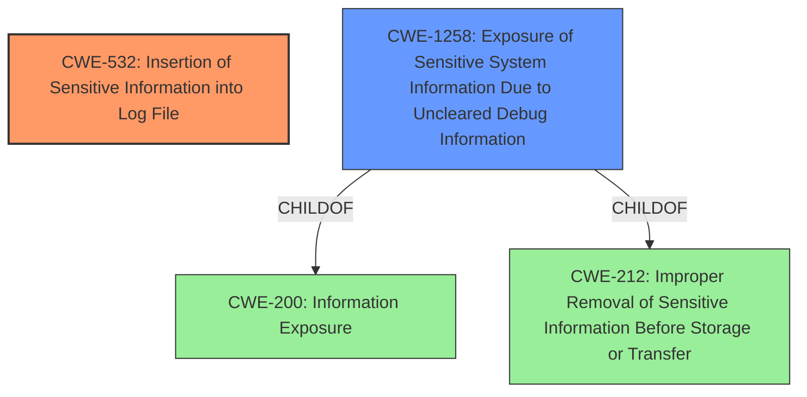

# Analysis Report for CVE-2025-24262

# Vulnerability Analysis Report: CVE-2025-24262

## Description

A privacy issue was addressed with improved private data redaction for log entries. This issue is fixed in macOS Sequoia 15.4. A sandboxed app may be able to access sensitive user data in system logs.

## Vulnerability Description Key Phrases

- **Impact:** access sensitive user data
- **Attacker:** sandboxed app
- **Product:** macOS Sequoia
- **Version:** 15.4

## Analysis (with Relationship Data)

# Summary

| CWE ID  | CWE Name                                                        | Confidence | CWE Abstraction Level | CWE Vulnerability Mapping Label | CWE-Vulnerability Mapping Notes |
| :-------- | :-------------------------------------------------------------- | :--------- | :-------------------- | :------------------------------ | :------------------------------ |
| CWE-532   | Insertion of Sensitive Information into Log File               | 0.85       | Base                  | Primary                         | Allowed                       |
| CWE-1258  | Exposure of Sensitive System Information Due to Uncleared Debug Information | 0.75       | Base                  | Secondary                      | Allowed                       |

## Evidence and Confidence

*   **Confidence Score:** 0.80
*   **Evidence Strength:** MEDIUM

## Relationship Analysis

The primary relationship that influenced the decision was the hierarchical relationship between CWE-1258 and CWE-200 (Information Exposure). CWE-1258 is a child of CWE-200 and CWE-212 (Improper Removal of Sensitive Information Before Storage or Transfer), indicating a more specific case of information exposure due to uncleared debug information. The other relevant factor was considering what the weakness was relative to the log entries, which led to choosing CWE-532 as the primary cause.



## Vulnerability Chain

The vulnerability chain starts with the **insertion of sensitive information into log files (CWE-532)**. This leads to the **exposure of sensitive system information (CWE-1258)**, which a sandboxed application can then access, resulting in a privacy issue. The chain can be summarized as: CWE-532 -> CWE-1258 -> Information Disclosure.

## Summary of Analysis

The primary assessment is based on the provided evidence, which indicates that a sandboxed app can access sensitive user data in system logs. The **root cause** is the insertion of this sensitive information into the logs, addressed by improved private data redaction for log entries.

The decision to prioritize CWE-532, Insertion of Sensitive Information into Log File, is directly supported by the "CVE Reference Links Content Summary" section that mentions "An app may be able to access sensitive user data," which is a file of type "Notes" and the mitigation is "Improved redaction of sensitive information." The graph relationships highlight that CWE-1258 is a child of CWE-200 and CWE-212, indicating a specific type of information exposure.

CWE-532 is at the optimal level of specificity because it directly addresses the **root cause** of the vulnerability: the insertion of sensitive data into the log file. While CWE-1258 represents the immediate consequence of this insertion, CWE-532 is the actual **weakness** that needs to be addressed. The vulnerability description and mitigation confirm that the sensitive data was being logged, and the fix involves redacting this data.

**CWE Considerations:**
*   CWE-532: Insertion of Sensitive Information into Log File. This is chosen as the primary CWE as the vulnerability description indicates that sensitive information is being logged, and the fix involves improved redaction of that information.
*   CWE-1258: Exposure of Sensitive System Information Due to Uncleared Debug Information. This is a secondary CWE because it describes the result of the sensitive information being in the logs. It is uncleared debug information.
*   CWE-200: Information Exposure: Considered but deemed too general. While the vulnerability leads to information exposure, the more specific CWE-1258 captures the nature of the exposure more accurately.
*   CWE-212: Improper Removal of Sensitive Information Before Storage or Transfer: Considered but not chosen as primary as the destination is specifically a log file, making CWE-532 a more specific and appropriate choice.


## CWE Relationship Analysis

Current CWEs represent these abstraction levels: .


### Vulnerability Chain Analysis

**Chain starting from CWE-212:**
- 212 (Improper Removal of Sensitive Information Before Storage or Transfer) - ROOT


**Chain starting from CWE-200:**
- 200 (Exposure of Sensitive Information to an Unauthorized Actor) - ROOT


### CWE Relationship Diagram

```mermaid
graph TD
    classDef primary fill:#f96,stroke:#333,stroke-width:2px
    classDef secondary fill:#69f,stroke:#333
    classDef tertiary fill:#9e9,stroke:#333
```


*Report generated on 2025-07-14 12:30:16*
