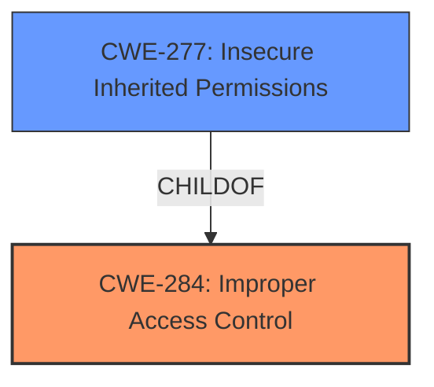

# Analysis Report for CVE-2025-24280

# Vulnerability Analysis Report: CVE-2025-24280

## Description

An **access issue** was addressed with additional sandbox restrictions. This issue is fixed in macOS Sequoia 15.4, macOS Sonoma 14.7.5. An app may be able to access user-sensitive data.

## Vulnerability Description Key Phrases

- **Weakness:** access issue
- **Product:** macOS Sequoia, macOS Sonoma
- **Impact:** access user-sensitive data
- **Version:** 15.4, 14.7.5

## Analysis (with Relationship Data)

# Summary
| CWE ID | CWE Name | Confidence | CWE Abstraction Level | CWE Vulnerability Mapping Label | CWE-Vulnerability Mapping Notes |
|---|---|---|---|---|---|
| CWE-284 | Improper Access Control | 0.75 | Pillar | Primary | Allowed-with-Review |
| CWE-277 | Insecure Inherited Permissions | 0.60 | Variant | Secondary Candidate | Allowed |

## Evidence and Confidence

*   **Confidence Score:** 0.70
*   **Evidence Strength:** MEDIUM

## Relationship Analysis
The primary relationship considered was the hierarchical structure with CWE-284 as a high-level class, with several more specific children. CWE-277 is a variant of access control issues. The abstraction levels influenced the selection, favoring the higher-level CWE-284 due to lack of specific details and the broad nature of the vulnerability description.



## Vulnerability Chain
The vulnerability chain starts with an **access issue**, leading to the impact of an app being able to access user-sensitive data. The fix involves additional sandbox restrictions. The chain is:
1.  **Improper Access Control (CWE-284)** - Root cause: An **access issue** due to lack of proper enforcement.
2.  **Access of user-sensitive data** - Impact.

## Summary of Analysis
The initial analysis focused on identifying the root cause of the vulnerability. The provided evidence indicates a general **access issue**, which was addressed with additional sandbox restrictions. The most relevant CWE is CWE-284, "Improper Access Control," because the description explicitly states an **access issue**, and the fix implemented involves access control mechanisms (sandbox restrictions).

The retriever results suggested several CWEs, including CWE-277, CWE-787, CWE-665, and CWE-843. However, these CWEs are either too specific or do not directly address the root cause described in the vulnerability description. For example, CWE-787 (Out-of-bounds Write) and CWE-843 (Access of Resource Using Incompatible Type) are related to memory corruption issues, which are not mentioned in the description. CWE-665 (Improper Initialization) is about resources not being properly initialized, which is also not supported by the evidence. CWE-277 (Insecure Inherited Permissions) is a possibility, but the description doesn't specify that inherited permissions are the issue, so the broader CWE-284 is more appropriate.

The relationships between CWEs also influenced the selection. CWE-284 is a high-level class, and more specific child CWEs exist. However, the lack of detailed information in the vulnerability description makes it difficult to choose a more specific CWE with high confidence. Therefore, CWE-284 is the most appropriate choice at this time.

Relevant CWE Information:

# Enhanced Context (25 CWEs)
The following CWEs were identified as potentially relevant to this vulnerability:

## CWE-277: Insecure Inherited Permissions
**Abstraction Level**: Variant
**Similarity Score**: 0.73
**Source**: dense

**Description**:
A product defines a set of insecure permissions that are inherited by objects that are created by the program.

**Mapping Guidance**:
- Usage: Allowed
- Rationale: This CWE entry is at the Variant level of abstraction, which is a preferred level of abstraction for mapping to the root causes of vulnerabilities.

## CWE-284: Improper Access Control
**Abstraction Level**: Pillar
**Similarity Score**: 0.190
**Source**: sparse

**Description**:
The product does not adequately control access to resources, which can lead to unintended information disclosure, modification, or destruction of resources.

**Mapping Guidance**:
- Usage: Discouraged
- Rationale: CWE-284 is high-level and lower-level CWEs can frequently be used instead. It is a Pillar.

## CWE-285: Improper Authorization
**Abstraction Level**: Class
**Similarity Score**: 0.188
**Source**: sparse

**Description**:
The product does not perform or incorrectly performs an authorization check when an actor attempts to access a resource or perform an action.

**Mapping Guidance**:
- Usage: Discouraged
- Rationale: CWE-285 is high-level and lower-level CWEs can frequently be used instead. It is a level-1 Class (i.e., a child of a Pillar).

### CWE-284: Improper Access Control
CWE-284 is a Pillar-level CWE that describes a general failure to adequately control access to resources. The vulnerability description states that there is an **access issue** and that the issue was addressed by adding additional sandbox restrictions. Sandbox restrictions are a form of access control. While it's a high level CWE, the lack of details allows it to be applied as the root cause.
*   **How the vulnerability's details match the CWE's characteristics:** The vulnerability involves an **access issue**, meaning that an application can access user-sensitive data without proper authorization.
*   **The security implications and potential impact:** The security implication is that user-sensitive data can be accessed by unauthorized apps.
*   **Any parent-child relationships or chain patterns that influenced your mapping:** The hierarchical relationship of access control CWEs was considered, but given the high-level nature of the description, the parent CWE was chosen.
*   **Whether the weakness is primary or secondary in the vulnerability:** This is the primary weakness.
*   **How the official MITRE mapping guidance influenced your decision:** The MITRE mapping guidance discourages the use of CWE-284 because it is high-level. However, in this case, the lack of specificity in the vulnerability description makes it the most appropriate choice.

### CWE-277: Insecure Inherited Permissions
CWE-277 is a Variant-level CWE that describes a product defining a set of insecure permissions that are inherited by objects that are created by the program. It is possible that the **access issue** is related to insecure inherited permissions, which would make this CWE a good fit, however, that is not explicitly stated.
*   **How the vulnerability's details match the CWE's characteristics:** The vulnerability could be related to insecure inherited permissions, allowing an application to access user-sensitive data.
*   **The security implications and potential impact:** The security implication is that user-sensitive data can be accessed by unauthorized apps because permissions were set up incorrectly.
*   **Any parent-child relationships or chain patterns that influenced your mapping:** The hierarchical relationship of access control CWEs was considered.
*   **Whether the weakness is primary or secondary in the vulnerability:** This is a secondary candidate.
*   **How the official MITRE mapping guidance influenced your decision:** The MITRE mapping guidance allows the use of CWE-277 since it's a Variant level.

### CWEs Considered But Not Used:

*   **CWE-787 (Out-of-bounds Write):** This CWE relates to memory corruption, which is not mentioned in the vulnerability description.
*   **CWE-665 (Improper Initialization):** This CWE relates to resources not being properly initialized, which is not supported by the evidence.
*   **CWE-843 (Access of Resource Using Incompatible Type):** This CWE relates to type confusion issues, which are not mentioned in the description.
*   **CWE-863 (Incorrect Authorization):** This CWE is more specific than CWE-284, implying that an authorization check was performed but was incorrect. The description does not provide this level of detail.
*   **CWE-285 (Improper Authorization):** Similar to CWE-863, this implies that an authorization check was attempted but failed, which is not explicitly stated.
*   **CWE-20 (Improper Input Validation):** This CWE is too general and doesn't directly relate to the **access issue** described.
*   **CWE-347 (Improper Verification of Cryptographic Signature):** This CWE relates to cryptographic signature verification, which is not mentioned in the vulnerability description.
*   **CWE-1257 (Improper Access Control Applied to Mirrored or Aliased Memory Regions):** This CWE is very specific and not supported by the limited information provided.

The final assessment leans towards CWE-284 due to the direct mention of an **access issue** and the use of sandbox restrictions as a fix, which aligns with access control mechanisms. The level of specificity is appropriate given the limited details in the vulnerability description.


## CWE Relationship Analysis

Current CWEs represent these abstraction levels: .


### Vulnerability Chain Analysis

**Chain starting from CWE-863:**
- 863 (Incorrect Authorization) - ROOT


**Chain starting from CWE-787:**
- 787 (Out-of-bounds Write) - ROOT


### CWE Relationship Diagram

```mermaid
graph TD
    classDef primary fill:#f96,stroke:#333,stroke-width:2px
    classDef secondary fill:#69f,stroke:#333
    classDef tertiary fill:#9e9,stroke:#333
```


*Report generated on 2025-07-14 12:33:28*
