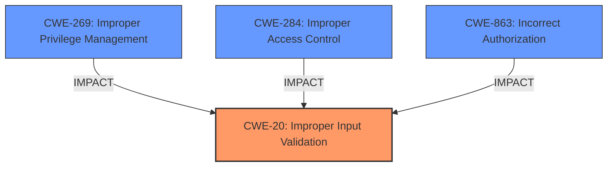

# Raw Analyzer Response for CVE-2025-24308

# Summary
| CWE ID | CWE Name | Confidence | CWE Abstraction Level | CWE Vulnerability Mapping Label | CWE-Vulnerability Mapping Notes |
|---|---|---|---|---|---|
| CWE-20 | Improper Input Validation | 0.9 | Class | Primary | Allowed |
| CWE-269 | Improper Privilege Management | 0.3 | Class | Secondary Candidate | Discouraged |
| CWE-284 | Improper Access Control | 0.2 | Pillar | Secondary Candidate | Discouraged |
| CWE-863 | Incorrect Authorization | 0.2 | Class | Secondary Candidate | Allowed-with-Review |

## Evidence and Confidence

*   **Confidence Score:** 0.9
*   **Evidence Strength:** HIGH

## Relationship Analysis
The primary relationship that influenced the decision was the parent-child relationship between CWE-20 and more specific input validation CWEs. While more specific CWEs exist, the provided information doesn't provide enough detail to pinpoint the exact type of input validation failure. The potential for privilege escalation (CWE-269) and access control issues (CWE-284) were also considered, but these are impacts rather than root causes in this specific scenario. The abstraction level of CWE-20 (Class) is appropriate given the lack of detail.

## Vulnerability Chain
The vulnerability chain starts with **improper input validation** (CWE-20) in the UEFI firmware error handler. This leads to a potential escalation of privilege. The chain is:
1.  **Improper Input Validation** (CWE-20) - Root cause: The system does not properly validate input.
2.  Escalation of Privilege - Impact: A privileged user can gain higher-level privileges.

## Summary of Analysis
The analysis indicates that the primary weakness is **improper input validation** (CWE-20) in the UEFI firmware error handler. This **weakness** allows a privileged user to potentially escalate privileges. The selection of CWE-20 is based on the vulnerability description stating "**Improper input validation** in the UEFI firmware error handler...may allow a privileged user to potentially enable escalation of privilege via local access." The "CVE Reference Links Content Summary" confirms the root cause: "Root cause of vulnerability: **Improper input validation** in the UEFI firmware error handler." While privilege escalation is the impact, the root cause is the lack of proper validation. The retriever results also list CWE-20 as a candidate, although not the top-ranked one.

Other CWEs considered:

*   CWE-269 (Improper Privilege Management): Considered as a potential secondary CWE because the impact is privilege escalation. However, the description focuses on the root cause (**improper input validation**), making CWE-20 the more appropriate primary classification.
*   CWE-284 (Improper Access Control): Similar to CWE-269, this relates to the impact (privilege escalation) but is not the root cause.
*   CWE-863 (Incorrect Authorization): Considered but deemed less appropriate than CWE-20, as the issue is not an authorization check itself, but rather the validation of the input used in a privileged operation.
*   CWE-1256 (Improper Restriction of Software Interfaces to Hardware Features): Not directly related to the described vulnerability, although UEFI is firmware, the issue isn't related to hardware feature access but validation of inputs.
*   CWE-781 (Improper Address Validation in IOCTL with METHOD_NEITHER I/O Control Code): IOCTLs are not mentioned in the description, making this unrelated.

The choice of CWE-20 is at an appropriate level of specificity. While more specific input validation CWEs exist, the provided information doesn't allow for a more precise classification.

Relevant CWE Information:
# Enhanced Context (25 CWEs)
The following CWEs were identified as potentially relevant to this vulnerability:

## CWE-274: Improper Handling of Insufficient Privileges
**Abstraction Level**: Base
**Similarity Score**: 0.80
**Source**: dense

**Description**:
The product does not handle or incorrectly handles when it has insufficient privileges to perform an operation, leading to resultant weaknesses.

**Mapping Guidance**:
- Usage: Discouraged
- Rationale: This CWE entry could be deprecated in a future version of CWE.

## CWE-280: Improper Handling of Insufficient Permissions or Privileges 
**Abstraction Level**: Base
**Similarity Score**: 0.80
**Source**: dense

**Description**:
The product does not handle or incorrectly handles when it has insufficient privileges to access resources or functionality as specified by their permissions. This may cause it to follow unexpected code paths that may leave the product in an invalid state.

**Mapping Guidance**:
- Usage: Allowed
- Rationale: This CWE entry is at the Base level of abstraction, which is a preferred level of abstraction for mapping to the root causes of vulnerabilities.

## CWE-266: Incorrect Privilege Assignment
**Abstraction Level**: Base
**Similarity Score**: 0.78
**Source**: dense

**Description**:
A product incorrectly assigns a privilege to a particular actor, creating an unintended sphere of control for that actor.

**Mapping Guidance**:
- Usage: Allowed
- Rationale: This CWE entry is at the Base level of abstraction, which is a preferred level of abstraction for mapping to the root causes of vulnerabilities.

## CWE-807: Reliance on Untrusted Inputs in a Security Decision
**Abstraction Level**: Base
**Similarity Score**: 0.78
**Source**: dense

**Description**:
The product uses a protection mechanism that relies on the existence or values of an input, but the input can be modified by an untrusted actor in a way that bypasses the protection mechanism.

**Mapping Guidance**:
- Usage: Allowed
- Rationale: This CWE entry is at the Base level of abstraction, which is a preferred level of abstraction for mapping to the root causes of vulnerabilities.

## CWE-267: Privilege Defined With Unsafe Actions
**Abstraction Level**: Base
**Similarity Score**: 0.78
**Source**: dense

**Description**:
A particular privilege, role, capability, or right can be used to perform unsafe actions that were not intended, even when it is assigned to the correct entity.

**Mapping Guidance**:
- Usage: Allowed
- Rationale: This CWE entry is at the Base level of abstraction, which is a preferred level of abstraction for mapping to the root causes of vulnerabilities.

## CWE-703: Improper Check or Handling of Exceptional Conditions
**Abstraction Level**: Pillar
**Similarity Score**: 0.77
**Source**: dense

**Description**:
The product does not properly anticipate or handle exceptional conditions that rarely occur during normal operation of the product.

**Mapping Guidance**:
- Usage: Discouraged
- Rationale: This CWE entry is extremely high-level, a Pillar.

## CWE-691: Insufficient Control Flow Management
**Abstraction Level**: Pillar
**Similarity Score**: 0.77
**Source**: dense

**Description**:
The code does not sufficiently manage its control flow during execution, creating conditions in which the control flow can be modified in unexpected ways.

**Mapping Guidance**:
- Usage: Discouraged
- Rationale: This CWE entry is extremely high-level, a Pillar. However, classification research is limited for weaknesses of this type, so there can be gaps or organizational difficulties within CWE that force use of this weakness, even at such a high level of abstraction.

## CWE-1289: Improper Validation of Unsafe Equivalence in Input
**Abstraction Level**: Base
**Similarity Score**: 0.77
**Source**: dense

**Description**:
The product receives an input value that is used as a resource identifier or other type of reference, but it does not validate or incorrectly validates that the input is equivalent to a potentially-unsafe value.

**Mapping Guidance**:
- Usage: Allowed
- Rationale: This CWE entry is at the Base level of abstraction, which is a preferred level of abstraction for mapping to the root causes of vulnerabilities.

## CWE-41: Improper Resolution of Path Equivalence
**Abstraction Level**: Base
**Similarity Score**: 0.77
**Source**: dense

**Description**:
The product is vulnerable to file system contents disclosure through path equivalence. Path equivalence involves the use of special characters in file and directory names. The associated manipulations are intended to generate multiple names for the same object.

**Mapping Guidance**: