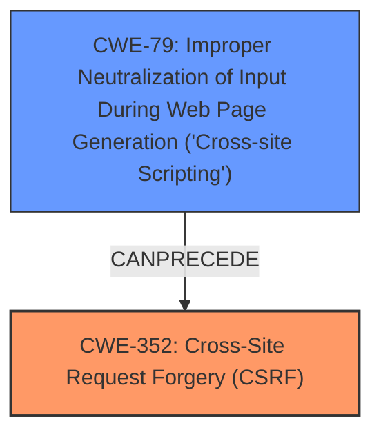

# Analysis Report for CVE-2025-24358

# Vulnerability Analysis Report: CVE-2025-24358

## Description

gorilla/csrf provides **Cross Site Request Forgery** (CSRF) prevention middleware for Go web applications & services. Prior to 1.7.2, gorilla/csrf does not validate the Origin header against an allowlist. Its executes its validation of the Referer header for cross-origin requests only when it believes the request is being served over TLS. It determines this by inspecting the r.URL.Scheme value. However, this value is never populated for server requests per the Go spec, and so this check does not run in practice. This vulnerability allows an attacker who has gained **XSS** on a subdomain or top level domain to perform authenticated form submissions against gorilla/csrf protected targets that share the same top level domain. This vulnerability is fixed in 1.7.2.

## Vulnerability Description Key Phrases

- **Weakness:** ['cross-origin request forgery', 'Cross Site Request Forgery', 'XSS']
- **Impact:** ['perform authenticated form submissions', 'cross-site scripting']
- **Attacker:** attacker
- **Product:** gorilla/csrf
- **Version:** prior to 1.7.2

## Analysis (with Relationship Data)

# Summary
| CWE ID  | CWE Name                                                                   | Confidence | CWE Abstraction Level | CWE Vulnerability Mapping Label | CWE-Vulnerability Mapping Notes |
| :-------- | :------------------------------------------------------------------------- | :--------- | :-------------------- | :------------------------------ | :------------------------------ |
| CWE-352   | Cross-Site Request Forgery (CSRF)                                          | 0.9        | Compound              | Primary                         | Allowed                         |
| CWE-79    | Improper Neutralization of Input During Web Page Generation ('Cross-site Scripting') | 0.7        | Base                  | Secondary                       | Allowed                         |

## Evidence and Confidence

*   **Confidence Score:** 0.8
*   **Evidence Strength:** MEDIUM

## Relationship Analysis

The primary CWE is CWE-352 [Cross-Site Request Forgery (CSRF)], which is a compound weakness. The vulnerability description explicitly mentions **Cross Site Request Forgery** (CSRF) as a primary issue. The vulnerability also mentions that an attacker with **XSS** can perform authenticated form submissions, which indicates a relationship between **XSS** and CSRF. Therefore, CWE-79 [Improper Neutralization of Input During Web Page Generation ('Cross-site Scripting')] is a secondary CWE.



## Vulnerability Chain

The vulnerability chain starts with **XSS** (CWE-79) which allows an attacker to inject malicious scripts into a web page. This leads to the ability to perform authenticated form submissions via **Cross-Site Request Forgery** (CWE-352) because the CSRF protection mechanism **does not validate the Origin header against an allowlist** and therefore doesn't properly verify that the request is coming from a trusted source.

CWE-79 (XSS) -> CWE-352 (CSRF)

## Summary of Analysis

The analysis is based on the provided vulnerability description, particularly the key phrases "**Cross Site Request Forgery**" and "**XSS**". The retriever results also strongly suggest CWE-352 [Cross-Site Request Forgery (CSRF)] as the primary weakness. The relationship analysis indicates that **XSS** can precede CSRF, making CWE-79 [Improper Neutralization of Input During Web Page Generation ('Cross-site Scripting')] a relevant secondary weakness.

The description states that "gorilla/csrf does not validate the Origin header against an allowlist". This aligns with the definition of CWE-352, where the application fails to adequately verify if a request was intentionally provided by the user.

The evidence supports the selection of CWE-352 as the primary CWE due to the explicit mention of **Cross-Site Request Forgery** and the **lack of origin validation**. The inclusion of CWE-79 is justified by the vulnerability's mention of "**XSS**" enabling the attack. These CWEs are at the appropriate level of specificity, as they directly address the root cause and enabling factor of the vulnerability.

Relevant CWE Information:

# Enhanced Context (25 CWEs)
The following CWEs were identified as potentially relevant to this vulnerability:

## CWE-451: User Interface (UI) Misrepresentation of Critical Information
**Abstraction Level**: Class
**Similarity Score**: 0.75
**Source**: dense

**Description**:
The user interface (UI) does not properly represent critical information to the user, allowing the information - or its source - to be obscured or spoofed. This is often a component in phishing attacks.

**Mapping Guidance**:
- Usage: Allowed-with-Review
- Rationale: This CWE entry is a Class and might have Base-level children that would be more appropriate

*Not Used:* This CWE is not relevant because the vulnerability doesn't involve UI misrepresentation.

## CWE-74: Improper Neutralization of Special Elements in Output Used by a Downstream Component ('Injection')
**Abstraction Level**: Class
**Similarity Score**: 0.75
**Source**: dense

**Description**:
The product constructs all or part of a command, data structure, or record using externally-influenced input from an upstream component, but it does not neutralize or incorrectly neutralizes special elements that could modify how it is parsed or interpreted when it is sent to a downstream component.

**Mapping Guidance**:
- Usage: Discouraged
- Rationale: CWE-74 is high-level and often misused when lower-level weaknesses are more appropriate.

*Not Used:* While injection is related to XSS (CWE-79), it isn't the primary weakness in this scenario.

## CWE-668: Exposure of Resource to Wrong Sphere
**Abstraction Level**: Class
**Similarity Score**: 0.74
**Source**: dense

**Description**:
The product exposes a resource to the wrong control sphere, providing unintended actors with inappropriate access to the resource.

**Mapping Guidance**:
- Usage: Discouraged
- Rationale: CWE-668 is high-level and is often misused as a catch-all when lower-level CWE IDs might be applicable. It is sometimes used for low-information vulnerability reports [REF-1287]. It is a level-1 Class (i.e., a child of a Pillar). It is not useful for trend analysis.

*Not Used:* This is too generic and doesn't accurately represent the specific vulnerability.

## CWE-212: Improper Removal of Sensitive Information Before Storage or Transfer
**Abstraction Level**: Base
**Similarity Score**: 0.74
**Source**: dense

**Description**:
The product stores, transfers, or shares a resource that contains sensitive information, but it does not properly remove that information before the product makes the resource available to unauthorized actors.

**Mapping Guidance**:
- Usage: Allowed
- Rationale: This CWE entry is at the Base level of abstraction, which is a preferred level of abstraction for mapping to the root causes of vulnerabilities.

*Not Used:* Not directly applicable, as the vulnerability does not involve exposure of sensitive information during storage or transfer.

## CWE-807: Reliance on Untrusted Inputs in a Security Decision
**Abstraction Level**: Base
**Similarity Score**: 0.74
**Source**: dense

**Description**:
The product uses a protection mechanism that relies on the existence or values of an input, but the input can be modified by an untrusted actor in a way that bypasses the protection mechanism.

**Mapping Guidance**:
- Usage: Allowed
- Rationale: This CWE entry is at the Base level of abstraction, which is a preferred level of abstraction for mapping to the root causes of vulnerabilities.

*Not Used:* Although the CSRF protection relies on the Origin header, the core issue is the **missing** or **improper** validation, not the reliance on an untrusted input.

## CWE-303: Incorrect Implementation of Authentication Algorithm
**Abstraction Level**: Base
**Similarity Score**: 0.74
**Source**: dense

**Description**:
The requirements for the product dictate the use of an established authentication algorithm, but the implementation of the algorithm is incorrect.

**Mapping Guidance**:
- Usage: Allowed
- Rationale: This CWE entry is at the Base level of abstraction, which is a preferred level of abstraction for mapping to the root causes of vulnerabilities.

*Not Used:* The vulnerability doesn't involve an incorrect implementation of an authentication algorithm.

## CWE-1391: Use of Weak Credentials
**Abstraction Level**: Class
**Similarity Score**: 0.74
**Source**: dense

**Description**:
The product uses weak credentials (such as a default key or hard-coded password) that can be calculated, derived, reused, or guessed by an attacker.

**Mapping Guidance**:
- Usage: Allowed-with-Review
- Rationale: This CWE entry is a Class and might have Base-level children that would be more appropriate

*Not Used:* The vulnerability isn't related to weak credentials.

## CWE-80: Improper Neutralization of Script-Related HTML Tags in a Web Page (Basic XSS)
**Abstraction Level**: Variant
**Similarity Score**: 0.74
**Source**: dense

**Description**:
The product receives input from an upstream component, but it does not neutralize or incorrectly neutralizes special characters such as "<", ">", and "&" that could be interpreted as web-scripting elements when they are sent to a downstream component that processes web pages.

**Mapping Guidance**:
- Usage: Allowed
- Rationale: This CWE entry is at the Variant level of abstraction, which is a preferred level of abstraction for mapping to the root causes of vulnerabilities.

*Not Used:* CWE-79 is more suitable for the **XSS** aspect than CWE-80, since it is a base level.

## CWE-472: External Control of Assumed-Immutable Web Parameter
**Abstraction Level**: Base
**Similarity Score**: 0.74


## CWE Relationship Analysis

Current CWEs represent these abstraction levels: .


### Vulnerability Chain Analysis

**Chain starting from CWE-1391:**
- 1391 (Use of Weak Credentials) - ROOT


**Chain starting from CWE-80:**
- 80 (Improper Neutralization of Script-Related HTML Tags in a Web Page (Basic XSS)) - ROOT


### CWE Relationship Diagram

```mermaid
graph TD
    classDef primary fill:#f96,stroke:#333,stroke-width:2px
    classDef secondary fill:#69f,stroke:#333
    classDef tertiary fill:#9e9,stroke:#333
```


*Report generated on 2025-07-14 12:36:27*
