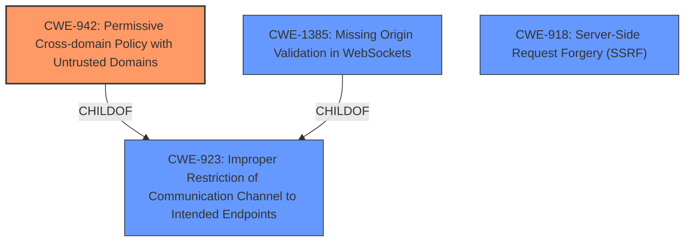

# Raw Analyzer Response for CVE-2025-24360

# Summary
| CWE ID | CWE Name | Confidence | CWE Abstraction Level | CWE Vulnerability Mapping Label | CWE-Vulnerability Mapping Notes |
|---|---|---|---|---|---|
| CWE-942 | Permissive Cross-domain Policy with Untrusted Domains | 0.9 | Variant | Allowed | Primary CWE |
| CWE-1385 | Missing Origin Validation in WebSockets | 0.7 | Variant | Allowed | Secondary Candidate |
| CWE-918 | Server-Side Request Forgery (SSRF) | 0.6 | Base | Allowed | Secondary Candidate |
| CWE-923 | Improper Restriction of Communication Channel to Intended Endpoints | 0.5 | Class | Allowed-with-Review | Secondary Candidate |

## Evidence and Confidence

*   **Confidence Score:** 0.9
*   **Evidence Strength:** HIGH

## Relationship Analysis
The primary CWE selected, CWE-942, is a Variant of the broader Class CWE-923 (Improper Restriction of Communication Channel to Intended Endpoints). CWE-942 directly addresses the specific issue of permissive cross-domain policies, which is the **root cause** described in the vulnerability. CWE-1385 (Missing Origin Validation in WebSockets) is also a Variant that is relevant due to the mention of WebSocket connections. Both CWE-942 and CWE-1385 are related to the broader issue of improper restriction of communication, but CWE-942 more precisely captures the **default CORS settings** issue.

## Vulnerability Chain
The vulnerability chain starts with the **default CORS settings** being overly permissive (CWE-942). This leads to the ability of malicious websites to send requests to the development server and read the response. The lack of origin validation in WebSockets (CWE-1385) and Host header validation contributes to the problem. The impact is source code theft and potential exploitation of other functionalities.

## Summary of Analysis
The analysis indicates that the **root cause** of the vulnerability is the **default CORS settings** in Nuxt, which allows any website to send requests to the development server and read the response. This aligns directly with CWE-942 (Permissive Cross-domain Policy with Untrusted Domains).

The evidence includes:
- The Vulnerability Description Key Phrases stating: "**rootcause:** **default CORS settings**"
- The CVE Reference Links Content Summary stating: "Nuxt allows any websites to send any requests to the development server and read the response due to default CORS settings."

The relationship analysis confirms that CWE-942 is the most specific and appropriate CWE, being a Variant of CWE-923. While other CWEs like CWE-918 (Server-Side Request Forgery) and CWE-1385 (Missing Origin Validation in WebSockets) are relevant, CWE-942 best represents the primary weakness.

CWEs considered but not used:
- CWE-79: Improper Neutralization of Input During Web Page Generation ('Cross-site Scripting') - While XSS could be a consequence of the vulnerability, it's not the direct **root cause**. The vulnerability is about the misconfiguration of CORS allowing external access.
- CWE-93: Improper Neutralization of CRLF Sequences ('CRLF Injection') and CWE-113: Improper Neutralization of CRLF Sequences in HTTP Headers ('HTTP Request/Response Splitting') - These are related to HTTP header manipulation, which is not the primary issue. The core problem is the permissive CORS policy.
- CWE-306: Missing Authentication for Critical Function - While authentication is related to security, the core issue is not missing authentication, but rather the misconfiguration of CORS.
- CWE-425: Direct Request ('Forced Browsing') - This is more about unauthorized access due to lack of authorization checks, whereas the identified issue is about the misconfiguration of CORS allowing the requests in the first place.
- CWE-863: Incorrect Authorization - This is too general. CWE-942 is more specific to the CORS misconfiguration.
- CWE-1390: Weak Authentication - Authentication is not the primary problem.
- CWE-269: Improper Privilege Management - Privilege management is not the primary problem.

The selected CWEs are at the optimal level of specificity because they directly address the **root cause** and contributing factors of the vulnerability, as evidenced by the vulnerability description and CVE summary.