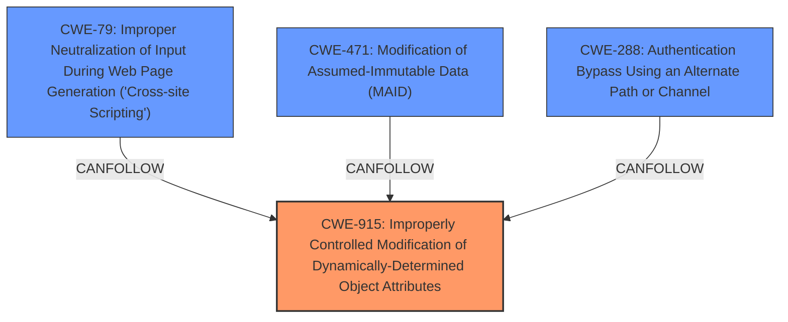

# Enhanced Analysis for CVE-2025-24370

# Summary
| CWE ID | CWE Name | Confidence | CWE Abstraction Level | CWE Vulnerability Mapping Label | CWE-Vulnerability Mapping Notes |
|---|---|---|---|---|---|
| CWE-915 | Improperly Controlled Modification of Dynamically-Determined Object Attributes | 0.9 | Base | Allowed | Primary CWE: Root cause of the vulnerability is that user-controlled input is used to modify object attributes.|
| CWE-79 | Improper Neutralization of Input During Web Page Generation ('Cross-site Scripting') | 0.7 | Base | Allowed | Secondary CWE: One of the impacts of the root cause is XSS. |
| CWE-471 | Modification of Assumed-Immutable Data (MAID) | 0.6 | Base | Allowed | Secondary CWE: The vulnerability involves modification of data that is assumed to be immutable. |
| CWE-288 | Authentication Bypass Using an Alternate Path or Channel | 0.5 | Base | Allowed | Secondary CWE: The vulnerability leads to authentication bypass. |

## Evidence and Confidence

*   **Confidence Score:** 0.8
*   **Evidence Strength:** HIGH

## Relationship Analysis
The primary CWE is CWE-915, which describes the root cause of the vulnerability where user-controlled input can modify object attributes. This can lead to several other weaknesses like CWE-79 (XSS), CWE-471 (MAID), and CWE-288 (Authentication Bypass). CWE-915 is a base-level CWE, making it a suitable choice for describing the core weakness.



## Vulnerability Chain
1.  **Root Cause:** CWE-915: Improperly Controlled Modification of Dynamically-Determined Object Attributes. The `set_property_value` function allows modification of object attributes based on user-supplied input without proper validation.
2.  **Impact 1:** CWE-79: Improper Neutralization of Input During Web Page Generation ('Cross-site Scripting'). By modifying certain object attributes, an attacker can inject malicious scripts into web pages.
3.  **Impact 2:** CWE-471: Modification of Assumed-Immutable Data (MAID). The vulnerability allows modification of data that should be immutable, leading to unexpected behavior.
4.  **Impact 3:** CWE-288: Authentication Bypass Using an Alternate Path or Channel. By modifying authentication-related attributes, an attacker can bypass authentication mechanisms.

## Summary of Analysis
The initial analysis correctly identifies the root cause as a **python class pollution vulnerability** in the `set_property_value` function, which aligns with CWE-915. The vulnerability chain starts with the improper modification of object attributes (CWE-915) and leads to various impacts such as XSS (CWE-79), Modification of Assumed-Immutable Data (CWE-471), and Authentication Bypass (CWE-288). The evidence from the CVE reference links confirms the root cause and impacts. The patch mitigates the vulnerability by preventing modification of properties starting and ending with "__", further supporting the chosen CWEs.

The selection of CWE-915 as the primary CWE is appropriate because it directly addresses the **root cause** of the vulnerability, where user-controlled input is used to modify object attributes without proper validation.

The evidence supporting CWE-915 comes from:
*   "**Root cause of vulnerability:** The `set_property_value` function in `django-unicorn/views/action_parsers/utils.py` is vulnerable. It allows modification of a property value of an object based on user-supplied parameters (`property_name` and `property_value`) via component requests. The vulnerability arises because this function fails to adequately prevent attackers from traversing to other objects in the python runtime using "magic attributes" such as `__init__.__globals__`."
*   "**Weaknesses/vulnerabilities present:** Python class pollution vulnerability, categorized as CWE-915."

The graph relationships influenced the final selection by highlighting the potential chain of weaknesses that stem from the root cause. The selected CWEs are at the optimal level of specificity, with CWE-915 accurately representing the core weakness and the other CWEs representing the potential impacts.

**CWEs Considered But Not Used:**

*   CWE-74: Improper Neutralization of Special Elements in Output Used by a Downstream Component ('Injection') - While injection is an impact, this CWE is too high level and doesn't capture the specific nature of the object attribute modification.
*   CWE-94: Improper Control of Generation of Code ('Code Injection') - While RCE is a possible impact, the vulnerability doesn't directly involve code injection but rather object attribute modification.
*   CWE-285: Improper Authorization - While the vulnerability can lead to authentication bypass, this is an indirect result of object attribute modification, not a direct authorization issue.
*   CWE-502: Deserialization of Untrusted Data - Deserialization is not part of the attack vector.


## CWE Relationship Analysis

Current CWEs represent these abstraction levels: .


### Vulnerability Chain Analysis

**Chain starting from CWE-288:**
- 288 (Authentication Bypass Using an Alternate Path or Channel) - ROOT


**Chain starting from CWE-471:**
- 471 (Modification of Assumed-Immutable Data (MAID)) - ROOT


### CWE Relationship Diagram

```mermaid
graph TD
    classDef primary fill:#f96,stroke:#333,stroke-width:2px
    classDef secondary fill:#69f,stroke:#333
    classDef tertiary fill:#9e9,stroke:#333
```