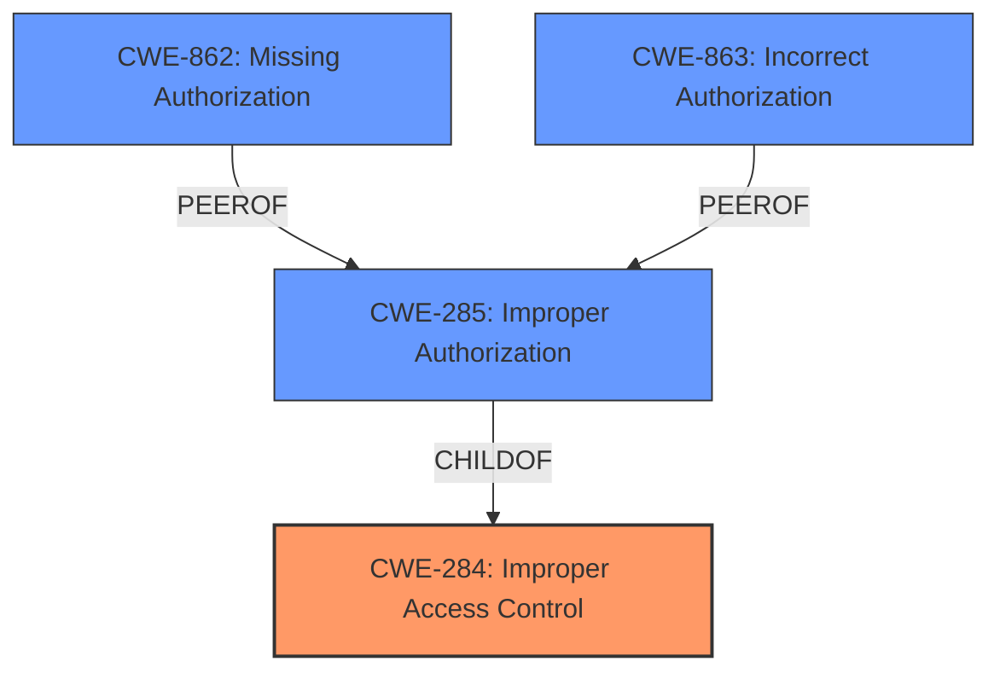

# Raw Analyzer Response for CVE-2025-24426

# Summary
| CWE ID    | CWE Name                                                                  | Confidence | CWE Abstraction Level | CWE Vulnerability Mapping Label | CWE-Vulnerability Mapping Notes |
| --------- | ------------------------------------------------------------------------- | ---------- | --------------------- | ------------------------------- | ------------------------------- |
| CWE-284   | Improper Access Control                                                     | 0.90       | Pillar                | Primary CWE                   | Discouraged                     |
| CWE-862   | Missing Authorization                                                       | 0.70       | Class                 | Secondary Candidate             | Allowed-with-Review             |
| CWE-285   | Improper Authorization                                                      | 0.60       | Class                 | Secondary Candidate             | Discouraged                     |
| CWE-863   | Incorrect Authorization                                                     | 0.50       | Class                 | Secondary Candidate             | Allowed-with-Review             |

## Evidence and Confidence

*   **Confidence Score:** 0.90
*   **Evidence Strength:** HIGH

## Relationship Analysis
The primary CWE selected is CWE-284, which is a high-level category. While more specific CWEs like CWE-862, CWE-863, and CWE-285 were considered, the initial description and even the more specific CVE summary suggest a general access control problem without pinpointing the exact flaw in authorization or authentication. CWE-284 serves as a suitable starting point, given that the root cause is generally **Improper Access Control**. The relationship between these CWEs shows that CWE-284 is a parent to CWE-285, and both CWE-862 and CWE-863 can be seen as related authorization issues.

## Vulnerability Chain
The vulnerability chain starts with **Improper Access Control** (CWE-284), which leads to a security feature bypass and unauthorized read access. The attacker is a low-privileged user who can exploit this vulnerability without user interaction.

Improper Access Control (CWE-284) -> Security Feature Bypass -> Unauthorized Read Access

## Summary of Analysis
The initial assessment led to the selection of CWE-284 due to the **Improper Access Control** being highlighted in the vulnerability description and the CVE Reference Links Content Summary. The retriever results also suggested CWE-285, CWE-862, and CWE-863, which are related to authorization issues. However, given that the description indicates a general access control issue rather than a specific authorization flaw, CWE-284 is the most appropriate primary CWE.

The key evidence supporting this decision is from the vulnerability description: "Adobe Commerce versions ... are affected by an **Improper Access Control** vulnerability that could result in a Security feature bypass." Furthermore, the CVE Reference Links Content Summary states the "Root cause of vulnerability: Improper Access Control (CWE-284)".

The choice of CWE-284 is at a higher level of abstraction (Pillar), and the MITRE guidance suggests avoiding it if a more specific CWE is available. However, without more information pinpointing the exact nature of the access control flaw (missing authentication, missing authorization, incorrect authorization), CWE-284 is a reasonable starting point. If further investigation reveals the specific mechanism of the access control bypass, a more specific CWE like CWE-862 or CWE-863 may be more appropriate.

Relevant CWE Information:

# Enhanced Context (25 CWEs)
The following CWEs were identified as potentially relevant to this vulnerability:

## CWE-280: Improper Handling of Insufficient Permissions or Privileges
**Abstraction Level**: Base
**Similarity Score**: 0.75
**Source**: dense

**Description**:
The product does not handle or incorrectly handles when it has insufficient privileges to access resources or functionality as specified by their permissions. This may cause it to follow unexpected code paths that may leave the product in an invalid state.

**Mapping Guidance**:
- Usage: Allowed
- Rationale: This CWE entry is at the Base level of abstraction, which is a preferred level of abstraction for mapping to the root causes of vulnerabilities.

## CWE-274: Improper Handling of Insufficient Privileges
**Abstraction Level**: Base
**Similarity Score**: 0.75
**Source**: dense

**Description**:
The product does not handle or incorrectly handles when it has insufficient privileges to perform an operation, leading to resultant weaknesses.

**Mapping Guidance**:
- Usage: Discouraged
- Rationale: This CWE entry could be deprecated in a future version of CWE.

## CWE-639: Authorization Bypass Through User-Controlled Key
**Abstraction Level**: Base
**Similarity Score**: 0.75
**Source**: dense

**Description**:
The system's authorization functionality does not prevent one user from gaining access to another user's data or record by modifying the key value identifying the data.

**Mapping Guidance**:
- Usage: Allowed
- Rationale: This CWE entry is at the Base level of abstraction, which is a preferred level of abstraction for mapping to the root causes of vulnerabilities.

## CWE-41: Improper Resolution of Path Equivalence
**Abstraction Level**: Base
**Similarity Score**: 0.75
**Source**: dense

**Description**:
The product is vulnerable to file system contents disclosure through path equivalence. Path equivalence involves the use of special characters in file and directory names. The associated manipulations are intended to generate multiple names for the same object.

**Mapping Guidance**:
- Usage: Allowed
- Rationale: This CWE entry is at the Base level of abstraction, which is a preferred level of abstraction for mapping to the root causes of vulnerabilities.

## CWE-552: Files or Directories Accessible to External Parties
**Abstraction Level**: Base
**Similarity Score**: 0.75
**Source**: dense

**Description**:
The product makes files or directories accessible to unauthorized actors, even though they should not be.

**Mapping Guidance**:
- Usage: Allowed
- Rationale: This CWE entry is at the Base level of abstraction, which is a preferred level of abstraction for mapping to the root causes of vulnerabilities.

## CWE-425: Direct Request ('Forced Browsing')
**Abstraction Level**: Base
**Similarity Score**: 0.75
**Source**: dense

**Description**:
The web application does not adequately enforce appropriate authorization on all restricted URLs, scripts, or files.

**Mapping Guidance**:
- Usage: Allowed
- Rationale: This CWE entry is at the Base level of abstraction, which is a preferred level of abstraction for mapping to the root causes of vulnerabilities.

## CWE-472: External Control of Assumed-Immutable Web Parameter
**Abstraction Level**: Base
**Similarity Score**: 0.74
**Source**: dense

**Description**:
The web application does not sufficiently verify inputs that are assumed to be immutable but are actually externally controllable, such as hidden form fields.

**Mapping Guidance**:
- Usage: Allowed
- Rationale: This CWE entry is at the Base level of abstraction, which is a preferred level of abstraction for mapping to the root causes of vulnerabilities.

## CWE-668: Exposure of Resource to Wrong Sphere
**Abstraction Level**: Class
**Similarity Score**: 0.74
**Source**: dense

**Description**:
The product exposes a resource to the wrong control sphere, providing unintended actors with inappropriate access to the resource.

**Mapping Guidance**:
- Usage: Discouraged
- Rationale: CWE-668 is high-level and is often misused as a catch-all when lower-level CWE IDs might be applicable. It is sometimes used for low-information vulnerability reports [REF-1287]. It is a level-1 Class (i.e., a child of a Pillar). It is not useful for trend analysis.

## CWE-807: Reliance on Untrusted Inputs in a Security Decision
**Abstraction Level**: Base
**Similarity Score**: 0.74
**Source**: dense

**Description**:
The product uses a protection mechanism that relies on the existence or values of an input, but the input can be modified by an untrusted actor in a way that bypasses the protection mechanism.

**Mapping Guidance**:
- Usage: Allowed
- Rationale: This CWE entry is at the Base level of abstraction, which is a preferred level of abstraction for mapping to the root causes of vulnerabilities.

## CWE-267: Privilege Defined With Unsafe Actions
**Abstraction Level**: Base
**Similarity Score**: 0.74