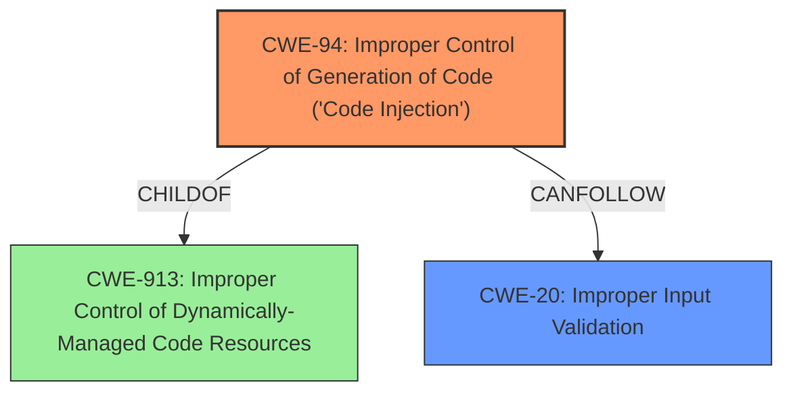

# Analysis Report for CVE-2025-24499

# Vulnerability Analysis Report: CVE-2025-24499

## Description

A vulnerability has been identified in SCALANCE WAB762-1 (6GK5762-1AJ00-6AA0) (All versions < V3.0.0), SCALANCE WAM763-1 (6GK5763-1AL00-7DA0) (All versions < V3.0.0), SCALANCE WAM763-1 (ME) (6GK5763-1AL00-7DC0) (All versions < V3.0.0), SCALANCE WAM763-1 (US) (6GK5763-1AL00-7DB0) (All versions < V3.0.0), SCALANCE WAM766-1 (6GK5766-1GE00-7DA0) (All versions < V3.0.0), SCALANCE WAM766-1 (ME) (6GK5766-1GE00-7DC0) (All versions < V3.0.0), SCALANCE WAM766-1 (US) (6GK5766-1GE00-7DB0) (All versions < V3.0.0), SCALANCE WAM766-1 EEC (6GK5766-1GE00-7TA0) (All versions < V3.0.0), SCALANCE WAM766-1 EEC (ME) (6GK5766-1GE00-7TC0) (All versions < V3.0.0), SCALANCE WAM766-1 EEC (US) (6GK5766-1GE00-7TB0) (All versions < V3.0.0), SCALANCE WUB762-1 (6GK5762-1AJ00-1AA0) (All versions < V3.0.0), SCALANCE WUB762-1 iFeatures (6GK5762-1AJ00-2AA0) (All versions < V3.0.0), SCALANCE WUM763-1 (6GK5763-1AL00-3AA0) (All versions < V3.0.0), SCALANCE WUM763-1 (6GK5763-1AL00-3DA0) (All versions < V3.0.0), SCALANCE WUM763-1 (US) (6GK5763-1AL00-3AB0) (All versions < V3.0.0), SCALANCE WUM763-1 (US) (6GK5763-1AL00-3DB0) (All versions < V3.0.0), SCALANCE WUM766-1 (6GK5766-1GE00-3DA0) (All versions < V3.0.0), SCALANCE WUM766-1 (ME) (6GK5766-1GE00-3DC0) (All versions < V3.0.0), SCALANCE WUM766-1 (USA) (6GK5766-1GE00-3DB0) (All versions < V3.0.0). Affected devices do not properly validate input while loading the configuration files. This could allow an authenticated remote attacker to execute arbitrary shell commands on the device.

## Vulnerability Description Key Phrases

- **Rootcause:** input validation
- **Product:** ['SCALANCE WAB762-1', 'SCALANCE WAM763-1', 'SCALANCE WAM763-1 (ME)', 'SCALANCE WAM763-1 (US)', 'SCALANCE WAM766-1', 'SCALANCE WAM766-1 (ME)', 'SCALANCE WAM766-1 (US)', 'SCALANCE WAM766-1 EEC', 'SCALANCE WAM766-1 EEC (ME)', 'SCALANCE WAM766-1 EEC (US)', 'SCALANCE WUB762-1', 'SCALANCE WUB762-1 iFeatures', 'SCALANCE WUM763-1', 'SCALANCE WUM763-1', 'SCALANCE WUM763-1 (US)', 'SCALANCE WUM763-1 (US)', 'SCALANCE WUM766-1', 'SCALANCE WUM766-1 (ME)', 'SCALANCE WUM766-1 (USA)']
- **Impact:** execute arbitrary shell commands, execute arbitrary shell commands on the device
- **Attacker:** authenticated remote attacker
- **Version:** All versions < V3.0.0

## Analysis (with Relationship Data)

# Summary
| CWE ID | CWE Name | Confidence | CWE Abstraction Level | CWE Vulnerability Mapping Label | CWE-Vulnerability Mapping Notes |
|---|---|---|---|---|---|
| CWE-94 | Improper Control of Generation of Code ('Code Injection') | 0.9 | Base | Allowed-with-Review | Primary CWE. The vulnerability allows for execution of arbitrary shell commands due to **improper control of code generation**, stemming from **insufficient input validation**. |
| CWE-20 | Improper Input Validation | 0.7 | Class | Discouraged | Secondary candidate. While **improper input validation** is mentioned, CWE-94 is a more specific cause of the vulnerability. |

## Evidence and Confidence

*   **Confidence Score:** 0.8
*   **Evidence Strength:** MEDIUM

## Relationship Analysis
The primary relationship that influenced the decision was the parent-child relationship between CWE-94 and CWE-913. While the description indicates **improper input validation** (CWE-20), the resulting "arbitrary shell commands execution" points to a more specific issue of **improper code generation** (CWE-94).



## Vulnerability Chain
The vulnerability chain starts with **improper input validation**, which leads to the **improper control of code generation**, ultimately resulting in arbitrary shell command execution.

Improper Input Validation -> Improper Control of Generation of Code -> Arbitrary Shell Command Execution

## Summary of Analysis
The initial assessment was to map the vulnerability to CWE-20, given the mention of **improper input validation**. However, further analysis revealed that the root cause is more accurately described by CWE-94, as the **improperly validated input** leads directly to the generation and execution of arbitrary code. The description explicitly states "Affected devices do not properly validate input while loading the configuration files. This could allow an authenticated remote attacker to execute arbitrary shell commands on the device," which directly supports CWE-94.

The final decision is based on the evidence provided and the relationships between CWEs. CWE-94 is chosen for its specificity in describing the root cause, while CWE-20 is considered a contributing factor.

Relevant CWE Information:

# Enhanced Context (25 CWEs)
The following CWEs were identified as potentially relevant to this vulnerability:

## CWE-345: Insufficient Verification of Data Authenticity
**Abstraction Level**: Class
**Similarity Score**: 0.77
**Source**: dense

**Description**:
The product does not sufficiently verify the origin or authenticity of data, in a way that causes it to accept invalid data.

**Mapping Guidance**:
- Usage: Discouraged
- Rationale: This CWE entry is a level-1 Class (i.e., a child of a Pillar). It might have lower-level children that would be more appropriate

## CWE-303: Incorrect Implementation of Authentication Algorithm
**Abstraction Level**: Base
**Similarity Score**: 0.77
**Source**: dense

**Description**:
The requirements for the product dictate the use of an established authentication algorithm, but the implementation of the algorithm is incorrect.

**Mapping Guidance**:
- Usage: Allowed
- Rationale: This CWE entry is at the Base level of abstraction, which is a preferred level of abstraction for mapping to the root causes of vulnerabilities.

## CWE-294: Authentication Bypass by Capture-replay
**Abstraction Level**: Base
**Similarity Score**: 0.77
**Source**: dense

**Description**:
A capture-replay flaw exists when the design of the product makes it possible for a malicious user to sniff network traffic and bypass authentication by replaying it to the server in question to the same effect as the original message (or with minor changes).

**Mapping Guidance**:
- Usage: Allowed
- Rationale: This CWE entry is at the Base level of abstraction, which is a preferred level of abstraction for mapping to the root causes of vulnerabilities.

## CWE-807: Reliance on Untrusted Inputs in a Security Decision
**Abstraction Level**: Base
**Similarity Score**: 0.77
**Source**: dense

**Description**:
The product uses a protection mechanism that relies on the existence or values of an input, but the input can be modified by an untrusted actor in a way that bypasses the protection mechanism.

**Mapping Guidance**:
- Usage: Allowed
- Rationale: This CWE entry is at the Base level of abstraction, which is a preferred level of abstraction for mapping to the root causes of vulnerabilities.

## CWE-798: Use of Hard-coded Credentials
**Abstraction Level**: Base
**Similarity Score**: 0.76
**Source**: dense

**Description**:
The product contains hard-coded credentials, such as a password or cryptographic key.

**Mapping Guidance**:
- Usage: Allowed
- Rationale: This CWE entry is at the Base level of abstraction, which is a preferred level of abstraction for mapping to the root causes of vulnerabilities.

## CWE-912: Hidden Functionality
**Abstraction Level**: Class
**Similarity Score**: 0.76
**Source**: dense

**Description**:
The product contains functionality that is not documented, not part of the specification, and not accessible through an interface or command sequence that is obvious to the product's users or administrators.

**Mapping Guidance**:
- Usage: Allowed-with-Review
- Rationale: This CWE entry is a Class and might have Base-level children that would be more appropriate

## CWE-497: Exposure of Sensitive System Information to an Unauthorized Control Sphere
**Abstraction Level**: Base
**Similarity Score**: 0.76
**Source**: dense

**Description**:
The product does not properly prevent sensitive system-level information from being accessed by unauthorized actors who do not have the same level of access to the underlying system as the product does.

**Mapping Guidance**:
- Usage: Allowed
- Rationale: This CWE entry is at the Base level of abstraction, which is a preferred level of abstraction for mapping to the root causes of vulnerabilities.

## CWE-138: Improper Neutralization of Special Elements
**Abstraction Level**: Class
**Similarity Score**: 0.76
**Source**: dense

**Description**:
The product receives input from an upstream component, but it does not neutralize or incorrectly neutralizes special elements that could be interpreted as control elements or syntactic markers when they are sent to a downstream component.

**Mapping Guidance**:
- Usage: Discouraged
- Rationale: This CWE entry is a level-1 Class (i.e., a child of a Pillar). It might have lower-level children that would be more appropriate

## CWE-134: Use of Externally-Controlled Format String
**Abstraction Level**: Base
**Similarity Score**: 0.76
**Source**: dense

**Description**:
The product uses a function that accepts a format string as an argument, but the format string originates from an external source.

**Mapping Guidance**:
- Usage: Allowed
- Rationale: This CWE entry is at the Base level of abstraction, which is a preferred level of abstraction for mapping to the root causes of vulnerabilities.

## CWE-280: Improper Handling of Insufficient Permissions or Privileges
**Abstraction Level**: Base
**Similarity Score**: 0.76
**Source**: dense

**Description**:
The product does not handle or incorrectly handles when it has insufficient privileges to access resources or functionality as specified by their permissions. This may cause it to follow unexpected code paths that may leave the product in an invalid state.

**Mapping Guidance**:
- Usage: Allowed
- Rationale: This CWE entry is at the Base level of abstraction, which is a preferred level of abstraction for mapping to the root causes of vulnerabilities.

## CWE-94: Improper Control of Generation of Code ('Code Injection')
**Abstraction Level**: Base
**Similarity Score**: 1068.44
**Source**: sparse

**Description**:
The product constructs all or part of a code segment using externally-influenced input from an upstream component, but it does not neutralize or incorrectly neutralizes special elements that could modify the syntax or behavior of the intended code segment.

**Mapping Guidance**:
- Usage: Allowed-with-Review
- Rationale: This entry is frequently misused for vulnerabilities with a technical impact of "code execution," which does not by itself indicate a root cause weakness, since dozens of weaknesses can enable code execution.

## CWE-284: Improper Access Control
**Abstraction Level**: Pillar
**Similarity Score**: 847.52
**Source**: sparse

**Description**:
The product does not restrict or incorrectly restricts access to a resource from an unauthorized actor.

**Mapping Guidance**:
- Usage:


## CWE Relationship Analysis

Current CWEs represent these abstraction levels: .


### Vulnerability Chain Analysis

**Chain starting from CWE-280:**
- 280 (Improper Handling of Insufficient Permissions or Privileges ) - ROOT


**Chain starting from CWE-94:**
- 94 (Improper Control of Generation of Code ('Code Injection')) - ROOT


### CWE Relationship Diagram

```mermaid
graph TD
    classDef primary fill:#f96,stroke:#333,stroke-width:2px
    classDef secondary fill:#69f,stroke:#333
    classDef tertiary fill:#9e9,stroke:#333
```


*Report generated on 2025-07-14 12:45:42*
