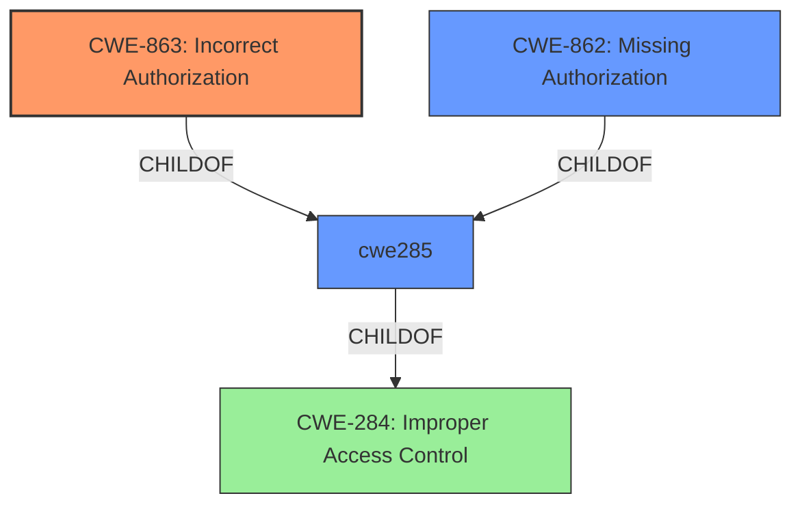

# Analysis Report for CVE-2025-24532

# Vulnerability Analysis Report: CVE-2025-24532

## Description

A vulnerability has been identified in SCALANCE WAB762-1 (6GK5762-1AJ00-6AA0) (All versions < V3.0.0), SCALANCE WAM763-1 (6GK5763-1AL00-7DA0) (All versions < V3.0.0), SCALANCE WAM763-1 (ME) (6GK5763-1AL00-7DC0) (All versions < V3.0.0), SCALANCE WAM763-1 (US) (6GK5763-1AL00-7DB0) (All versions < V3.0.0), SCALANCE WAM766-1 (6GK5766-1GE00-7DA0) (All versions < V3.0.0), SCALANCE WAM766-1 (ME) (6GK5766-1GE00-7DC0) (All versions < V3.0.0), SCALANCE WAM766-1 (US) (6GK5766-1GE00-7DB0) (All versions < V3.0.0), SCALANCE WAM766-1 EEC (6GK5766-1GE00-7TA0) (All versions < V3.0.0), SCALANCE WAM766-1 EEC (ME) (6GK5766-1GE00-7TC0) (All versions < V3.0.0), SCALANCE WAM766-1 EEC (US) (6GK5766-1GE00-7TB0) (All versions < V3.0.0), SCALANCE WUB762-1 (6GK5762-1AJ00-1AA0) (All versions < V3.0.0), SCALANCE WUB762-1 iFeatures (6GK5762-1AJ00-2AA0) (All versions < V3.0.0), SCALANCE WUM763-1 (6GK5763-1AL00-3AA0) (All versions < V3.0.0), SCALANCE WUM763-1 (6GK5763-1AL00-3DA0) (All versions < V3.0.0), SCALANCE WUM763-1 (US) (6GK5763-1AL00-3AB0) (All versions < V3.0.0), SCALANCE WUM763-1 (US) (6GK5763-1AL00-3DB0) (All versions < V3.0.0), SCALANCE WUM766-1 (6GK5766-1GE00-3DA0) (All versions < V3.0.0), SCALANCE WUM766-1 (ME) (6GK5766-1GE00-3DC0) (All versions < V3.0.0), SCALANCE WUM766-1 (USA) (6GK5766-1GE00-3DB0) (All versions < V3.0.0). Affected devices with role `user` is affected by **incorrect authorization in SNMPv3 View configuration**. This could allow an attacker to change the View Type of SNMPv3 Views.

## Vulnerability Description Key Phrases

- **Rootcause:** incorrect authorization in SNMPv3 View configuration
- **Product:** SCALANCE WAB762-1, SCALANCE WAM763-1, SCALANCE WAM763-1 (ME), SCALANCE WAM763-1 (US), SCALANCE WAM766-1, SCALANCE WAM766-1 (ME), SCALANCE WAM766-1 (US), SCALANCE WAM766-1 EEC, SCALANCE WAM766-1 EEC (ME), SCALANCE WAM766-1 EEC (US), SCALANCE WUB762-1, SCALANCE WUB762-1 iFeatures, SCALANCE WUM763-1, SCALANCE WUM763-1, SCALANCE WUM763-1 (US), SCALANCE WUM763-1 (US), SCALANCE WUM766-1, SCALANCE WUM766-1 (ME), SCALANCE WUM766-1 (USA)
- **Impact:** change the View Type of SNMPv3 Views
- **Attacker:** attacker
- **Version:** All versions < V3.0.0

## Analysis (with Relationship Data)

# Summary
| CWE ID    | CWE Name                                                                   | Confidence | CWE Abstraction Level | CWE Vulnerability Mapping Label | CWE-Vulnerability Mapping Notes |
| :-------- | :------------------------------------------------------------------------- | :--------- | :-------------------- | :------------------------------ | :------------------------------ |
| CWE-863   | Incorrect Authorization                                                    | 0.9        | Base                  | Primary                         | Allowed                         |

## Evidence and Confidence

*   **Confidence Score:** 0.9
*   **Evidence Strength:** MEDIUM

## Relationship Analysis
The primary relationship that influenced the decision was the hierarchical relationship between CWE-284 (Improper Access Control), CWE-862 (Missing Authorization), and CWE-863 (Incorrect Authorization). Given the **incorrect authorization** specified, CWE-863 was selected as the most specific and appropriate choice.



## Vulnerability Chain
The vulnerability chain begins with **incorrect authorization** leading to the ability to change the View Type of SNMPv3 Views.

## Summary of Analysis
The analysis is based primarily on the provided vulnerability description, which identifies **incorrect authorization** as the root cause. The selection of CWE-863 (Incorrect Authorization) is supported by the CWE Classification Guidance, which recommends using CWE-863 when authorization checks are present but flawed. The absence of detailed information in the CVE Reference Links Content Summary reduces confidence, but the vulnerability description is sufficient for a strong mapping. The selected CWE is at the optimal level of specificity as it directly addresses the **incorrect authorization** aspect of the vulnerability.

Relevant CWE Information:

# Enhanced Context (25 CWEs)
The following CWEs were identified as potentially relevant to this vulnerability:

## CWE-668: Exposure of Resource to Wrong Sphere
**Abstraction Level**: Class
**Similarity Score**: 0.76
**Source**: dense

**Description**:
The product exposes a resource to the wrong control sphere, providing unintended actors with inappropriate access to the resource.

**Mapping Guidance**:
- Usage: Discouraged
- Rationale: CWE-668 is high-level and is often misused as a catch-all when lower-level CWE IDs might be applicable. It is sometimes used for low-information vulnerability reports [REF-1287]. It is a level-1 Class (i.e., a child of a Pillar). It is not useful for trend analysis.


## CWE-497: Exposure of Sensitive System Information to an Unauthorized Control Sphere
**Abstraction Level**: Base
**Similarity Score**: 0.75
**Source**: dense

**Description**:
The product does not properly prevent sensitive system-level information from being accessed by unauthorized actors who do not have the same level of access to the underlying system as the product does.

**Mapping Guidance**:
- Usage: Allowed
- Rationale: This CWE entry is at the Base level of abstraction, which is a preferred level of abstraction for mapping to the root causes of vulnerabilities.


## CWE-807: Reliance on Untrusted Inputs in a Security Decision
**Abstraction Level**: Base
**Similarity Score**: 0.75
**Source**: dense

**Description**:
The product uses a protection mechanism that relies on the existence or values of an input, but the input can be modified by an untrusted actor in a way that bypasses the protection mechanism.

**Mapping Guidance**:
- Usage: Allowed
- Rationale: This CWE entry is at the Base level of abstraction, which is a preferred level of abstraction for mapping to the root causes of vulnerabilities.


## CWE-41: Improper Resolution of Path Equivalence
**Abstraction Level**: Base
**Similarity Score**: 0.75
**Source**: dense

**Description**:
The product is vulnerable to file system contents disclosure through path equivalence. Path equivalence involves the use of special characters in file and directory names. The associated manipulations are intended to generate multiple names for the same object.

**Mapping Guidance**:
- Usage: Allowed
- Rationale: This CWE entry is at the Base level of abstraction, which is a preferred level of abstraction for mapping to the root causes of vulnerabilities.


## CWE-303: Incorrect Implementation of Authentication Algorithm
**Abstraction Level**: Base
**Similarity Score**: 0.75
**Source**: dense

**Description**:
The requirements for the product dictate the use of an established authentication algorithm, but the implementation of the algorithm is incorrect.

**Mapping Guidance**:
- Usage: Allowed
- Rationale: This CWE entry is at the Base level of abstraction, which is a preferred level of abstraction for mapping to the root causes of vulnerabilities.


## CWE-345: Insufficient Verification of Data Authenticity
**Abstraction Level**: Class
**Similarity Score**: 0.74
**Source**: dense

**Description**:
The product does not sufficiently verify the origin or authenticity of data, in a way that causes it to accept invalid data.

**Mapping Guidance**:
- Usage: Discouraged
- Rationale: This CWE entry is a level-1 Class (i.e., a child of a Pillar). It might have lower-level children that would be more appropriate


## CWE-280: Improper Handling of Insufficient Permissions or Privileges 
**Abstraction Level**: Base
**Similarity Score**: 0.74
**Source**: dense

**Description**:
The product does not handle or incorrectly handles when it has insufficient privileges to access resources or functionality as specified by their permissions. This may cause it to follow unexpected code paths that may leave the product in an invalid state.

**Mapping Guidance**:
- Usage: Allowed
- Rationale: This CWE entry is at the Base level of abstraction, which is a preferred level of abstraction for mapping to the root causes of vulnerabilities.


## CWE-74: Improper Neutralization of Special Elements in Output Used by a Downstream Component ('Injection')
**Abstraction Level**: Class
**Similarity Score**: 0.74
**Source**: dense

**Description**:
The product constructs all or part of a command, data structure, or record using externally-influenced input from an upstream component, but it does not neutralize or incorrectly neutralizes special elements that could modify how it is parsed or interpreted when it is sent to a downstream component.

**Mapping Guidance**:
- Usage: Discouraged
- Rationale: CWE-74 is high-level and often misused when lower-level weaknesses are more appropriate.


## CWE-703: Improper Check or Handling of Exceptional Conditions
**Abstraction Level**: Pillar
**Similarity Score**: 0.74
**Source**: dense

**Description**:
The product does not properly anticipate or handle exceptional conditions that rarely occur during normal operation of the product.

**Mapping Guidance**:
- Usage: Discouraged
- Rationale: This CWE entry is extremely high-level, a Pillar.


## CWE-204: Observable Response Discrepancy
**Abstraction Level**: Base
**Similarity Score**: 0.74
**Source**: dense

**Description**:
The product provides different responses to incoming requests in a way that reveals internal state information to an unauthorized actor outside of the intended control sphere.

**Mapping Guidance**:
- Usage: Allowed
- Rationale: This CWE entry is at the Base level of abstraction, which is a preferred level of abstraction for mapping to the root causes of vulnerabilities.


## CWE-94: Improper Control of Generation of Code ('Code Injection')
**Abstraction Level**: Base
**Similarity Score**: 1736.47
**Source**: sparse

**Description**:
The product constructs all or part of a code segment using externally-influenced input from an upstream component, but it does not neutralize or incorrectly neutralizes special elements that could modify the syntax or behavior of the intended code segment.

**Mapping Guidance**:
- Usage: Allowed-with-Review
- Rationale: This entry is frequently misused for vulnerabilities with a technical impact of "code execution," which does not by itself indicate a root cause weakness, since dozens of weaknesses can enable code execution.


## CWE-284: Improper Access Control
**Abstraction Level**: Pillar
**Similarity Score**: 1631.36
**Source**: sparse

**Description**:
The product does not restrict or incorrectly restricts access to a resource from an unauthorized actor.

**Mapping Guidance**:
- Usage: Discouraged
- Rationale: CWE-284 is extremely high-level, a Pillar. Its name, "Improper Access Control," is often misused in low-information vulnerability reports [REF-1287] or by active use of the OWASP Top Ten, such as "A01:2021


## CWE Relationship Analysis

Current CWEs represent these abstraction levels: .


### Vulnerability Chain Analysis

**Chain starting from CWE-863:**
- 863 (Incorrect Authorization) - ROOT


**Chain starting from CWE-280:**
- 280 (Improper Handling of Insufficient Permissions or Privileges ) - ROOT


### CWE Relationship Diagram

```mermaid
graph TD
    classDef primary fill:#f96,stroke:#333,stroke-width:2px
    classDef secondary fill:#69f,stroke:#333
    classDef tertiary fill:#9e9,stroke:#333
```


*Report generated on 2025-07-14 12:47:51*
