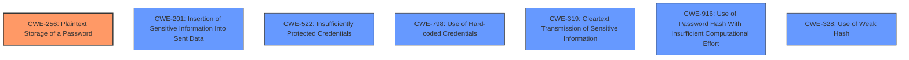

# Analysis Report for CVE-2025-24858

# Vulnerability Analysis Report: CVE-2025-24858

## Description

Develocity (formerly Gradle Enterprise) before 2024.3.1 allows an attacker who has network access to a Develocity server to obtain the hashed password of the system user. The hash algorithm used by Develocity was chosen according to best practices for password storage and provides some protection against brute-force attempts. The applicable severity of this vulnerability depends on whether a Develocity server is accessible by external or unauthorized users, and the complexity of the System User password.

## Vulnerability Description Key Phrases

- **Product:** Develocity
- **Impact:** obtain the hashed password, obtain the System User password
- **Attacker:** attacker who has network access
- **Version:** before 2024.3.1

## Analysis (with Relationship Data)

# Summary
| CWE ID | CWE Name | Confidence | CWE Abstraction Level | CWE Vulnerability Mapping Label | CWE-Vulnerability Mapping Notes |
|---|---|---|---|---|---|
| CWE-256 | Plaintext Storage of a Password | 0.75 | Base |  Primary CWE | Allowed |
| CWE-201 | Insertion of Sensitive Information Into Sent Data | 0.5 | Base | Secondary Candidate CWE | Allowed |
| CWE-522 | Insufficiently Protected Credentials | 0.5 | Class | Secondary Candidate CWE | Allowed-with-Review |
| CWE-798 | Use of Hard-coded Credentials | 0.5 | Base | Secondary Candidate CWE | Allowed |
| CWE-319 | Cleartext Transmission of Sensitive Information | 0.5 | Base | Secondary Candidate CWE | Allowed |
| CWE-916 | Use of Password Hash With Insufficient Computational Effort | 0.3 | Base | Secondary Candidate CWE | Allowed |
| CWE-328 | Use of Weak Hash | 0.3 | Base | Secondary Candidate CWE | Allowed |

## Evidence and Confidence

*   **Confidence Score:** 0.7
*   **Evidence Strength:** MEDIUM

## Relationship Analysis
The primary relationship that influences this decision is the parent-child relationships. CWE-256 is chosen because the root cause is the password hash information exposure, which leads to the attacker obtaining the hashed password of the system user. The other CWEs are related to how the password hash could be obtained and what weaknesses could be present.



## Vulnerability Chain
The vulnerability chain starts with the **exposure** of the hashed password, which may or may not have been stored in plaintext (depending on what "obtain" means). This could lead to an attacker gaining unauthorized access.

CWE-256 (Plaintext Storage of a Password) -> Possible unauthorized access

## Summary of Analysis
The primary CWE is CWE-256 because the main vulnerability is that the system user's hashed password can be obtained. This suggests that the password hash might be stored insecurely, potentially in plaintext.

The evidence for this is:

*   "allows an attacker who has network access to a Develocity server to **obtain the hashed password** of the system user"
*   "**Weaknesses/vulnerabilities present: Password hash information exposure**."

Other CWEs such as CWE-916 (Use of Password Hash With Insufficient Computational Effort) and CWE-328 (Use of Weak Hash) were considered but are not the primary issue. The vulnerability description states, "The hash algorithm used by Develocity was chosen according to best practices for password storage and provides some protection against brute-force attempts," which suggests these aren't the primary issue, but they can contribute if they are present.
CWE-201, CWE-522, CWE-798, and CWE-319 were also considered as they provide a possible pathway on how to obtain the hashed password.

**Therefore, the primary CWE is CWE-256 because the root cause is the potential for insecure storage or transmission of the hashed password.**

Relevant CWE Information:

# Enhanced Context (25 CWEs)
The following CWEs were identified as potentially relevant to this vulnerability:

## CWE-916: Use of Password Hash With Insufficient Computational Effort
**Abstraction Level**: Base
**Similarity Score**: 0.76
**Source**: dense

**Description**:
The product generates a hash for a password, but it uses a scheme that does not provide a sufficient level of computational effort that would make password cracking attacks infeasible or expensive.

**Mapping Guidance**:
- Usage: Allowed
- Rationale: This CWE entry is at the Base level of abstraction, which is a preferred level of abstraction for mapping to the root causes of vulnerabilities.


## CWE-1391: Use of Weak Credentials
**Abstraction Level**: Class
**Similarity Score**: 0.71
**Source**: dense

**Description**:
The product uses weak credentials (such as a default key or hard-coded password) that can be calculated, derived, reused, or guessed by an attacker.

**Mapping Guidance**:
- Usage: Allowed-with-Review
- Rationale: This CWE entry is a Class and might have Base-level children that would be more appropriate


## CWE-836: Use of Password Hash Instead of Password for Authentication
**Abstraction Level**: Base
**Similarity Score**: 0.71
**Source**: dense

**Description**:
The product records password hashes in a data store, receives a hash of a password from a client, and compares the supplied hash to the hash obtained from the data store.

**Mapping Guidance**:
- Usage: Allowed
- Rationale: This CWE entry is at the Base level of abstraction, which is a preferred level of abstraction for mapping to the root causes of vulnerabilities.


## CWE-328: Use of Weak Hash
**Abstraction Level**: Base
**Similarity Score**: 0.70
**Source**: dense

**Description**:
The product uses an algorithm that produces a digest (output value) that does not meet security expectations for a hash function that allows an adversary to reasonably determine the original input (preimage attack), find another input that can produce the same hash (2nd preimage attack), or find multiple inputs that evaluate to the same hash (birthday attack).

**Mapping Guidance**:
- Usage: Allowed
- Rationale: This CWE entry is at the Base level of abstraction, which is a preferred level of abstraction for mapping to the root causes of vulnerabilities.


## CWE-798: Use of Hard-coded Credentials
**Abstraction Level**: Base
**Similarity Score**: 0.69
**Source**: dense

**Description**:
The product contains hard-coded credentials, such as a password or cryptographic key.

**Mapping Guidance**:
- Usage: Allowed
- Rationale: This CWE entry is at the Base level of abstraction, which is a preferred level of abstraction for mapping to the root causes of vulnerabilities.


## CWE-256: Plaintext Storage of a Password
**Abstraction Level**: Base
**Similarity Score**: 0.69
**Source**: dense

**Description**:
Storing a password in plaintext may result in a system compromise.

**Mapping Guidance**:
- Usage: Allowed
- Rationale: This CWE entry is at the Base level of abstraction, which is a preferred level of abstraction for mapping to the root causes of vulnerabilities.


## CWE-303: Incorrect Implementation of Authentication Algorithm
**Abstraction Level**: Base
**Similarity Score**: 0.69
**Source**: dense

**Description**:
The requirements for the product dictate the use of an established authentication algorithm, but the implementation of the algorithm is incorrect.

**Mapping Guidance**:
- Usage: Allowed
- Rationale: This CWE entry is at the Base level of abstraction, which is a preferred level of abstraction for mapping to the root causes of vulnerabilities.


## CWE-319: Cleartext Transmission of Sensitive Information
**Abstraction Level**: Base
**Similarity Score**: 0.68
**Source**: dense

**Description**:
The product transmits sensitive or security-critical data in cleartext in a communication channel that can be sniffed by unauthorized actors.

**Mapping Guidance**:
- Usage: Allowed
- Rationale: This CWE entry is at the Base level of abstraction, which is a preferred level of abstraction for mapping to the root causes of vulnerabilities.


## CWE-620: Unverified Password Change
**Abstraction Level**: Base
**Similarity Score**: 0.68
**Source**: dense

**Description**:
When setting a new password for a user, the product does not require knowledge of the original password, or using another form of authentication.

**Mapping Guidance**:
- Usage: Allowed
- Rationale: This CWE entry is at the Base level of abstraction, which is a preferred level of abstraction for mapping to the root causes of vulnerabilities.


## CWE-330: Use of Insufficiently Random Values
**Abstraction Level**: Class
**Similarity Score**: 0.68
**Source**: dense

**Description**:
The product uses insufficiently random numbers or values in a security context that depends on unpredictable numbers.

**Mapping Guidance**:
- Usage: Discouraged
- Rationale: This CWE entry is a level-1 Class (i.e.,


## CWE Relationship Analysis

Current CWEs represent these abstraction levels: .


### Vulnerability Chain Analysis

**Chain starting from CWE-330:**
- 330 (Use of Insufficiently Random Values) - ROOT


**Chain starting from CWE-319:**
- 319 (Cleartext Transmission of Sensitive Information) - ROOT


### CWE Relationship Diagram

```mermaid
graph TD
    classDef primary fill:#f96,stroke:#333,stroke-width:2px
    classDef secondary fill:#69f,stroke:#333
    classDef tertiary fill:#9e9,stroke:#333
```


*Report generated on 2025-07-14 12:55:55*
