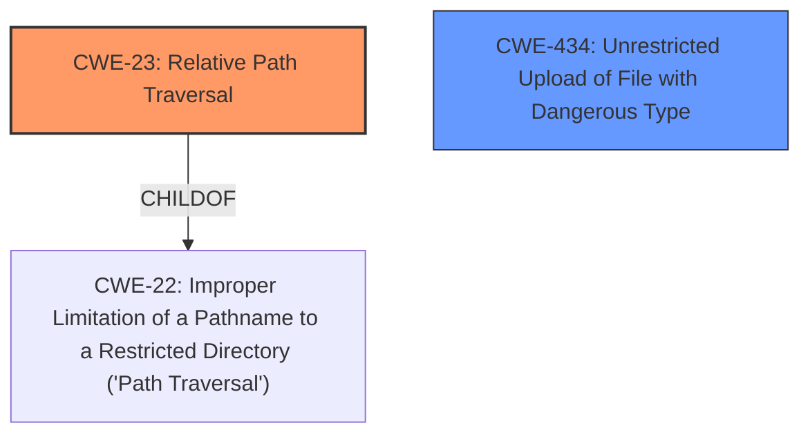

# Analysis Report for CVE-2025-24888

# Vulnerability Analysis Report: CVE-2025-24888

## Description

The SecureDrop Client is a desktop application for journalists to communicate with sources and work with submissions on the SecureDrop Workstation. Prior to version 0.14.1, a malicious SecureDrop Server could obtain code execution on the SecureDrop Client virtual machine (`sd-app`). SecureDrop Server itself has multiple layers of built-in hardening, and is a dedicated physical machine exposed on the internet only via Tor hidden services for the Source and Journalist interfaces, and optionally via remote SSH access over another Tor hidden service. A newsrooms SecureDrop Workstation communicates only with its own dedicated SecureDrop Server. The SecureDrop Client runs in a dedicated Qubes virtual machine, named `sd-app`, as part of the SecureDrop Workstation. The private OpenPGP key used to decrypt submissions and replies is stored in a separate virtual machine and never accessed directly. The vulnerability lies in the code responsible for downloading replies. The filename of the reply is obtained from the `Content-Disposition` HTTP header and used to write the encrypted reply on disk. Note that filenames are generated and sanitized server-side, and files are downloaded in an encrypted format, so a remote attacker who has not achieved server compromise, such as one posing as a source, could not craft the HTTP response necessary for this attack. While the filename is later checked to guard against **path traversal** before being moved into the Clients data storage directory, the file has already been written to a potentially arbitrary location. In this case, `safe_move()` would detect the **path traversal** and fail, leaving the original downloaded file in the attacker-chosen directory. Code execution can be gained by writing an autostart file in `/home/user/.config/autostart/`. Version 0.14.1 fixes the issue. As of time of publication, there is no known evidence of exploitation in the wild. This attack requires a previously compromised SecureDrop Server.

## Vulnerability Description Key Phrases

- **Component:** SecureDrop Client virtual machine (`sd-app`)
- **Weakness:** path traversal
- **Product:** SecureDrop Client
- **Impact:** arbitrary file write, code execution
- **Attacker:** attacker
- **Version:** prior to 0.14.1

## Analysis (with Relationship Data)

# Summary
| CWE ID  | CWE Name                                                                                    | Confidence | CWE Abstraction Level | CWE Vulnerability Mapping Label | CWE-Vulnerability Mapping Notes |
| :-------- | :------------------------------------------------------------------------------------------ | :----------- | :---------------------- | :------------------------------ | :------------------------------ |
| CWE-23  | Relative Path Traversal                                                                 | 1          | Base                    | Primary                         | Allowed                       |
| CWE-434 | Unrestricted Upload of File with Dangerous Type                                         | 0.7        | Base                    | Secondary                       | Allowed                       |

## Evidence and Confidence

*   **Confidence Score:** 0.85
*   **Evidence Strength:** HIGH

## Relationship Analysis
The primary CWE is CWE-23, which describes the **improper neutralization of special elements within a pathname** that can cause the pathname to resolve to a location outside of the restricted directory. CWE-23 is a child of CWE-22, which is a more general case of path traversal. CWE-434 is included as a secondary weakness, because the vulnerability allows an attacker to write a file with a dangerous type (autostart) to an arbitrary location.



## Vulnerability Chain
1.  The SecureDrop server is compromised.
2.  The server crafts a malicious HTTP response with a `Content-Disposition` header containing a filename with **path traversal** sequences.
3.  The SecureDrop Client downloads the file to an arbitrary location on disk due to **insufficient path traversal** checks before the file write.
4.  The `safe_move()` function detects the **path traversal** during the move operation, but the file is already written.
5.  Attacker gains code execution by writing an autostart file.

## Summary of Analysis
The vulnerability is a **path traversal** issue (CWE-23) in the SecureDrop Client, which allows a compromised SecureDrop server to write files to arbitrary locations due to **insufficient sanitization** of the filename obtained from the `Content-Disposition` header. Although there is a later check to guard against path traversal, the file has already been written. This can lead to code execution by writing an autostart file to `/home/user/.config/autostart/`.

The primary weakness is CWE-23 (Relative Path Traversal), as the vulnerability's core lies in the application's **failure to properly neutralize path traversal** sequences, enabling the writing of files to unintended locations. CWE-23 is a base level CWE which is at the preferred abstraction level.

CWE-434 (Unrestricted Upload of File with Dangerous Type) is a secondary consideration because the successful **path traversal** allows writing an autostart file (a dangerous type) to an arbitrary location, leading to code execution. While the description mentions that the filenames are generated and sanitized server-side, the vulnerability arises because this sanitization is **insufficient**.

Other CWEs considered but not used:

*   CWE-22: While a parent of CWE-23, it's less specific and the evidence supports the relative traversal.
*   CWE-201 and CWE-212: These relate to sensitive information, which is not the primary concern here. The downloaded files are encrypted, and the issue is about the file's location, not its content.
*   CWE-918: SSRF is not applicable as the client is not making requests based on server-provided URLs.
*   CWE-295 and CWE-345: Certificate validation and data authenticity are not the focus here. The server is assumed to be compromised.
*   CWE-923 and CWE-1275: Related to communication channel restrictions and cookies respectively, which are not applicable.
*   CWE-379: Creation of Temporary File in Directory with Insecure Permissions. While the file is written before the `safe_move` function, this CWE is not appropriate because the issue is about **path traversal**, not insecure permissions.
*   CWE-346: Origin Validation Error is too high level.
*   CWE-538: Insertion of Sensitive Information into Externally-Accessible File or Directory, is about sensitive information, not the file location.
*   CWE-116: Improper Encoding or Escaping of Output is about structured messages, which is not applicable.

```
  ________  _________  ______   _______   ________ _________
 (_______)(  _______)(  __  \ (  ____ ) (  ____  )\__   __/
  _______ | (_______ | (  \  )| (____ ) | (____ ) |   ) (
 (_______)|         |(  __  ) |  ____ ) |  ____  ) |   | |
  _______ | (_______ | (  \  )| (____ ) | (____ ) |   ) (
 (_______)(_________) (______/ (_______) (_______) |   ) (
```

# Summary
| CWE ID  | CWE Name                                                                                    | Confidence | CWE Abstraction Level | CWE Vulnerability Mapping Label | CWE-Vulnerability Mapping Notes |
| :-------- | :------------------------------------------------------------------------------------------ | :----------- | :---------------------- | :------------------------------ | :------------------------------ |
| CWE-23  | Relative Path Traversal                                                                 | 1          | Base                    | Primary                         | Allowed                       |
| CWE-434 | Unrestricted Upload of File with Dangerous Type                                         | 0.7        | Base                    | Secondary                       | Allowed                       |

## Evidence and Confidence

*   **Confidence Score:** 0.85
*   **Evidence Strength:** HIGH

## Relationship Analysis
The primary CWE is CWE-23, which describes the **improper neutralization of special elements within a pathname** that can cause the pathname to resolve to a location outside of the restricted directory. CWE-23 is a child of CWE-22, which is a more general case of path traversal. CWE-434 is included as a secondary weakness, because the vulnerability allows an attacker to write a file with a dangerous type (autostart) to an arbitrary location.


## Vulnerability Chain
1.  The SecureDrop server is compromised.
2.  The server crafts a malicious HTTP response with a `Content-Disposition` header containing a filename with **path traversal** sequences.
3.  The SecureDrop Client downloads the file to an arbitrary location on disk due to **insufficient path traversal** checks before the file write.
4.  The `safe_move()` function detects the **path traversal** during the move operation, but the file is already written.
5.  Attacker gains code execution by writing an autostart file.

## Summary of Analysis
The vulnerability is a **path traversal** issue (CWE-23) in the SecureDrop Client, which allows a compromised SecureDrop server to write files to arbitrary locations due to **insufficient sanitization** of the filename obtained from the `Content-Disposition` header. Although there is a later check to guard against path traversal, the file has already been written. This can lead to code execution by writing an autostart file to `/home/user/.config/autostart/`.

The primary weakness is CWE-23 (Relative Path Traversal), as the vulnerability's core lies in the application's **failure to properly neutralize path traversal** sequences, enabling the writing of files to unintended locations. CWE-23 is a base level CWE which is at the preferred abstraction level.

CWE-434 (Unrestricted Upload of File with Dangerous Type) is a secondary consideration because the successful **path traversal** allows writing an autostart file (a dangerous type) to an arbitrary location, leading to code execution. While the description mentions that the filenames are generated and sanitized server-side, the vulnerability arises because this sanitization is **insufficient**.

Other CWEs considered but not used:

*   CWE-22: While a


## CWE Relationship Analysis

Current CWEs represent these abstraction levels: .


### Vulnerability Chain Analysis

**Chain starting from CWE-295:**
- 295 (Improper Certificate Validation) - ROOT


**Chain starting from CWE-116:**
- 116 (Improper Encoding or Escaping of Output) - ROOT


### CWE Relationship Diagram

```mermaid
graph TD
    classDef primary fill:#f96,stroke:#333,stroke-width:2px
    classDef secondary fill:#69f,stroke:#333
    classDef tertiary fill:#9e9,stroke:#333
```


*Report generated on 2025-07-14 12:58:24*
