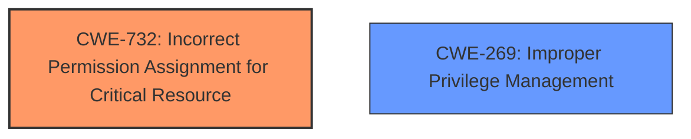

# Analysis Report for CVE-2025-24917

# Vulnerability Analysis Report: CVE-2025-24917

## Description

In Tenable Network Monitor versions prior to 6.5.1 on a Windows host, it was found that a non-administrative user could stage files in a local directory to run arbitrary code with SYSTEM privileges, potentially leading to local privilege escalation.

## Vulnerability Description Key Phrases

- **Vector:** stage files in a local directory
- **Product:** Tenable Network Monitor
- **Impact:** local privilege escalation, run arbitrary code with SYSTEM privileges
- **Attacker:** non-administrative user
- **Version:** prior to 6.5.1

## Analysis (with Relationship Data)

# Summary
| CWE ID | CWE Name | Confidence | CWE Abstraction Level | CWE Vulnerability Mapping Label | CWE-Vulnerability Mapping Notes |
|---|---|---|---|---|---|
| **CWE-732** | Incorrect Permission Assignment for Critical Resource | 0.8 | Class | Primary | Allowed-with-Review |
| CWE-269 | Improper Privilege Management | 0.6 | Class | Secondary | Discouraged |

## Evidence and Confidence

*   **Confidence Score:** 0.7
*   **Evidence Strength:** MEDIUM

## Relationship Analysis
The primary CWE is CWE-732, which is a Class-level CWE. It relates to assigning incorrect permissions to critical resources. The description states that a non-administrative user could stage files to run arbitrary code with SYSTEM privileges, which implies that the initial file permissions were incorrectly set, allowing this escalation to occur. CWE-269, Improper Privilege Management, is a related Class-level CWE, but is more general and discouraged for use.



## Vulnerability Chain
The vulnerability chain starts with the **incorrect permission assignment** (CWE-732) for critical resources. This allows a non-administrative user to stage files in a local directory. The end result is that the non-administrative user can then execute arbitrary code with SYSTEM privileges, leading to a privilege escalation.

## Summary of Analysis
Based on the provided information and the CWE specifications, the primary weakness is CWE-732 (Incorrect Permission Assignment for Critical Resource). The vulnerability description clearly indicates that a non-administrative user could stage files and run arbitrary code with SYSTEM privileges, implying that the file permissions were improperly set, allowing for this privilege escalation. The CWE guidance on privileges and permissions also supports this classification.

While CWE-269 (Improper Privilege Management) is related, it is a broader category and is discouraged for use when more specific CWEs are applicable. The retriever results also list several other CWEs related to file access and privilege management, such as CWE-59 (Improper Link Resolution Before File Access) and CWE-73 (External Control of File Name or Path). However, these CWEs do not directly address the root cause of the vulnerability, which is the incorrect permission assignment that enables the exploit.

Therefore, CWE-732 is the most appropriate CWE for this vulnerability, as it accurately describes the root cause of the issue.

Relevant CWE Information:

# Enhanced Context (25 CWEs)
The following CWEs were identified as potentially relevant to this vulnerability:

## CWE-732: Incorrect Permission Assignment for Critical Resource
**Abstraction Level**: Class
**Similarity Score**: 1480.12
**Source**: sparse

**Description**:
The product specifies permissions for a security-critical resource in a way that allows that resource to be read or modified by unintended actors.

**Mapping Guidance**:
- Usage: Allowed-with-Review
- Rationale: While the name itself indicates an assignment of permissions for resources, this is often misused for vulnerabilities in which "permissions" are not checked, which is an "authorization" weakness (CWE-285 or descendants) within CWE's model [REF-1287].

## CWE-269: Improper Privilege Management
**Abstraction Level**: Class
**Similarity Score**: 1518.36
**Source**: sparse

**Description**:
The product does not properly assign, modify, track, or check privileges for an actor, creating an unintended sphere of control for that actor.

**Mapping Guidance**:
- Usage: Discouraged
- Rationale: CWE-269 is commonly misused. It can be conflated with "privilege escalation," which is a technical impact that is listed in many low-information vulnerability reports [REF-1287]. It is not useful for trend analysis.


## CWE Relationship Analysis

Current CWEs represent these abstraction levels: .


### Vulnerability Chain Analysis

**Chain starting from CWE-732:**
- 732 (Incorrect Permission Assignment for Critical Resource) - ROOT


**Chain starting from CWE-59:**
- 59 (Improper Link Resolution Before File Access ('Link Following')) - ROOT


### CWE Relationship Diagram

```mermaid
graph TD
    classDef primary fill:#f96,stroke:#333,stroke-width:2px
    classDef secondary fill:#69f,stroke:#333
    classDef tertiary fill:#9e9,stroke:#333
```


*Report generated on 2025-07-14 13:00:25*
