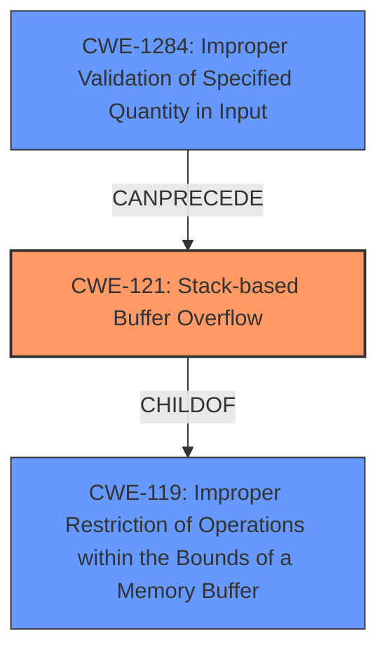

# Enhanced Analysis for CVE-2025-2497

# Summary
| CWE ID | CWE Name | Confidence | CWE Abstraction Level | CWE Vulnerability Mapping Label | CWE-Vulnerability Mapping Notes |
|---|---|---|---|---|---|
| CWE-121 | Stack-based Buffer Overflow | 1.0 | Variant |  Primary | Allowed |
| CWE-119 | Improper Restriction of Operations within the Bounds of a Memory Buffer | 0.7 | Class | Secondary | Discouraged |
| CWE-1284 | Improper Validation of Specified Quantity in Input | 0.5 | Base | Secondary | Allowed |

## Evidence and Confidence

*   **Confidence Score:** 0.8
*   **Evidence Strength:** HIGH

## Relationship Analysis
The primary CWE is CWE-121, which is a variant of CWE-119. CWE-119 is a class-level CWE that describes a general condition where operations are performed outside the bounds of a memory buffer. CWE-121 specifically focuses on stack-based buffer overflows. CWE-1284 is related, as it could lead to the overflow if the size is not validated.



## Vulnerability Chain
The vulnerability chain starts with a maliciously crafted DWG file. This file is parsed by Autodesk Revit, which leads to a **stack-based buffer overflow (CWE-121)** because of **improper handling of length parameter inconsistency (CWE-130)** or perhaps **improper validation of specified quantity in input (CWE-1284)** if the size is determined by the file. The impact of the **stack-based buffer overflow** is arbitrary code execution.

## Summary of Analysis
The vulnerability description clearly states that the vulnerability is a **Stack-Based Buffer Overflow**, which makes CWE-121 the most appropriate primary CWE. The CVE reference links content summary confirms this. The description includes "A maliciously crafted DWG file, when parsed through Autodesk Revit, can cause a Stack-Based Buffer Overflow vulnerability." The retriever results also list CWE-121 as a candidate, though not at the top. The evidence strongly supports the selection of CWE-121 as the primary CWE.

CWE-119 is a more general case of a buffer overflow. While applicable, CWE-121 provides a more specific classification. Therefore, CWE-119 is a secondary consideration.

CWE-1284 is considered as a secondary CWE, as it is possible that the crafted DWG file provides a quantity that is not validated correctly, leading to the buffer overflow.

Other CWEs Considered But Not Used:

*   CWE-122 (Heap-based Buffer Overflow): The description explicitly mentions a stack-based buffer overflow, ruling out CWE-122.
*   CWE-787 (Out-of-bounds Write): While related to buffer overflows, CWE-121 is more specific in this case.
*   CWE-120 (Buffer Copy without Checking Size of Input): This is a classic buffer overflow, but the stack-based nature is key here.
*   CWE-190 (Integer Overflow or Wraparound): While potentially related to calculating buffer sizes, there's no direct evidence of integer overflow.
*   CWE-193 (Off-by-one Error): The description does not indicate an off-by-one error, but a more general overflow.
*   CWE-130 (Improper Handling of Length Parameter Inconsistency): This could be part of the cause, but no clear evidence.
*   CWE-822 (Untrusted Pointer Dereference): No explicit mention of pointer dereferencing issues.


## CWE Relationship Analysis

Current CWEs represent these abstraction levels: .


### Vulnerability Chain Analysis

**Chain starting from CWE-121:**
- 121 (Stack-based Buffer Overflow) - ROOT


**Chain starting from CWE-130:**
- 130 (Improper Handling of Length Parameter Inconsistency) - ROOT


### CWE Relationship Diagram

```mermaid
graph TD
    classDef primary fill:#f96,stroke:#333,stroke-width:2px
    classDef secondary fill:#69f,stroke:#333
    classDef tertiary fill:#9e9,stroke:#333
```