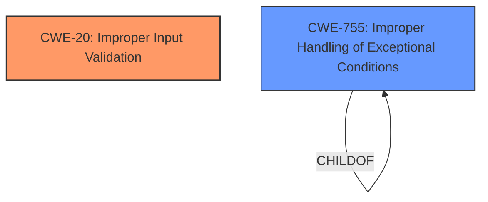

# Enhanced Analysis for CVE-2025-24970

# Summary
| CWE ID    | CWE Name                                                                         | Confidence | CWE Abstraction Level | CWE Vulnerability Mapping Label | CWE-Vulnerability Mapping Notes |
| --------- | -------------------------------------------------------------------------------- | ---------- | --------------------- | ----------------------------- | ------------------------------- |
| CWE-20  | Improper Input Validation                                                                | 0.95       | Class                 | Primary                       | Allowed-with-Review             |
| CWE-755   | Improper Handling of Exceptional Conditions                                      | 0.70       | Class                 | Secondary                      | Discouraged                     |

## Evidence and Confidence

*   **Confidence Score:** 0.85
*   **Evidence Strength:** MEDIUM

## Relationship Analysis

The primary relationship that influenced my decision was the parent-child relationship, particularly between CWE-20 and its potential children. While the description points to **improper validation** as the root cause, a more specific child of CWE-20 could be a better fit if more details were available about what type of input was not validated correctly. CWE-755 was considered due to the resulting "native crash", implying an unhandled exceptional condition. However, it is a class-level CWE and its usage is discouraged.



## Vulnerability Chain

The vulnerability chain starts with the **improper validation** of specially crafted packets received by the `SslHandler`. This **weakness** leads to a native crash. Thus, the chain is:

1.  **Improper Input Validation (CWE-20)**: The `SslHandler` does not properly validate specially crafted packets.
2.  **Improper Handling of Exceptional Conditions (CWE-755)**: The **improper validation** leads to a native crash (exceptional condition).

## Summary of Analysis

The initial analysis focused on identifying the root cause of the vulnerability. The key phrase "doesn't correctly handle validation of such a packet in all cases which can lead to a native crash" strongly suggests an input validation issue.

Given the available evidence, CWE-20 is the most appropriate primary CWE. However, the native crash implies that the exceptional condition resulting from the **improper validation** is not being properly handled, leading to the inclusion of CWE-755 as a secondary CWE.

The selection of CWE-20 and CWE-755 is based on the provided evidence and aims to capture both the root cause (validation issue) and the immediate consequence (crash due to unhandled condition). More information on the exact nature of the input validation error could allow for a more specific CWE selection.

Relevant CWE Information:

# Enhanced Context (25 CWEs)
The following CWEs were identified as potentially relevant to this vulnerability:

## Vulnerability Description
Netty, an asynchronous, event-driven network application framework, has a vulnerability starting in version 4.1.91.Final and prior to version 4.1.118.Final. When a special crafted packet is received via SslHandler it doesnt correctly handle validation of such a packet in all cases which can lead to a native crash. Version 4.1.118.Final contains a patch. As workaround its possible to either disable the usage of the native SSLEngine or change the code manually.

### Vulnerability Description Key Phrases
- **weakness:** **improper validation**
- **impact:** native crash
- **vector:** special crafted packet
- **product:** Netty
- **version:** 4.1.91.Final to 4.1.118.Final
- **component:** SslHandler

## CVE Reference Links Content Summary
```
Root cause of vulnerability:
SslHandler doesn't correctly validate packets, leading to a native crash when using a native SSLEngine.

Weaknesses/vulnerabilities present:
Incorrect handling of validation of specially crafted packets received via SslHandler.

Impact of exploitation:
Native crash.

Attack vectors:
Receiving a special crafted packet via SslHandler.

Required attacker capabilities/position:
Network access.

Mitigation or fix:
- Disable the usage of the native SSLEngine.
- Change the code from: `SslContext context = ...; SslHandler handler = context.newHandler(....);` to: `SslContext context = ...; SSLEngine engine = context.newEngine(....); SslHandler handler = new SslHandler(engine, ....);`

Affected versions:
4.1.91.Final <= 4.1.117.Final

Patched versions:
>= 4.1.118.Final

CVSS score: 7.5 (High)
CVSS vector: CVSS:3.1/AV:N/AC:L/PR:N/UI:N/S:U/C:N/I:N/A:H
```

## Retriever Results

### Top Combined Results

| Rank | CWE ID | Name | Abstraction | Usage  | Retrievers | Individual Scores |
|------|--------|------|-------------|-------|------------|-------------------|
| 1 | 378 | Creation of Temporary File With Insecure Permissions | Base | Allowed | sparse | 0.469 |
| 2 | 674 | Uncontrolled Recursion | Class | Allowed-with-Review | sparse | 0.400 |
| 3 | 1284 | Improper Validation of Specified Quantity in Input | Base | Allowed | sparse | 0.389 |
| 4 | 770 | Allocation of Resources Without Limits or Throttling | Base | Allowed | sparse | 0.380 |
| 5 | 346 | Origin Validation Error | Class | Allowed-with-Review | sparse | 0.378 |
| 6 | 1390 | Weak Authentication | Class | Allowed-with-Review | sparse | 0.371 |
| 7 | 116 | Improper Encoding or Escaping of Output | Class | Allowed-with-Review | sparse | 0.371 |
| 8 | 1333 | Inefficient Regular Expression Complexity | Base | Allowed | sparse | 0.369 |
| 9 | 401 | Missing Release of Memory after Effective Lifetime | Variant | Allowed | dense | 0.522 |
| 10 | 79 | Improper Neutralization of Input During Web Page Generation ('Cross-site Scripting') | Base | Allowed | graph | 0.002 |


# Complete CWE Specifications

**CWE-20: Improper Input Validation**

*   **Technical Explanation:** The software does not validate or incorrectly validates input before use. This can lead to control-flow errors, arbitrary code execution, or other vulnerabilities. In this case, the `SslHandler` in Netty does not properly validate specially crafted packets.
*   **Security Implications:** An attacker can send a specially crafted packet that exploits the **improper validation** to cause a native crash, leading to a denial-of-service.
*   **Relationship:** This is a Class-level CWE. More specific Base or Variant CWEs might exist if we knew more about the specific type of input validation that was missing.
*   **Why Primary:** The vulnerability description and CVE summary explicitly mention **improper validation** as the root cause.

**CWE-755: Improper Handling of Exceptional Conditions**

*   **Technical Explanation:** The software does not handle or incorrectly handles exceptional conditions. In this case, the **improper validation** leads to a condition that results in a native crash, indicating that the exceptional condition was not handled correctly.
*   **Security Implications:** The unhandled exceptional condition (native crash) leads to a denial-of-service.
*   **Relationship:** This is a Class-level CWE and a child of CWE-755.
*   **Why Secondary:** The native crash strongly suggests the exceptional condition triggered by the **improper validation** is not properly handled.

**CWEs Considered but Not Used:**

*   CWE-1284: Improper Validation of Specified Quantity in Input: While related to validation, the description doesn't specify the quantity, and the problem is a special crafted package not quantity.
*   CWE-770: Allocation of Resources Without Limits or Throttling: No evidence suggests resource allocation issues.
*   CWE-378: Creation of Temporary File With Insecure Permissions: Not relevant to this vulnerability.
*   CWE-674: Uncontrolled Recursion: No evidence for recursion is in the description.
*   CWE-346: Origin Validation Error: Not relevant. The issue is with the content of the packet, not its origin.
*   CWE-1390: Weak Authentication: Authentication is not mentioned.
*   CWE-


## CWE Relationship Analysis

Current CWEs represent these abstraction levels: .


### Vulnerability Chain Analysis

**Chain starting from CWE-1390:**
- 1390 (Weak Authentication) - ROOT


**Chain starting from CWE-1284:**
- 1284 (Improper Validation of Specified Quantity in Input) - ROOT


### CWE Relationship Diagram

```mermaid
graph TD
    classDef primary fill:#f96,stroke:#333,stroke-width:2px
    classDef secondary fill:#69f,stroke:#333
    classDef tertiary fill:#9e9,stroke:#333
```