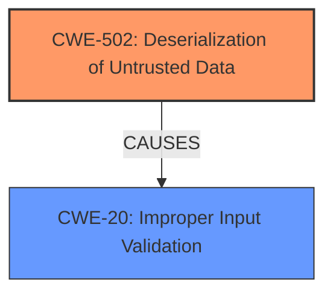

# Raw Analyzer Response for CVE-2025-24974

# Summary
| CWE ID | CWE Name | Confidence | CWE Abstraction Level | CWE Vulnerability Mapping Label | CWE-Vulnerability Mapping Notes |
|---|---|---|---|---|---|
| CWE-502 | Deserialization of Untrusted Data | 0.9 | Base | Allowed | Primary CWE. The vulnerability allows authenticated users to **read and deserialize arbitrary files** through the background JDBC connection. |
| CWE-20 | Improper Input Validation | 0.7 | Class | Discouraged | Secondary candidate. The vulnerability stems from **insufficient validation** of JDBC connection parameters. While **improper input validation** is present, it is a more general weakness than the specific **deserialization** issue. |

## Evidence and Confidence

*   **Confidence Score:** 0.8
*   **Evidence Strength:** HIGH

## Relationship Analysis
The primary relationship that influenced my decision was the direct match of CWE-502 to the **deserialization of untrusted data** vulnerability. While CWE-20 (Improper Input Validation) is also relevant as a contributing factor, CWE-502 more accurately captures the core weakness.

## Vulnerability Chain
The vulnerability chain starts with **insufficient input validation** (CWE-20) of the JDBC connection parameters, which leads to the ability to **deserialize untrusted data** (CWE-502), resulting in the ability to **read arbitrary files** on the server.

## Summary of Analysis
The initial analysis strongly pointed towards CWE-502 as the primary weakness, given the ability to **read and deserialize arbitrary files**. The vulnerability description explicitly mentions this capability, and the provided content confirms that the **root cause** is related to the **insufficient validation** of JDBC connection parameters, allowing for the **deserialization of untrusted data**.

The evidence directly supporting this assessment is found in:
*   **Vulnerability Description:** "**read and deserialize arbitrary files** through the background JDBC connection."
*   **CVE Reference Links Content Summary:** "The vulnerability stems from **insufficient validation** of JDBC connection parameters...Specifically, the code does not prevent the use of the `maxAllowedPacket` parameter, which can be exploited to **read arbitrary files** on the server."

CWE-20 was considered as a secondary weakness because the vulnerability involves **insufficient input validation** of the JDBC connection parameters. However, the core issue is the **deserialization** that occurs due to this **lack of validation**.

CWE-502 is at the optimal level of specificity as it accurately describes the core weakness of **deserialization of untrusted data**, which is the direct result of the **improperly validated** JDBC connection parameters.

Relevant CWE Information:

# Enhanced Context (25 CWEs)
The following CWEs were identified as potentially relevant to this vulnerability:

## CWE-497: Exposure of Sensitive System Information to an Unauthorized Control Sphere
**Abstraction Level**: Base
**Similarity Score**: 0.73
**Source**: dense

**Description**:
The product does not properly prevent sensitive system-level information from being accessed by unauthorized actors who do not have the same level of access to the underlying system as the product does.

**Mapping Guidance**:
- Usage: Allowed
- Rationale: This CWE entry is at the Base level of abstraction, which is a preferred level of abstraction for mapping to the root causes of vulnerabilities.

**Why Not Used:** This CWE focuses on the exposure of system information. While the vulnerability allows reading arbitrary files, the primary issue is the **deserialization of untrusted data**, not directly exposing system information.

## CWE-502: Deserialization of Untrusted Data
**Abstraction Level**: Base
**Similarity Score**: 0.72
**Source**: dense

**Description**:
The product deserializes untrusted data without sufficiently ensuring that the resulting data will be valid.

**Mapping Guidance**:
- Usage: Allowed
- Rationale: This CWE entry is at the Base level of abstraction, which is a preferred level of abstraction for mapping to the root causes of vulnerabilities.

**Why Used:** The vulnerability allows authenticated users to **read and deserialize arbitrary files** through the background JDBC connection.

## CWE-20: Improper Input Validation
**Abstraction Level**: Class
**Similarity Score**: 774.70
**Source**: sparse

**Description**:
The product receives input or data, but it does
        not validate or incorrectly validates that the input has the
        properties that are required to process the data safely and
        correctly.

**Mapping Guidance**:
- Usage: Discouraged
- Rationale: CWE-20 is commonly misused in low-information vulnerability reports when lower-level CWEs could be used instead, or when more details about the vulnerability are available [REF-1287]. It is not useful for trend analysis. It is also a level-1 Class (i.e., a child of a Pillar).

**Why Used:** The vulnerability stems from **insufficient validation** of JDBC connection parameters.

## Other CWE Considerations and Why Not Used:
- CWE-918 (Server-Side Request Forgery (SSRF)): While the vulnerability involves a server-side component (JDBC), it doesn't fit the SSRF pattern of making requests to unintended destinations.
- CWE-200 (Exposure of Sensitive Information to an Unauthorized Actor): This is a high-level impact rather than the root cause. The root cause is the **deserialization of untrusted data**.
- CWE-668 (Exposure of Resource to Wrong Sphere): Similar to CWE-200, this is a high-level description of the impact and less specific than CWE-502.
- CWE-125 (Out-of-bounds Read): Not applicable as the vulnerability involves **deserialization of arbitrary files**, not reading outside of allocated memory.
- CWE-22 (Improper Limitation of a Pathname to a Restricted Directory ('Path Traversal')): Not applicable as the vulnerability involves **deserialization of arbitrary files**, not path traversal.