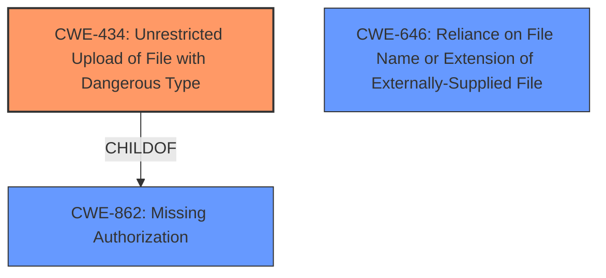

# Analysis Report for CVE-2025-2512

# Vulnerability Analysis Report: CVE-2025-2512

## Description

The File Away plugin for WordPress is vulnerable to arbitrary file uploads due to a **missing capability check and missing file type validation** in the upload() function in all versions up to, and including, 3.9.9.0.1. This makes it possible for unauthenticated attackers to upload arbitrary files on the affected sites server which may make remote code execution possible.

## Vulnerability Description Key Phrases

- **Rootcause:** missing capability check and missing file type validation
- **Impact:** ['arbitrary file uploads', 'remote code execution']
- **Attacker:** unauthenticated attackers
- **Product:** File Away plugin for WordPress
- **Version:** all versions up to and including 3.9.9.0.1
- **Component:** upload() function

## Analysis (with Relationship Data)

# Summary

| CWE ID  | CWE Name                                                        | Confidence | CWE Abstraction Level | CWE Vulnerability Mapping Label | CWE-Vulnerability Mapping Notes |
| :-------- | :-------------------------------------------------------------- | :--------- | :-------------------- | :------------------------------ | :------------------------------ |
| CWE-434 | Unrestricted Upload of File with Dangerous Type               | 0.9        | Base                  | Allowed                         | Primary CWE                     |
| CWE-862 | Missing Authorization                                           | 0.7        | Class                 | Allowed-with-Review             | Secondary Candidate             |
| CWE-646 | Reliance on File Name or Extension of Externally-Supplied File | 0.6        | Variant               | Allowed                         | Secondary Candidate             |

## Evidence and Confidence

*   **Confidence Score:** 0.8
*   **Evidence Strength:** MEDIUM

## Relationship Analysis

The primary CWE is CWE-434, which represents the **unrestricted upload of dangerous file types**. CWE-862 (Missing Authorization) is a parent class that describes the broader issue of failing to perform authorization checks. CWE-646 describes a situation where the program relies on the file name or extension, which can lead to issues of dangerous types being uploaded.



## Vulnerability Chain

The vulnerability chain starts with **missing capability check and missing file type validation** (**ROOTCAUSE**), leading to the ability to upload arbitrary files, which can then result in remote code execution (IMPACT).

## Summary of Analysis

The primary weakness is the **unrestricted upload of file with dangerous type** (CWE-434). The evidence from the vulnerability description clearly states "**missing capability check and missing file type validation** in the upload() function". This directly allows unauthenticated attackers to upload arbitrary files. The lack of proper checks on uploaded files allows for potentially dangerous files to be uploaded and executed, leading to remote code execution. This aligns with CWE-434's description: "The product allows the upload or transfer of dangerous file types that are automatically processed within its environment."

CWE-862 (Missing Authorization) is a relevant consideration as the description mentions a **missing capability check**, and therefore, a missing authorization check. However, CWE-434 is more specific to the vulnerability.

CWE-646 (Reliance on File Name or Extension of Externally-Supplied File) is included because of the "missing file type validation".

I am overriding the retriever results by putting CWE-434 as the primary weakness and moving CWE-862 to the secondary weakness.

Relevant CWE Information:

# Enhanced Context (25 CWEs)

## CWE-434: Unrestricted Upload of File with Dangerous Type

**Abstraction Level**: Base
**Similarity Score**: 0.77
**Source**: dense

**Description**:
The product allows the upload or transfer of dangerous file types that are automatically processed within its environment.

**Mapping Guidance**:
- Usage: Allowed
- Rationale: This CWE entry is at the Base level of abstraction, which is a preferred level of abstraction for mapping to the root causes of vulnerabilities.

**Justification:** This CWE directly addresses the **missing file type validation** aspect of the vulnerability, which allows the upload of arbitrary and potentially dangerous files. The description aligns with the vulnerability's ability for "unauthenticated attackers to upload arbitrary files". Confidence: 0.9

## CWE-862: Missing Authorization

**Abstraction Level**: Class
**Similarity Score**: 0.68
**Source**: dense

**Description**:
The product does not perform an authorization check when an actor attempts to access a resource or perform an action.

**Mapping Guidance**:
- Usage: Allowed-with-Review
- Rationale: This CWE entry is a Class and might have Base-level children that would be more appropriate

**Justification:** This CWE addresses the **missing capability check** aspect of the vulnerability. The description aligns with the vulnerability description which states there is a "**missing capability check**". Since there are no authorization checks, unauthenticated attackers can upload files, thus bypassing intended access controls. Confidence: 0.7

## CWE-646: Reliance on File Name or Extension of Externally-Supplied File

**Abstraction Level**: Variant
**Similarity Score**: 0.
**Source**: dense

**Description**:
The software relies on the filename or extension of an externally-supplied file in order to determine what actions to perform or which programs to execute.

**Mapping Guidance**:
- Usage: Allowed
- Rationale: This CWE entry is at the Base level of abstraction, which is a preferred level of abstraction for mapping to the root causes of vulnerabilities.

**Justification:** This CWE addresses the missing file type validation as the file name or extension can be modified to bypass basic checks. Confidence: 0.6

## Considered but not used:

*   CWE-352: Cross-Site Request Forgery (CSRF) - Not relevant as the vulnerability is not related to CSRF.
*   CWE-306: Missing Authentication for Critical Function - While authentication is missing, authorization is the more precise weakness.
*   CWE-863: Incorrect Authorization - This is about incorrect authorization, but the vulnerability is about missing authorization (CWE-862).
*   CWE-1284: Improper Validation of Specified Quantity in Input - Not relevant as the vulnerability is not related to quantity validation.
*   CWE-138: Improper Neutralization of Special Elements - This is too generic; CWE-434 and CWE-646 are more specific.
*   CWE-24: Path Traversal: '../filedir' - Not relevant as the vulnerability is not about path traversal.
*   CWE-183: Permissive List of Allowed Inputs - Not specific enough to the vulnerability, which involves dangerous file types.


## CWE Relationship Analysis

Current CWEs represent these abstraction levels: .


### Vulnerability Chain Analysis

**Chain starting from CWE-183:**
- 183 (Permissive List of Allowed Inputs) - ROOT


**Chain starting from CWE-863:**
- 863 (Incorrect Authorization) - ROOT


### CWE Relationship Diagram

```mermaid
graph TD
    classDef primary fill:#f96,stroke:#333,stroke-width:2px
    classDef secondary fill:#69f,stroke:#333
    classDef tertiary fill:#9e9,stroke:#333
```


*Report generated on 2025-07-14 13:09:03*
