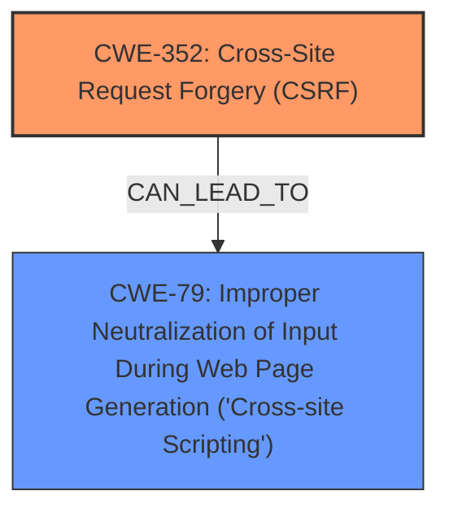

# Enhanced Analysis for CVE-2025-25152

# Summary

| CWE ID | CWE Name | Confidence | CWE Abstraction Level | CWE Vulnerability Mapping Label | CWE-Vulnerability Mapping Notes |
|---|---|---|---|---|---|
| CWE-352 | Cross-Site Request Forgery (CSRF) | 0.9 | Compound | Allowed | Primary CWE. |
| CWE-79 | Improper Neutralization of Input During Web Page Generation ('Cross-site Scripting') | 0.9 | Base | Allowed | Secondary Candidate. |

## Evidence and Confidence

*   **Confidence Score:** 0.9
*   **Evidence Strength:** HIGH

## Relationship Analysis
The primary relationship to consider is that Cross-Site Request Forgery (CSRF) often leads to other vulnerabilities, in this case Stored Cross-Site Scripting (XSS). CWE-352 [CWE-352: Cross-Site Request Forgery (CSRF)] is a Compound weakness, which aligns with its nature of being a combination of multiple underlying issues. CWE-79 [CWE-79: Improper Neutralization of Input During Web Page Generation ('Cross-site Scripting')] is a Base level CWE, representing the specific weakness of improper neutralization of input. While there isn't a direct parent-child relationship between these two, the exploitation of CWE-352 can lead to CWE-79.



## Vulnerability Chain
The vulnerability chain starts with the **Cross-Site Request Forgery** (**CWE-352**), which allows an attacker to trick a user into performing actions they did not intend. This can then lead to **Stored XSS** (**CWE-79**) if the attacker can use the CSRF vulnerability to inject malicious scripts into the application's data store, which are then executed when other users view the data.

## Summary of Analysis
The initial analysis focused on the provided vulnerability description and CVE details, which clearly indicated a Cross-Site Request Forgery (CSRF) vulnerability. The "Vulnerability Description Key Phrases" and "CVE Reference Links Content Summary" sections both explicitly mention CSRF as the root cause. The description also states that the CSRF vulnerability allows Stored XSS.

The Retriever Results also listed CWE-352 [CWE-352: Cross-Site Request Forgery (CSRF)] and CWE-79 [CWE-79: Improper Neutralization of Input During Web Page Generation ('Cross-site Scripting')] as top candidates. Given the provided information, CWE-352 [CWE-352: Cross-Site Request Forgery (CSRF)] is chosen as the primary CWE due to being the root cause, and CWE-79 [CWE-79: Improper Neutralization of Input During Web Page Generation ('Cross-site Scripting')] is identified as a secondary vulnerability that can be exploited through the CSRF vulnerability. The evidence supports selecting these CWEs at their respective abstraction levels (Compound for CWE-352 [CWE-352: Cross-Site Request Forgery (CSRF)] and Base for CWE-79 [CWE-79: Improper Neutralization of Input During Web Page Generation ('Cross-site Scripting')]). The retriever gave them high relevance scores.

Relevant CWE Information:

# Enhanced Context (25 CWEs)
The following CWEs were identified as potentially relevant to this vulnerability:

## CWE-352: Cross-Site Request Forgery (CSRF)
**Abstraction Level**: Compound
**Similarity Score**: 0.77
**Source**: dense

**Description**:
The web application does not, or can not, sufficiently verify whether a well-formed, valid, consistent request was intentionally provided by the user who submitted the request.

**Mapping Guidance**:
- Usage: Allowed
- Rationale: This is a well-known Composite of multiple weaknesses that must all occur simultaneously, although it is attack-oriented in nature.

**Explanation:** The vulnerability description clearly indicates a Cross-Site Request Forgery (CSRF) issue, aligning with the CWE description. This vulnerability allows an attacker to force a user to execute unwanted actions. The CWE is a Compound, which appropriately characterizes that multiple weaknesses must occur simultaneously. Confidence: 0.9

## CWE-79: Improper Neutralization of Input During Web Page Generation ('Cross-site Scripting')
**Abstraction Level**: Base
**Similarity Score**: 0.73
**Source**: dense

**Description**:
The product does not neutralize or incorrectly neutralizes user-controllable input before it is placed in output that is used as a web page that is served to other users.

**Mapping Guidance**:
- Usage: Allowed
- Rationale: This CWE entry is at the Base level of abstraction, which is a preferred level of abstraction for mapping to the root causes of vulnerabilities.

**Explanation:** The vulnerability description indicates that the CSRF vulnerability allows Stored XSS. This aligns with CWE-79 [CWE-79: Improper Neutralization of Input During Web Page Generation ('Cross-site Scripting')], where user-controllable input is not properly neutralized, leading to XSS. It's a secondary effect of the **Cross-Site Request Forgery** (**CSRF**) vulnerability where the attacker injects malicious script to be stored and executed later. Confidence: 0.9


## CWE Relationship Analysis

Current CWEs represent these abstraction levels: .


### Vulnerability Chain Analysis

**Chain starting from CWE-352:**
- 352 (Cross-Site Request Forgery (CSRF)) - ROOT


**Chain starting from CWE-79:**
- 79 (Improper Neutralization of Input During Web Page Generation ('Cross-site Scripting')) - ROOT


### CWE Relationship Diagram

```mermaid
graph TD
    classDef primary fill:#f96,stroke:#333,stroke-width:2px
    classDef secondary fill:#69f,stroke:#333
    classDef tertiary fill:#9e9,stroke:#333
```