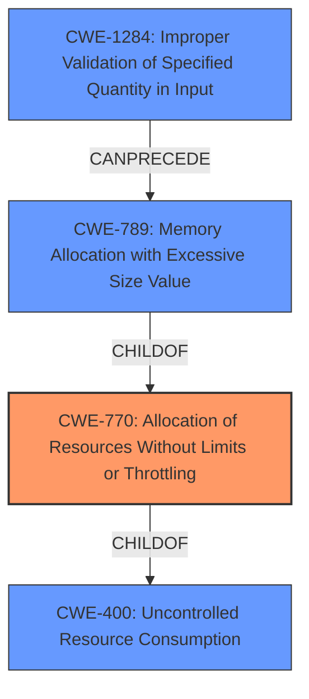

# Analysis Report for CVE-2025-25186

# Vulnerability Analysis Report: CVE-2025-25186

## Description

NetIMAP implements Internet Message Access Protocol (IMAP) client functionality in Ruby. Starting in version 0.3.2 and prior to versions 0.3.8, 0.4.19, and 0.5.6, there is a possibility for denial of service by **memory exhaustion** in `net-imap`s response parser. At any time while the client is connected, a malicious server can send can send highly compressed `uid-set` data which is automatically read by the clients receiver thread. The response parser uses `Range#to_a` to convert the `uid-set` data into arrays of integers, with no limitation on the expanded size of the ranges. Versions 0.3.8, 0.4.19, 0.5.6, and higher fix this issue. Additional details for proper configuration of fixed versions and backward compatibility are available in the GitHub Security Advisory.

## Vulnerability Description Key Phrases

- **Weakness:** memory exhaustion
- **Impact:** denial of service
- **Vector:** highly compressed uid-set data
- **Attacker:** malicious server
- **Product:** net-imap
- **Version:** 0.3.2 to 0.3.8, 0.4.19, 0.5.6
- **Component:** response parser

## Analysis (with Relationship Data)

# Summary
| CWE ID  | CWE Name                                                     | Confidence | CWE Abstraction Level | CWE Vulnerability Mapping Label | CWE-Vulnerability Mapping Notes |
| :-------- | :----------------------------------------------------------- | :--------- | :-------------------- | :------------------------------ | :-------------------------------- |
| CWE-770   | Allocation of Resources Without Limits or Throttling         | 0.9        | Base                  | Primary CWE                     | Allowed                           |
| CWE-400   | Uncontrolled Resource Consumption                          | 0.7        | Class                 | Secondary Candidate             | Discouraged                       |
| CWE-789   | Memory Allocation with Excessive Size Value                | 0.6        | Variant               | Secondary Candidate             | Allowed                           |
| CWE-1284  | Improper Validation of Specified Quantity in Input          | 0.5        | Base                  | Secondary Candidate             | Allowed                           |

## Evidence and Confidence

*   **Confidence Score:** 0.8
*   **Evidence Strength:** HIGH

## Relationship Analysis

The primary relationship influencing the decision is that CWE-770 [Allocation of Resources Without Limits or Throttling] is a more specific child of CWE-400 [Uncontrolled Resource Consumption]. CWE-789 [Memory Allocation with Excessive Size Value] is a child of CWE-770. The vulnerability involves allocating memory without limits, which leads to uncontrolled resource consumption. CWE-1284 [Improper Validation of Specified Quantity in Input] can precede CWE-789.



## Vulnerability Chain

The vulnerability chain starts with the **improper handling of the size of the `uid-set` data**, leading to **uncontrolled memory allocation**, and culminating in **memory exhaustion** and **denial of service**.

1.  **Root Cause:** **Improper Handling of Size**: `Range#to_a` converts `uid-set` data into arrays without size limits.
2.  **Weakness:** **Allocation of Resources Without Limits or Throttling (CWE-770)**: No restrictions on the size of allocated memory.
3.  **Impact:** **Uncontrolled Resource Consumption (CWE-400)**: Memory exhaustion.
4.  **Final Impact:** **Denial of Service**: Application crash due to memory exhaustion.

## Summary of Analysis

The initial analysis pointed towards uncontrolled resource consumption due to the `net-imap` library's response parser not limiting the size of expanded ranges when converting `uid-set` data into arrays of integers.

The evidence from the CVE description and reference links confirms this. The vulnerability description states "there is a possibility for denial of service by **memory exhaustion** in `net-imap`s response parser" and "The response parser uses `Range#to_a` to convert the `uid-set` data into arrays of integers, with no limitation on the expanded size of the ranges." The reference links provide further details, stating that "A malicious IMAP server can send specially crafted `APPENDUID` or `COPYUID` responses with very large `uid-set` ranges, causing the client to allocate excessive memory." This aligns directly with the description of CWE-770 [Allocation of Resources Without Limits or Throttling], which describes a product allocating resources without imposing restrictions on the size or number of resources. The graph relationships highlight that CWE-770 is a child of CWE-400 [Uncontrolled Resource Consumption], making it a more specific choice.

CWE-770 is the most appropriate primary CWE because the root cause is the **unrestricted allocation of memory**, rather than merely the consumption of resources.

CWE-400 [Uncontrolled Resource Consumption] was considered but is a higher-level class. While memory exhaustion is the result, the **lack of limits on memory allocation** is the more precise weakness.

CWE-789 [Memory Allocation with Excessive Size Value] was considered, but it focuses on allocating memory based on an untrusted *size value*. While the size is related, the core issue is the lack of any limits at all.

CWE-1284 [Improper Validation of Specified Quantity in Input] was considered because the size of the input is not validated. This is a contributing factor, but the core issue is the allocation of memory without limits, making CWE-770 a more direct representation of the vulnerability.


## CWE Relationship Analysis

Current CWEs represent these abstraction levels: .


### Vulnerability Chain Analysis

**Chain starting from CWE-1284:**
- 1284 (Improper Validation of Specified Quantity in Input) - ROOT


**Chain starting from CWE-400:**
- 400 (Uncontrolled Resource Consumption) - ROOT


### CWE Relationship Diagram

```mermaid
graph TD
    classDef primary fill:#f96,stroke:#333,stroke-width:2px
    classDef secondary fill:#69f,stroke:#333
    classDef tertiary fill:#9e9,stroke:#333
```


*Report generated on 2025-07-14 13:17:17*
