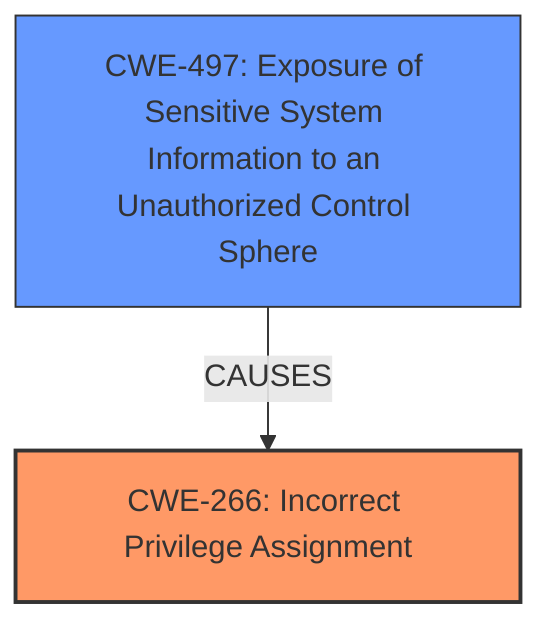

# Enhanced Analysis for CVE-2025-25192

# Summary
| CWE ID | CWE Name | Confidence | CWE Abstraction Level | CWE Vulnerability Mapping Label | CWE-Vulnerability Mapping Notes |
|---|---|---|---|---|---|
| CWE-266 | Incorrect Privilege Assignment | 0.8 | Base | Primary CWE | Allowed |
| CWE-497 | Exposure of Sensitive System Information to an Unauthorized Control Sphere | 0.7 | Base | Secondary Candidate | Allowed |

## Evidence and Confidence

*   **Confidence Score:** 0.75
*   **Evidence Strength:** MEDIUM

## Relationship Analysis
The primary relationship that impacted my decision was the child-of relationship. CWE-266 (Incorrect Privilege Assignment) represents the root cause where a low-privileged user is incorrectly granted the ability to enable debug mode. This leads to CWE-497 (Exposure of Sensitive System Information to an Unauthorized Control Sphere) because the debug mode exposes sensitive data to this unauthorized user.



## Vulnerability Chain
The vulnerability chain starts with **incorrect privilege assignment** (CWE-266), where a low-privileged user is granted the ability to enable debug mode. This leads to the **exposure of sensitive information** (CWE-497) due to the debug mode's functionality.
  - CWE-266: Incorrect Privilege Assignment (Root Cause)
  - CWE-497: Exposure of Sensitive System Information to an Unauthorized Control Sphere (Impact)

## Summary of Analysis
My assessment relies heavily on the vulnerability description, which states that a "low privileged user can enable debug mode and access sensitive information." This directly indicates a problem with privilege management, specifically that the user's privileges were incorrectly assigned, allowing them to perform an action (enabling debug mode) they should not have been able to. The result is the unauthorized access to sensitive information.

The graph relationships helped clarify the cause-and-effect relationship between the privilege assignment and the information exposure. CWE-266 is the root cause, and CWE-497 is the resulting impact.

I selected CWE-266 and CWE-497 because they are at the Base level of abstraction, providing a more specific representation of the weakness than higher-level classifications like CWE-285 (Improper Authorization) or CWE-269 (Improper Privilege Management).

Relevant CWE Information:

# Enhanced Context (25 CWEs)
The following CWEs were identified as potentially relevant to this vulnerability:

## CWE-1286: Improper Validation of Syntactic Correctness of Input
**Abstraction Level**: Base
**Similarity Score**: 0.78

## CWE-212: Improper Removal of Sensitive Information Before Storage or Transfer
**Abstraction Level**: Base
**Similarity Score**: 0.77

## CWE-267: Privilege Defined With Unsafe Actions
**Abstraction Level**: Base
**Similarity Score**: 0.77

## CWE-639: Authorization Bypass Through User-Controlled Key
**Abstraction Level**: Base
**Similarity Score**: 0.77

## CWE-425: Direct Request ('Forced Browsing')
**Abstraction Level**: Base
**Similarity Score**: 0.76

## CWE-209: Generation of Error Message Containing Sensitive Information
**Abstraction Level**: Base
**Similarity Score**: 0.76

## CWE-497: Exposure of Sensitive System Information to an Unauthorized Control Sphere
**Abstraction Level**: Base
**Similarity Score**: 0.75

## CWE-303: Incorrect Implementation of Authentication Algorithm
**Abstraction Level**: Base
**Similarity Score**: 0.75

## CWE-266: Incorrect Privilege Assignment
**Abstraction Level**: Base
**Similarity Score**: 0.75

## CWE-276: Incorrect Default Permissions
**Abstraction Level**: Base
**Similarity Score**: 0.75

## CWE-285: Improper Authorization
**Abstraction Level**: Class
**Similarity Score**: 803.60

## CWE-863: Incorrect Authorization
**Abstraction Level**: Class
**Similarity Score**: 782.21

## CWE-22: Improper Limitation of a Pathname to a Restricted Directory ('Path Traversal')
**Abstraction Level**: Base
**Similarity Score**: 775.23

## CWE-269: Improper Privilege Management
**Abstraction Level**: Class
**Similarity Score**: 757.78

## CWE-732: Incorrect Permission Assignment for Critical Resource
**Abstraction Level**: Class
**Similarity Score**: 748.02

## CWE-386: Symbolic Name not Mapping to Correct Object
**Abstraction Level**: base
**Similarity Score**: 3.79

## CWE-22: Improper Limitation of a Pathname to a Restricted Directory ('Path Traversal')
**Abstraction Level**: base
**Similarity Score**: 3.07

## CWE-1272: Sensitive Information Uncleared Before Debug/Power State Transition
**Abstraction Level**: base
**Similarity Score**: 2.73

## CWE-250: Execution with Unnecessary Privileges
**Abstraction Level**: base
**Similarity Score**: 2.47

## CWE-540: Inclusion of Sensitive Information in Source Code
**Abstraction Level**: base
**Similarity Score**: 2.40

## CWE-425: Direct Request ('Forced Browsing')
**Abstraction Level**: Base
**Similarity Score**: 2.36

## CWE-226: Sensitive Information in Resource Not Removed Before Reuse
**Abstraction Level**: base
**Similarity Score**: 2.34

## CWE-1336: Improper Neutralization of Special Elements Used in a Template Engine
**Abstraction Level**: base
**Similarity Score**: 2.33

## CWE-94: Improper Control of Generation of Code ('Code Injection')
**Abstraction Level**: base
**Similarity Score**: 2.28

## CWE-471: Modification of Assumed-Immutable Data (MAID)
**Abstraction Level**: base
**Similarity Score**: 2.21

**CWE-266: Incorrect Privilege Assignment**
*   **Technical Explanation:** The vulnerability arises because a low-privileged user is incorrectly assigned or allowed to have the privilege to enable debug mode. This deviates from the intended privilege model of the application.
*   **Security Implications:** This incorrect privilege assignment allows unauthorized access to sensitive information exposed by the debug mode, potentially leading to data breaches, system compromise, or other security incidents.
*   **Parent-Child Relationships:** CWE-266 is a base-level CWE and a child of CWE-269 (Improper Privilege Management), which is a more general class.
*   **Primary/Secondary:** Primary - this is the root cause.
*   **Mapping Guidance:** Allowed.

**CWE-497: Exposure of Sensitive System Information to an Unauthorized Control Sphere**
*   **Technical Explanation:** The debug mode, when enabled by an unauthorized user, exposes sensitive system information that should only be accessible to users with higher privileges. This information could include configuration details, internal data structures, or other sensitive data.
*   **Security Implications:** Exposure of sensitive system information can enable attackers to gain a deeper understanding of the system's architecture, identify further vulnerabilities, and potentially escalate their privileges or launch more sophisticated attacks.
*   **Parent-Child Relationships:** CWE-497 is a base-level CWE.
*   **Primary/Secondary:** Secondary - this is the direct consequence of the privilege issue.
*   **Mapping Guidance:** Allowed.

**CWEs Considered but Not Used:**

*   CWE-285 (Improper Authorization): While authorization is related, CWE-266 (Incorrect Privilege Assignment) is more specific because it pinpoints the root cause as the assignment of incorrect privileges, rather than a general failure to authorize.
*   CWE-269 (Improper Privilege Management): This is a higher-level class, and CWE-266 provides a more precise description of the vulnerability.
*   CWE-732 (Incorrect Permission Assignment for Critical Resource): This CWE is related to file system permissions, which doesn't accurately describe this particular vulnerability.
*   CWE-540 (Inclusion of Sensitive Information in Source Code): This CWE relates to sensitive information being directly present in the source code which is not the case here, as the debug mode enables the exposure of sensitive information.


## CWE Relationship Analysis

Current CWEs represent these abstraction levels: .


### Vulnerability Chain Analysis

**Chain starting from CWE-471:**
- 471 (Modification of Assumed-Immutable Data (MAID)) - ROOT


**Chain starting from CWE-94:**
- 94 (Improper Control of Generation of Code ('Code Injection')) - ROOT


### CWE Relationship Diagram

```mermaid
graph TD
    classDef primary fill:#f96,stroke:#333,stroke-width:2px
    classDef secondary fill:#69f,stroke:#333
    classDef tertiary fill:#9e9,stroke:#333
```