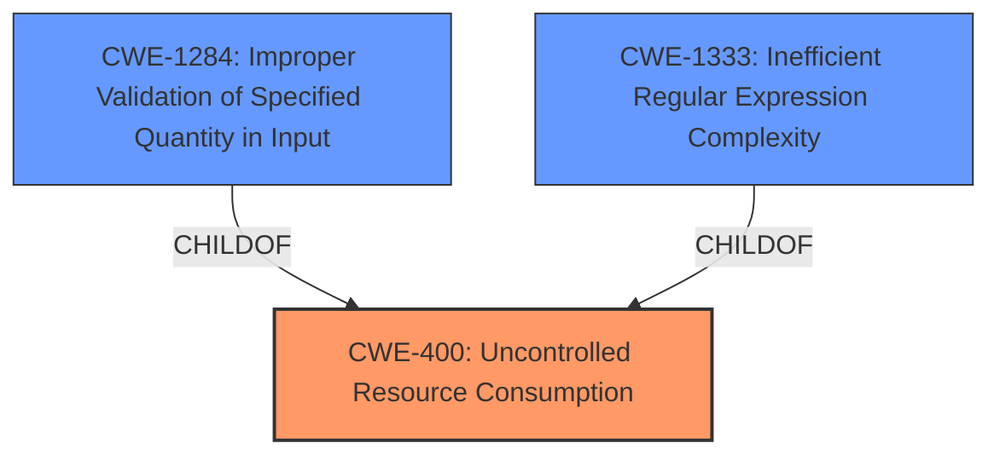

# Analysis for CVE-2025-25193

# Summary
| CWE ID | CWE Name | Confidence | CWE Abstraction Level | CWE Vulnerability Mapping Label | CWE-Vulnerability Mapping Notes |
|---|---|---|---|---|---|
| CWE-400 | Uncontrolled Resource Consumption | 0.8 | Class | Primary | Allowed-with-Review |
| CWE-1333 | Inefficient Regular Expression Complexity | 0.6 | Base | Secondary | Allowed |
| CWE-1284 | Improper Validation of Specified Quantity in Input | 0.6 | Base | Secondary | Allowed |

## Evidence and Confidence

*   **Confidence Score:** 0.7
*   **Evidence Strength:** MEDIUM

## Relationship Analysis
The primary CWE is CWE-400, a Class-level CWE, which represents the broad category of uncontrolled resource consumption. There isn't a specific base CWE identified for resource consumption, though it could be tied to memory allocation or CPU usage. CWE-1284 is related as it involves **improper validation of input quantity**, which can lead to excessive resource consumption. CWE-1333 is also potentially related to excessive resource consumption, specifically related to regular expression complexity if the file reading involves regex.

## Vulnerability Chain
The vulnerability chain starts with an **unsafe reading of environment file**. This leads to the Netty application attempting to load a large file, potentially caused by an **improper validation of input quantity**. The excessive resource consumption then causes the application to crash, resulting in a denial of service.

**Vulnerability Chain:**
1.  **Unsafe reading of environment file**
2.  **Improper validation of specified quantity in input** (CWE-1284) or **Inefficient Regular Expression Complexity** (CWE-1333) - optional
3.  **Uncontrolled Resource Consumption** (CWE-400)
4.  Application crash and Denial of Service

## Summary of Analysis
The primary weakness is **uncontrolled resource consumption** (CWE-400) due to the application attempting to load an excessively large environment file. This is directly stated as "If an attacker creates such a large file, the Netty application crash," indicating the consumption of resources leads to a crash. While CWE-400 is a class-level CWE, the information provided doesn't allow for a more specific Base level CWE. A secondary weakness could be the **improper validation of the input quantity** (CWE-1284) that allows the application to even attempt loading such a large file. Another weakness could be **Inefficient Regular Expression Complexity** (CWE-1333), if the file parsing involves regex.

The evidence primarily relies on the vulnerability description and CVE summary, which highlight the potential for denial of service and application crash due to a large file. The "unsafe reading of environment file" suggests the application doesn't properly handle the size or contents of the file, leading to excessive resource usage.

I considered several other CWEs from the retriever results:

*   CWE-378 (Creation of Temporary File With Insecure Permissions): Not applicable because the vulnerability isn't related to the creation of temporary files.
*   CWE-190 (Integer Overflow or Wraparound): Not directly applicable as the vulnerability description doesn't specifically mention integer overflow issues.
*   CWE-125 (Out-of-bounds Read): While possible, the primary issue is the uncontrolled resource consumption, not necessarily reading beyond buffer boundaries.
*   CWE-22 (Improper Limitation of a Pathname to a Restricted Directory ('Path Traversal')): Not relevant because it's not about path traversal.
*   CWE-59 (Improper Link Resolution Before File Access ('Link Following')): Not relevant as there is no mention of link resolution.
*   CWE-824 (Access of Uninitialized Pointer): Not applicable because the vulnerability doesn't specifically involve uninitialized pointers.
*   CWE-252 (Unchecked Return Value): Not applicable because there is no mention of return values.

The selected CWEs are at a reasonable level of specificity based on the available evidence. More information about the exact mechanism of resource consumption would allow for a more precise mapping, but based on the current details, CWE-400, CWE-1284, and CWE-1333 are the most appropriate.

Relevant CWE Information:

# Enhanced Context (25 CWEs)
The following CWEs were identified as potentially relevant to this vulnerability:

## CWE-378: Creation of Temporary File With Insecure Permissions
**Abstraction Level**: Base
**Similarity Score**: 0.78
**Source**: dense

**Description**:
Opening temporary files without appropriate measures or controls can leave the file, its contents and any function that it impacts vulnerable to attack.

**Mapping Guidance**:
- Usage: Allowed
- Rationale: This CWE entry is at the Base level of abstraction, which is a preferred level of abstraction for mapping to the root causes of vulnerabilities.

## CWE-789: Memory Allocation with Excessive Size Value
**Abstraction Level**: Variant
**Similarity Score**: 0.75
**Source**: dense

**Description**:
The product allocates memory based on an untrusted, large size value, but it does not ensure that the size is within expected limits, allowing arbitrary amounts of memory to be allocated.

**Mapping Guidance**:
- Usage: Allowed
- Rationale: This CWE entry is at the Variant level of abstraction, which is a preferred level of abstraction for mapping to the root causes of vulnerabilities.

## CWE-755: Improper Handling of Exceptional Conditions
**Abstraction Level**: Class
**Similarity Score**: 0.75
**Source**: dense

**Description**:
The product does not handle or incorrectly handles an exceptional condition.

**Mapping Guidance**:
- Usage: Discouraged
- Rationale: This CWE entry is a level-1 Class (i.e., a child of a Pillar). It might have lower-level children that would be more appropriate

## CWE-824: Access of Uninitialized Pointer
**Abstraction Level**: Base
**Similarity Score**: 0.74
**Source**: dense

**Description**:
The product accesses or uses a pointer that has not been initialized.

**Mapping Guidance**:
- Usage: Allowed
- Rationale: This CWE entry is at the Base level of abstraction, which is a preferred level of abstraction for mapping to the root causes of vulnerabilities.

## CWE-252: Unchecked Return Value
**Abstraction Level**: Base
**Similarity Score**: 0.74
**Source**: dense

**Description**:
The product does not check the return value from a method or function, which can prevent it from detecting unexpected states and conditions.

**Mapping Guidance**:
- Usage: Allowed
- Rationale: This CWE entry is at the Base level of abstraction, which is a preferred level of abstraction for mapping to the root causes of vulnerabilities.

## CWE-617: Reachable Assertion
**Abstraction Level**: Base
**Similarity Score**: 0.74
**Source**: dense

**Description**:
The product contains an assert() or similar statement that can be triggered by an attacker, which leads to an application exit or other behavior that is more severe than necessary.

**Mapping Guidance**:
- Usage: Allowed
- Rationale: This CWE entry is at the Base level of abstraction, which is a preferred level of abstraction for mapping to the root causes of vulnerabilities.

## CWE-330: Use of Insufficiently Random Values
**Abstraction Level**: Class
**Similarity Score**: 0.74
**Source**: dense

**Description**:
The product uses insufficiently random numbers or values in a security context that depends on unpredictable numbers.

**Mapping Guidance**:
- Usage: Discouraged
- Rationale: This CWE entry is a level-1 Class (i.e., a child of a Pillar). It might have lower-level children that would be more appropriate

## CWE-754: Improper Check for Unusual or Exceptional Conditions
**Abstraction Level**: Class
**Similarity Score**: 0.74
**Source**: dense

**Description**:
The product does not check or incorrectly checks for unusual or exceptional conditions that are not expected to occur frequently during day to day operation of the product.

**Mapping Guidance**:
- Usage: Allowed-with-Review
- Rationale: This CWE entry is a Class and might have Base-level children that would be more appropriate

## CWE-923: Improper Restriction of Communication Channel to Intended Endpoints
**Abstraction Level**: Class
**Similarity Score**: 0.73
**Source**: dense

**Description**:
The product establishes a communication