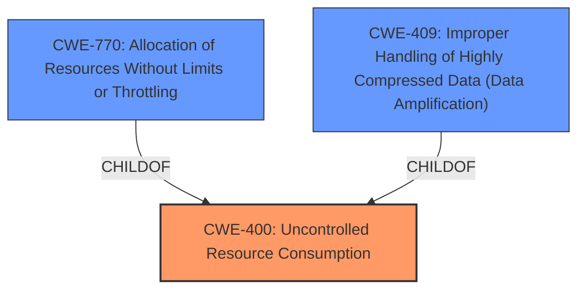

# Analysis Report for CVE-2025-25293

# Vulnerability Analysis Report: CVE-2025-25293

## Description

ruby-saml provides security assertion markup language (SAML) single sign-on (SSO) for Ruby. Prior to versions 1.12.4 and 1.18.0, ruby-saml is susceptible to remote Denial of Service (DoS) with compressed SAML responses. ruby-saml uses zlib to decompress SAML responses in case theyre compressed. It is possible to **bypass the message size check with a compressed assertion** since the message size is checked before inflation and not after. This issue may lead to remote Denial of Service (DoS). Versions 1.12.4 and 1.18.0 fix the issue.

## Vulnerability Description Key Phrases

- **Weakness:** bypass the message size check with a compressed assertion
- **Impact:** remote Denial of Service (DoS)
- **Vector:** compressed SAML responses
- **Product:** ruby-saml
- **Version:** prior to versions 1.12.4 and 1.18.0

## Analysis (with Relationship Data)

# Summary
| CWE ID | CWE Name | Confidence | CWE Abstraction Level | CWE Vulnerability Mapping Label | CWE-Vulnerability Mapping Notes |
|---|---|---|---|---|---|
| CWE-400 | Uncontrolled Resource Consumption | 0.8 | Class | Primary | Allowed-with-Review |
| CWE-770 | Allocation of Resources Without Limits or Throttling | 0.7 | Base | Secondary | Allowed |
| CWE-409 | Improper Handling of Highly Compressed Data (Data Amplification) | 0.6 | Base | Secondary | Allowed |

## Evidence and Confidence

*   **Confidence Score:** 0.8
*   **Evidence Strength:** MEDIUM

## Relationship Analysis
The primary CWE is CWE-400, which is a Class-level CWE. CWE-770 and CWE-409 are potential children of CWE-400 which is more specific and also base level.


## Vulnerability Chain
The vulnerability chain starts with the **bypass of the message size check with a compressed assertion**, leading to uncontrolled resource consumption, which then leads to a remote Denial of Service (DoS). The chain is: **Improper Size Check** -> **Uncontrolled Resource Consumption** -> **Denial of Service**.

## Summary of Analysis
The primary weakness is the **bypass of the message size check with a compressed assertion** which leads to uncontrolled resource consumption causing a denial of service.
CWE-400 (Uncontrolled Resource Consumption) is selected as the primary CWE because the vulnerability ultimately leads to excessive resource consumption, resulting in a denial-of-service condition. This aligns with the core definition of CWE-400.
The evidence supporting this is: "**bypass the message size check with a compressed assertion**" and "This issue may lead to remote Denial of Service (DoS)."

CWE-770 (Allocation of Resources Without Limits or Throttling) is considered a secondary CWE because the **bypass** allows the allocation of resources without proper limits.

CWE-409 (Improper Handling of Highly Compressed Data (Data Amplification)) is considered a secondary CWE since the vulnerability involves compressed data that isn't properly handled.

CWE-789 (Memory Allocation with Excessive Size Value) was considered, but it is related to memory allocation specifically. While memory could be a resource, the description does not limit it to memory.

CWE-1284 (Improper Validation of Specified Quantity in Input) was considered, as the message size check is bypassed, which would imply improper validation. However, the consequence is more accurately described by CWE-400.

CWE-1333 (Inefficient Regular Expression Complexity) was considered but is not applicable because the vulnerability does not involve regular expressions.

CWE-170 (Improper Null Termination) was considered but is not applicable as there is no mention of null termination issues.


## CWE Relationship Analysis

Current CWEs represent these abstraction levels: .


### Vulnerability Chain Analysis

**Chain starting from CWE-1284:**
- 1284 (Improper Validation of Specified Quantity in Input) - ROOT


**Chain starting from CWE-400:**
- 400 (Uncontrolled Resource Consumption) - ROOT


### CWE Relationship Diagram

```mermaid
graph TD
    classDef primary fill:#f96,stroke:#333,stroke-width:2px
    classDef secondary fill:#69f,stroke:#333
    classDef tertiary fill:#9e9,stroke:#333
```


*Report generated on 2025-07-14 13:24:09*
