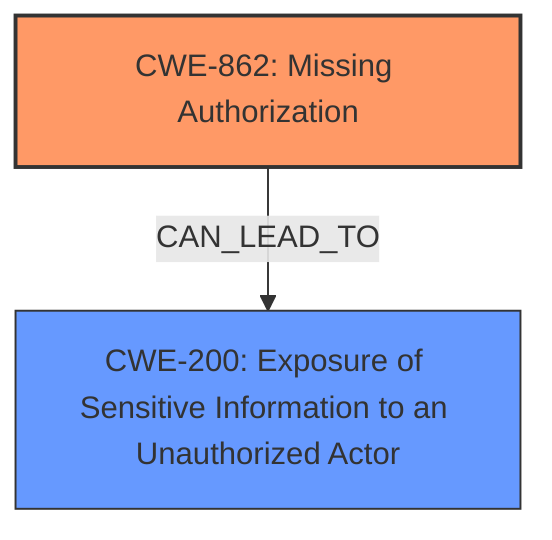

# Enhanced Analysis for CVE-2025-2539

# Summary
| CWE ID | CWE Name | Confidence | CWE Abstraction Level | CWE Vulnerability Mapping Label | CWE-Vulnerability Mapping Notes |
|---|---|---|---|---|---|
| CWE-862 | Missing Authorization | 1.0 | Class | Allowed-with-Review | Primary CWE. The product does not perform an authorization check when an actor attempts to access a resource or perform an action. |
| CWE-200 | Exposure of Sensitive Information to an Unauthorized Actor | 0.7 | Class | Discouraged | Secondary candidate. The product exposes sensitive information to an actor that is not explicitly authorized to have that information. |

## Evidence and Confidence

*   **Confidence Score:** 0.85
*   **Evidence Strength:** HIGH

## Relationship Analysis
The primary CWE is CWE-862, which is a class-level CWE. While it would be ideal to find a more specific base or variant CWE, the provided information does not give enough information to descend to a more detailed level. CWE-862 is related to other authorization-related CWEs like CWE-285 and CWE-863, but those are not appropriate because they describe *incorrect* authorization, not **missing** authorization. CWE-862 can lead to CWE-200 (Exposure of Sensitive Information), as the **missing authorization** allows unauthorized access to sensitive data.



## Vulnerability Chain
The vulnerability chain starts with the **missing capability check** (CWE-862). This **missing authorization** allows unauthenticated attackers to read arbitrary files, resulting in the exposure of sensitive information (CWE-200).
  - **Root Cause:** CWE-862 Missing Authorization.
  - **Impact:** CWE-200 Exposure of Sensitive Information to an Unauthorized Actor.

## Summary of Analysis
The vulnerability description clearly states a **missing capability check** on the `ajax()` function, which directly maps to CWE-862 (Missing Authorization). The impact of this **missing authorization** is that unauthenticated attackers can read arbitrary files, leading to the exposure of sensitive information (CWE-200). The retriever results also list CWE-862 as the top candidate. CWE-200 is included as it is the result of the **missing authorization** and the sensitive information can be read.

The evidence from the vulnerability description is: "The File Away plugin for WordPress is vulnerable to unauthorized access of data due to a **missing capability check** on the ajax() function in all versions up to, and including, 3.9.9.0.1. This makes it possible for unauthenticated attackers, leveraging the use of a reversible weak algorithm, to read the contents of arbitrary files on the server, which can contain sensitive information."

CWE-285, CWE-863, and CWE-639 were considered but not used. These involve *incorrect* or *bypassed* authorization, not a **missing** authorization check.
CWE-306 (Missing Authentication for Critical Function) was considered but not used because the issue is specifically a **missing authorization** check, not a **missing authentication** check. The function is likely already authenticated, but there is no further check to see if the authenticated user is authorized to access the specific file.
CWE-352 (Cross-Site Request Forgery) was considered, but it's not the primary issue. CSRF is about tricking a user into performing actions they didn't intend, whereas this vulnerability is about directly accessing files without proper authorization.
CWE-434 (Unrestricted Upload of File with Dangerous Type) was also considered, but it is about uploading dangerous files, which is not the case here.


## CWE Relationship Analysis

Current CWEs represent these abstraction levels: .


### Vulnerability Chain Analysis

**Chain starting from CWE-863:**
- 863 (Incorrect Authorization) - ROOT


**Chain starting from CWE-862:**
- 862 (Missing Authorization) - ROOT


### CWE Relationship Diagram

```mermaid
graph TD
    classDef primary fill:#f96,stroke:#333,stroke-width:2px
    classDef secondary fill:#69f,stroke:#333
    classDef tertiary fill:#9e9,stroke:#333
```